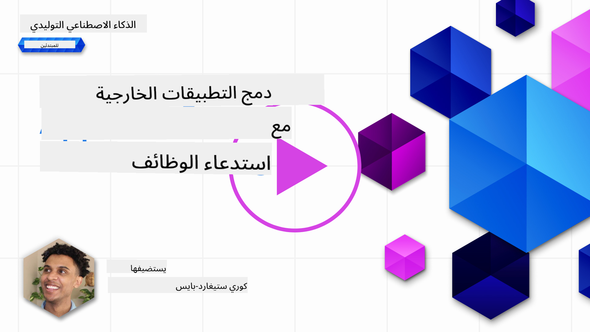
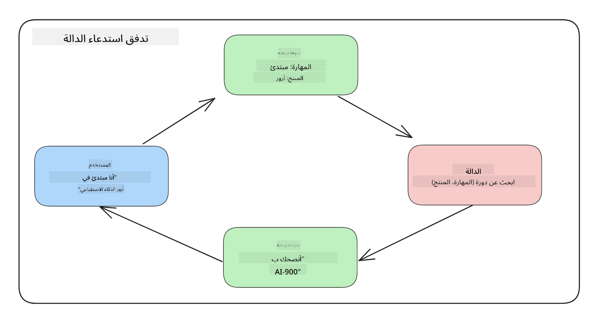
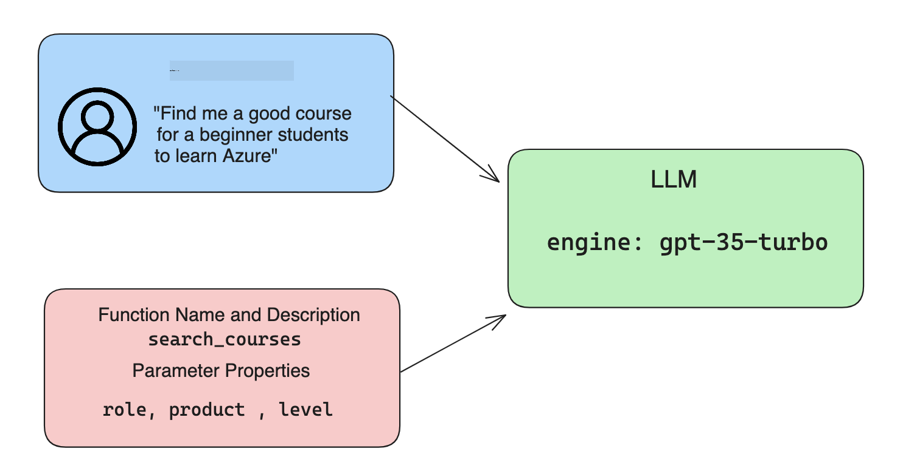

<!--
CO_OP_TRANSLATOR_METADATA:
{
  "original_hash": "77a48a201447be19aa7560706d6f93a0",
  "translation_date": "2025-07-09T14:23:26+00:00",
  "source_file": "11-integrating-with-function-calling/README.md",
  "language_code": "ar"
}
-->
# التكامل مع استدعاء الدوال

[](https://aka.ms/gen-ai-lesson11-gh?WT.mc_id=academic-105485-koreyst)

لقد تعلمت الكثير حتى الآن في الدروس السابقة. ومع ذلك، يمكننا التحسين أكثر. بعض الأمور التي يمكننا معالجتها هي كيفية الحصول على تنسيق استجابة أكثر اتساقًا لتسهيل التعامل مع الاستجابة لاحقًا. أيضًا، قد نرغب في إضافة بيانات من مصادر أخرى لتعزيز تطبيقنا بشكل أكبر.

المشاكل المذكورة أعلاه هي ما يسعى هذا الفصل لمعالجته.

## المقدمة

سيتناول هذا الدرس:

- شرح ما هو استدعاء الدوال وحالات استخدامه.
- إنشاء استدعاء دالة باستخدام Azure OpenAI.
- كيفية دمج استدعاء دالة في تطبيق.

## أهداف التعلم

بنهاية هذا الدرس، ستكون قادرًا على:

- شرح الهدف من استخدام استدعاء الدوال.
- إعداد استدعاء دالة باستخدام خدمة Azure OpenAI.
- تصميم استدعاءات دوال فعالة لحالة استخدام تطبيقك.

## السيناريو: تحسين روبوت الدردشة الخاص بنا باستخدام الدوال

في هذا الدرس، نريد بناء ميزة لشركتنا الناشئة في مجال التعليم تتيح للمستخدمين استخدام روبوت دردشة للعثور على الدورات التقنية. سنوصي بدورات تناسب مستوى مهاراتهم، ودورهم الحالي، والتقنية التي يهتمون بها.

لإكمال هذا السيناريو، سنستخدم مزيجًا من:

- `Azure OpenAI` لإنشاء تجربة دردشة للمستخدم.
- `Microsoft Learn Catalog API` لمساعدة المستخدمين في العثور على الدورات بناءً على طلب المستخدم.
- `Function Calling` لأخذ استعلام المستخدم وإرساله إلى دالة لتنفيذ طلب API.

لنبدأ بالنظر في سبب رغبتنا في استخدام استدعاء الدوال في المقام الأول:

## لماذا استدعاء الدوال

قبل استدعاء الدوال، كانت الاستجابات من نموذج اللغة الكبير (LLM) غير منظمة وغير متسقة. كان على المطورين كتابة كود تحقق معقد لضمان التعامل مع كل تنوع في الاستجابة. لم يكن بإمكان المستخدمين الحصول على إجابات مثل "ما هو الطقس الحالي في ستوكهولم؟". وذلك لأن النماذج كانت محدودة بوقت تدريب البيانات.

استدعاء الدوال هو ميزة في خدمة Azure OpenAI لتجاوز القيود التالية:

- **تنسيق استجابة متسق**. إذا استطعنا التحكم بشكل أفضل في تنسيق الاستجابة، يمكننا دمجها بسهولة أكبر مع أنظمة أخرى لاحقًا.
- **البيانات الخارجية**. القدرة على استخدام بيانات من مصادر أخرى في التطبيق ضمن سياق الدردشة.

## توضيح المشكلة من خلال سيناريو

> نوصي باستخدام [الدفتر المرفق](../../../11-integrating-with-function-calling/python/aoai-assignment.ipynb) إذا أردت تشغيل السيناريو أدناه. يمكنك أيضًا القراءة فقط بينما نحاول توضيح مشكلة يمكن للدوال المساعدة في حلها.

لننظر إلى المثال الذي يوضح مشكلة تنسيق الاستجابة:

لنفترض أننا نريد إنشاء قاعدة بيانات لبيانات الطلاب حتى نتمكن من اقتراح الدورة المناسبة لهم. أدناه لدينا وصفان لطلاب متشابهين جدًا في البيانات التي يحتويانها.

1. إنشاء اتصال بمورد Azure OpenAI الخاص بنا:

   ```python
   import os
   import json
   from openai import AzureOpenAI
   from dotenv import load_dotenv
   load_dotenv()

   client = AzureOpenAI(
   api_key=os.environ['AZURE_OPENAI_API_KEY'],  # this is also the default, it can be omitted
   api_version = "2023-07-01-preview"
   )

   deployment=os.environ['AZURE_OPENAI_DEPLOYMENT']
   ```

   أدناه بعض كود بايثون لتكوين اتصالنا بـ Azure OpenAI حيث نحدد `api_type`، `api_base`، `api_version` و `api_key`.

1. إنشاء وصفين للطلاب باستخدام المتغيرات `student_1_description` و `student_2_description`.

   ```python
   student_1_description="Emily Johnson is a sophomore majoring in computer science at Duke University. She has a 3.7 GPA. Emily is an active member of the university's Chess Club and Debate Team. She hopes to pursue a career in software engineering after graduating."

   student_2_description = "Michael Lee is a sophomore majoring in computer science at Stanford University. He has a 3.8 GPA. Michael is known for his programming skills and is an active member of the university's Robotics Club. He hopes to pursue a career in artificial intelligence after finishing his studies."
   ```

   نريد إرسال أوصاف الطلاب أعلاه إلى نموذج اللغة الكبير لتحليل البيانات. يمكن استخدام هذه البيانات لاحقًا في تطبيقنا وإرسالها إلى API أو تخزينها في قاعدة بيانات.

1. لننشئ طلبين متطابقين نوجه فيهما النموذج إلى المعلومات التي نهتم بها:

   ```python
   prompt1 = f'''
   Please extract the following information from the given text and return it as a JSON object:

   name
   major
   school
   grades
   club

   This is the body of text to extract the information from:
   {student_1_description}
   '''

   prompt2 = f'''
   Please extract the following information from the given text and return it as a JSON object:

   name
   major
   school
   grades
   club

   This is the body of text to extract the information from:
   {student_2_description}
   '''
   ```

   الطلبات أعلاه توجه النموذج لاستخراج المعلومات وإرجاع الاستجابة بتنسيق JSON.

1. بعد إعداد الطلبات والاتصال بـ Azure OpenAI، سنرسل الطلبات إلى النموذج باستخدام `openai.ChatCompletion`. نخزن الطلب في المتغير `messages` ونعين الدور إلى `user`. هذا لمحاكاة رسالة من المستخدم تُكتب إلى روبوت الدردشة.

   ```python
   # response from prompt one
   openai_response1 = client.chat.completions.create(
   model=deployment,
   messages = [{'role': 'user', 'content': prompt1}]
   )
   openai_response1.choices[0].message.content

   # response from prompt two
   openai_response2 = client.chat.completions.create(
   model=deployment,
   messages = [{'role': 'user', 'content': prompt2}]
   )
   openai_response2.choices[0].message.content
   ```

الآن يمكننا إرسال كلا الطلبين إلى النموذج وفحص الاستجابة التي نتلقاها بالعثور عليها هكذا `openai_response1['choices'][0]['message']['content']`.

1. أخيرًا، يمكننا تحويل الاستجابة إلى تنسيق JSON باستدعاء `json.loads`:

   ```python
   # Loading the response as a JSON object
   json_response1 = json.loads(openai_response1.choices[0].message.content)
   json_response1
   ```

   الاستجابة 1:

   ```json
   {
     "name": "Emily Johnson",
     "major": "computer science",
     "school": "Duke University",
     "grades": "3.7",
     "club": "Chess Club"
   }
   ```

   الاستجابة 2:

   ```json
   {
     "name": "Michael Lee",
     "major": "computer science",
     "school": "Stanford University",
     "grades": "3.8 GPA",
     "club": "Robotics Club"
   }
   ```

   بالرغم من أن الطلبات متطابقة والأوصاف متشابهة، نرى أن قيم خاصية `Grades` مُنسقة بشكل مختلف، حيث نحصل أحيانًا على التنسيق `3.7` أو `3.7 GPA` على سبيل المثال.

   هذا نتيجة لأن النموذج يتعامل مع بيانات غير منظمة في شكل الطلب المكتوب ويرجع أيضًا بيانات غير منظمة. نحتاج إلى تنسيق منظم حتى نعرف ما نتوقعه عند تخزين أو استخدام هذه البيانات.

فكيف نحل مشكلة التنسيق إذًا؟ باستخدام استدعاء الدوال، يمكننا التأكد من أننا نتلقى بيانات منظمة. عند استخدام استدعاء الدوال، لا يقوم النموذج فعليًا باستدعاء أو تشغيل أي دوال. بدلاً من ذلك، ننشئ هيكلًا يتبعه النموذج في استجاباته. ثم نستخدم تلك الاستجابات المنظمة لمعرفة الدالة التي يجب تشغيلها في تطبيقاتنا.



يمكننا بعد ذلك أخذ ما تم إرجاعه من الدالة وإرساله مرة أخرى إلى النموذج. سيقوم النموذج بعدها بالرد بلغة طبيعية للإجابة على استعلام المستخدم.

## حالات استخدام استدعاء الدوال

هناك العديد من حالات الاستخدام المختلفة حيث يمكن لاستدعاء الدوال تحسين تطبيقك مثل:

- **استدعاء أدوات خارجية**. روبوتات الدردشة ممتازة في تقديم إجابات على أسئلة المستخدمين. باستخدام استدعاء الدوال، يمكن لروبوتات الدردشة استخدام رسائل المستخدمين لإكمال مهام معينة. على سبيل المثال، يمكن لطالب أن يطلب من روبوت الدردشة "إرسال بريد إلكتروني إلى مدرسي يقول أنني أحتاج إلى مساعدة إضافية في هذا الموضوع". يمكن أن يقوم هذا باستدعاء دالة `send_email(to: string, body: string)`

- **إنشاء استعلامات API أو قواعد بيانات**. يمكن للمستخدمين العثور على معلومات باستخدام لغة طبيعية تتحول إلى استعلام منسق أو طلب API. مثال على ذلك معلم يطلب "من هم الطلاب الذين أكملوا الواجب الأخير" والذي يمكن أن يستدعي دالة باسم `get_completed(student_name: string, assignment: int, current_status: string)`

- **إنشاء بيانات منظمة**. يمكن للمستخدمين أخذ نص أو ملف CSV واستخدام النموذج لاستخراج معلومات مهمة منه. على سبيل المثال، يمكن لطالب تحويل مقال من ويكيبيديا عن اتفاقيات السلام لإنشاء بطاقات تعليمية بالذكاء الاصطناعي. يمكن القيام بذلك باستخدام دالة تسمى `get_important_facts(agreement_name: string, date_signed: string, parties_involved: list)`

## إنشاء أول استدعاء دالة لك

تتضمن عملية إنشاء استدعاء دالة 3 خطوات رئيسية:

1. **استدعاء** API إكمال الدردشة مع قائمة الدوال الخاصة بك ورسالة المستخدم.
2. **قراءة** استجابة النموذج لأداء إجراء مثل تنفيذ دالة أو استدعاء API.
3. **إجراء** استدعاء آخر إلى API إكمال الدردشة مع استجابة دالتك لاستخدام تلك المعلومات لإنشاء رد للمستخدم.



### الخطوة 1 - إنشاء الرسائل

الخطوة الأولى هي إنشاء رسالة المستخدم. يمكن تعيينها ديناميكيًا بأخذ قيمة من إدخال نصي أو يمكنك تعيين قيمة هنا. إذا كانت هذه هي المرة الأولى التي تعمل فيها مع API إكمال الدردشة، نحتاج إلى تحديد `role` و `content` للرسالة.

يمكن أن يكون `role` إما `system` (إنشاء قواعد)، `assistant` (النموذج) أو `user` (المستخدم النهائي). لاستدعاء الدوال، سنعينها كـ `user` مع مثال سؤال.

```python
messages= [ {"role": "user", "content": "Find me a good course for a beginner student to learn Azure."} ]
```

بتعيين أدوار مختلفة، يتضح للنموذج إذا كان النظام هو من يتحدث أو المستخدم، مما يساعد في بناء سجل محادثة يمكن للنموذج البناء عليه.

### الخطوة 2 - إنشاء الدوال

بعد ذلك، سنحدد دالة ومعاملات تلك الدالة. سنستخدم دالة واحدة هنا تسمى `search_courses` لكن يمكنك إنشاء دوال متعددة.

> **مهم**: الدوال مدرجة في رسالة النظام إلى النموذج وستُحتسب ضمن عدد الرموز المتاحة لديك.

أدناه، ننشئ الدوال كمصفوفة من العناصر. كل عنصر هو دالة وله خصائص `name`، `description` و `parameters`:

```python
functions = [
   {
      "name":"search_courses",
      "description":"Retrieves courses from the search index based on the parameters provided",
      "parameters":{
         "type":"object",
         "properties":{
            "role":{
               "type":"string",
               "description":"The role of the learner (i.e. developer, data scientist, student, etc.)"
            },
            "product":{
               "type":"string",
               "description":"The product that the lesson is covering (i.e. Azure, Power BI, etc.)"
            },
            "level":{
               "type":"string",
               "description":"The level of experience the learner has prior to taking the course (i.e. beginner, intermediate, advanced)"
            }
         },
         "required":[
            "role"
         ]
      }
   }
]
```

لنصف كل دالة بمزيد من التفصيل أدناه:

- `name` - اسم الدالة التي نريد استدعاؤها.
- `description` - وصف لكيفية عمل الدالة. من المهم هنا أن تكون محددًا وواضحًا.
- `parameters` - قائمة بالقيم والتنسيق الذي تريد أن ينتجه النموذج في استجابته. تتكون مصفوفة المعاملات من عناصر لها الخصائص التالية:
  1.  `type` - نوع البيانات التي ستُخزن فيها الخصائص.
  1.  `properties` - قائمة القيم المحددة التي سيستخدمها النموذج في استجابته
      1. `name` - المفتاح هو اسم الخاصية التي سيستخدمها النموذج في استجابته المنسقة، مثل `product`.
      1. `type` - نوع بيانات هذه الخاصية، مثل `string`.
      1. `description` - وصف الخاصية المحددة.

هناك أيضًا خاصية اختيارية `required` - خاصية مطلوبة لإكمال استدعاء الدالة.

### الخطوة 3 - إجراء استدعاء الدالة

بعد تعريف دالة، نحتاج الآن إلى تضمينها في استدعاء API إكمال الدردشة. نفعل ذلك بإضافة `functions` إلى الطلب. في هذه الحالة `functions=functions`.

هناك أيضًا خيار لتعيين `function_call` إلى `auto`. هذا يعني أننا نترك للنموذج اختيار الدالة التي يجب استدعاؤها بناءً على رسالة المستخدم بدلاً من تعيينها بأنفسنا.

إليك بعض الكود أدناه حيث نستدعي `ChatCompletion.create`، لاحظ كيف نحدد `functions=functions` و `function_call="auto"` مما يمنح النموذج حرية اختيار متى يستدعي الدوال التي نوفرها له:

```python
response = client.chat.completions.create(model=deployment,
                                        messages=messages,
                                        functions=functions,
                                        function_call="auto")

print(response.choices[0].message)
```

تبدو الاستجابة التي تعود الآن هكذا:

```json
{
  "role": "assistant",
  "function_call": {
    "name": "search_courses",
    "arguments": "{\n  \"role\": \"student\",\n  \"product\": \"Azure\",\n  \"level\": \"beginner\"\n}"
  }
}
```

هنا نرى كيف تم استدعاء الدالة `search_courses` وبأي معطيات، كما هو مدرج في خاصية `arguments` في استجابة JSON.

الاستنتاج هو أن النموذج تمكن من العثور على البيانات لتناسب معطيات الدالة لأنه كان يستخرجها من القيمة المقدمة إلى معامل `messages` في استدعاء إكمال الدردشة. أدناه تذكير بقيمة `messages`:

```python
messages= [ {"role": "user", "content": "Find me a good course for a beginner student to learn Azure."} ]
```

كما ترى، تم استخراج `student`، `Azure` و `beginner` من `messages` وتم تعيينها كمدخلات للدالة. استخدام الدوال بهذه الطريقة طريقة رائعة لاستخراج المعلومات من طلب، وأيضًا لتوفير هيكل للنموذج والحصول على وظائف قابلة لإعادة الاستخدام.

بعد ذلك، نحتاج إلى معرفة كيف يمكننا استخدام هذا في تطبيقنا.

## دمج استدعاءات الدوال في تطبيق

بعد أن اختبرنا الاستجابة المنسقة من النموذج، يمكننا الآن دمجها في تطبيق.

### إدارة التدفق

لدمج هذا في تطبيقنا، دعنا نتبع الخطوات التالية:

1. أولًا، لنقم بالاتصال بخدمات OpenAI وتخزين الرسالة في متغير يسمى `response_message`.

   ```python
   response_message = response.choices[0].message
   ```

1. الآن سنعرف الدالة التي ستستدعي Microsoft Learn API للحصول على قائمة الدورات:

   ```python
   import requests

   def search_courses(role, product, level):
     url = "https://learn.microsoft.com/api/catalog/"
     params = {
        "role": role,
        "product": product,
        "level": level
     }
     response = requests.get(url, params=params)
     modules = response.json()["modules"]
     results = []
     for module in modules[:5]:
        title = module["title"]
        url = module["url"]
        results.append({"title": title, "url": url})
     return str(results)
   ```

   لاحظ كيف ننشئ الآن دالة بايثون فعلية تطابق أسماء الدوال التي قدمناها في متغير `functions`. نحن أيضًا نجري استدعاءات API خارجية حقيقية لجلب البيانات التي نحتاجها. في هذه الحالة، نستخدم Microsoft Learn API للبحث عن وحدات تدريبية.

حسنًا، أنشأنا متغير `functions` ودالة بايثون مقابلة، كيف نخبر النموذج بكيفية ربط هذين معًا حتى يتم استدعاء دالتنا في بايثون؟

1. للتحقق مما إذا كنا بحاجة لاستدعاء دالة بايثون، نحتاج إلى النظر في استجابة النموذج ومعرفة ما إذا كانت `function_call` جزءًا منها واستدعاء الدالة المشار إليها. إليك كيفية إجراء هذا الفحص أدناه:

   ```python
   # Check if the model wants to call a function
   if response_message.function_call.name:
    print("Recommended Function call:")
    print(response_message.function_call.name)
    print()

    # Call the function.
    function_name = response_message.function_call.name

    available_functions = {
            "search_courses": search_courses,
    }
    function_to_call = available_functions[function_name]

    function_args = json.loads(response_message.function_call.arguments)
    function_response = function_to_call(**function_args)

    print("Output of function call:")
    print(function_response)
    print(type(function_response))


    # Add the assistant response and function response to the messages
    messages.append( # adding assistant response to messages
        {
            "role": response_message.role,
            "function_call": {
                "name": function_name,
                "arguments": response_message.function_call.arguments,
            },
            "content": None
        }
    )
    messages.append( # adding function response to messages
        {
            "role": "function",
            "name": function_name,
            "content":function_response,
        }
    )
   ```

   هذه الأسطر الثلاثة تضمن استخراج اسم الدالة، المعطيات، وتنفيذ الاستدعاء:

   ```python
   function_to_call = available_functions[function_name]

   function_args = json.loads(response_message.function_call.arguments)
   function_response = function_to_call(**function_args)
   ```

   أدناه ناتج تشغيل الكود:

   **الناتج**

   ```Recommended Function call:
   {
     "name": "search_courses",
     "arguments": "{\n  \"role\": \"student\",\n  \"product\": \"Azure\",\n  \"level\": \"beginner\"\n}"
   }

   Output of function call:
   [{'title': 'Describe concepts of cryptography', 'url': 'https://learn.microsoft.com/training/modules/describe-concepts-of-cryptography/?
   WT.mc_id=api_CatalogApi'}, {'title': 'Introduction to audio classification with TensorFlow', 'url': 'https://learn.microsoft.com/en-
   us/training/modules/intro-audio-classification-tensorflow/?WT.mc_id=api_CatalogApi'}, {'title': 'Design a Performant Data Model in Azure SQL
   Database with Azure Data Studio', 'url': 'https://learn.microsoft.com/training/modules/design-a-data-model-with-ads/?
   WT.mc_id=api_CatalogApi'}, {'title': 'Getting started with the Microsoft Cloud Adoption Framework for Azure', 'url':
   'https://learn.microsoft.com/training/modules/cloud-adoption-framework-getting-started/?WT.mc_id=api_CatalogApi'}, {'title': 'Set up the
   Rust development environment', 'url': 'https://learn.microsoft.com/training/modules/rust-set-up-environment/?WT.mc_id=api_CatalogApi'}]
   <class 'str'>
   ```

1. الآن سنرسل الرسالة المحدثة، `messages` إلى النموذج حتى نتلقى ردًا بلغة طبيعية بدلاً من استجابة JSON منسقة من API.

   ```python
   print("Messages in next request:")
   print(messages)
   print()

   second_response = client.chat.completions.create(
      messages=messages,
      model=deployment,
      function_call="auto",
      functions=functions,
      temperature=0
         )  # get a new response from GPT where it can see the function response


   print(second_response.choices[0].message)
   ```

   **الناتج**

   ```python
   {
     "role": "assistant",
     "content": "I found some good courses for beginner students to learn Azure:\n\n1. [Describe concepts of cryptography] (https://learn.microsoft.com/training/modules/describe-concepts-of-cryptography/?WT.mc_id=api_CatalogApi)\n2. [Introduction to audio classification with TensorFlow](https://learn.microsoft.com/training/modules/intro-audio-classification-tensorflow/?WT.mc_id=api_CatalogApi)\n3. [Design a Performant Data Model in Azure SQL Database with Azure Data Studio](https://learn.microsoft.com/training/modules/design-a-data-model-with-ads/?WT.mc_id=api_CatalogApi)\n4. [Getting started with the Microsoft Cloud Adoption Framework for Azure](https://learn.microsoft.com/training/modules/cloud-adoption-framework-getting-started/?WT.mc_id=api_CatalogApi)\n5. [Set up the Rust development environment](https://learn.microsoft.com/training/modules/rust-set-up-environment/?WT.mc_id=api_CatalogApi)\n\nYou can click on the links to access the courses."
   }

   ```

## المهمة

لمتابعة تعلمك لاستدعاء دوال Azure OpenAI يمكنك بناء:

- المزيد من معلمات الدالة التي قد تساعد المتعلمين في العثور على المزيد من الدورات.
- إنشاء استدعاء دالة آخر يأخذ معلومات إضافية من المتعلم مثل لغته الأم.
- إنشاء معالجة للأخطاء عندما لا يعيد استدعاء الدالة و/أو استدعاء API أي دورات مناسبة.
## عمل رائع! استمر في الرحلة

بعد إكمال هذا الدرس، اطلع على مجموعتنا [Generative AI Learning collection](https://aka.ms/genai-collection?WT.mc_id=academic-105485-koreyst) لمواصلة تطوير معرفتك في الذكاء الاصطناعي التوليدي!

توجه إلى الدرس 12، حيث سنستعرض كيفية [تصميم تجربة المستخدم لتطبيقات الذكاء الاصطناعي](../12-designing-ux-for-ai-applications/README.md?WT.mc_id=academic-105485-koreyst)!

**إخلاء المسؤولية**:  
تمت ترجمة هذا المستند باستخدام خدمة الترجمة الآلية [Co-op Translator](https://github.com/Azure/co-op-translator). بينما نسعى لتحقيق الدقة، يرجى العلم أن الترجمات الآلية قد تحتوي على أخطاء أو عدم دقة. يجب اعتبار المستند الأصلي بلغته الأصلية المصدر الموثوق به. للمعلومات الهامة، يُنصح بالاعتماد على الترجمة البشرية المهنية. نحن غير مسؤولين عن أي سوء فهم أو تفسير ناتج عن استخدام هذه الترجمة.