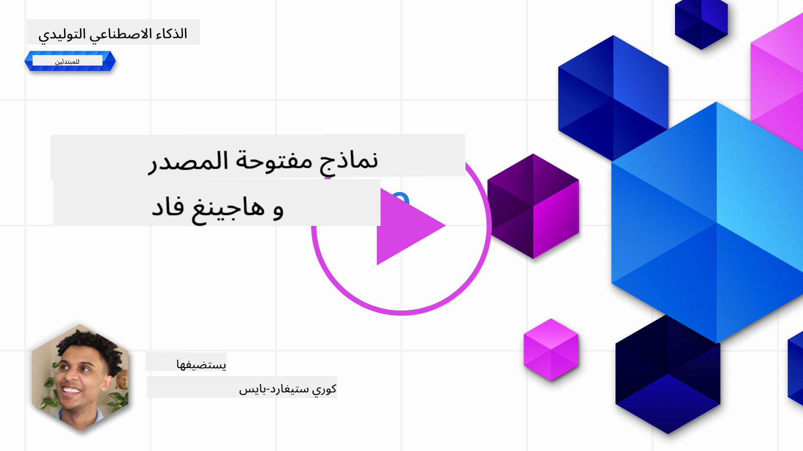
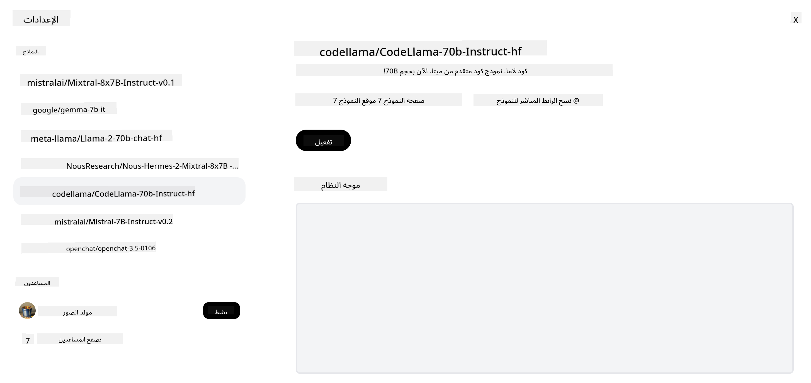
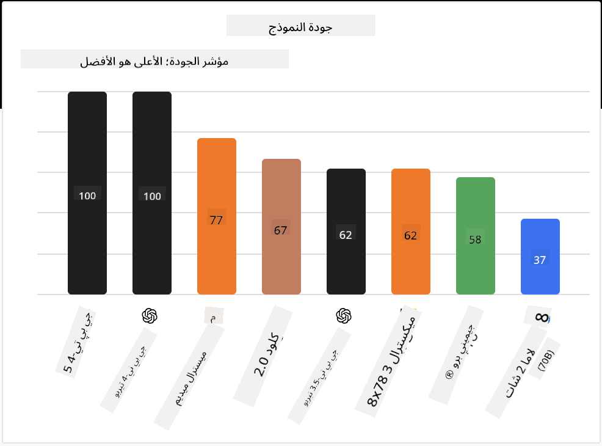

<!--
CO_OP_TRANSLATOR_METADATA:
{
  "original_hash": "0bba96e53ab841d99db731892a51fab8",
  "translation_date": "2025-07-09T17:03:57+00:00",
  "source_file": "16-open-source-models/README.md",
  "language_code": "ar"
}
-->

## المقدمة

عالم نماذج LLM مفتوحة المصدر مثير ويتطور باستمرار. تهدف هذه الدرس إلى تقديم نظرة معمقة على النماذج المفتوحة المصدر. إذا كنت تبحث عن معلومات حول كيفية مقارنة النماذج المملوكة بالنماذج المفتوحة المصدر، توجه إلى درس ["استكشاف ومقارنة نماذج LLM المختلفة"](../02-exploring-and-comparing-different-llms/README.md?WT.mc_id=academic-105485-koreyst). كما سيغطي هذا الدرس موضوع التخصيص الدقيق، لكن يمكنك العثور على شرح أكثر تفصيلاً في درس ["التخصيص الدقيق لنماذج LLM"](../18-fine-tuning/README.md?WT.mc_id=academic-105485-koreyst).

## أهداف التعلم

- فهم نماذج المصدر المفتوح
- التعرف على فوائد العمل مع نماذج المصدر المفتوح
- استكشاف النماذج المفتوحة المتاحة على Hugging Face و Azure AI Studio

## ما هي نماذج المصدر المفتوح؟

لعبت البرمجيات مفتوحة المصدر دورًا حيويًا في نمو التكنولوجيا عبر مجالات متعددة. قامت مبادرة المصدر المفتوح (OSI) بتحديد [10 معايير للبرمجيات](https://web.archive.org/web/20241126001143/https://opensource.org/osd?WT.mc_id=academic-105485-koreyst) لتصنيفها كمصدر مفتوح. يجب أن يكون كود المصدر متاحًا بشكل علني تحت ترخيص معتمد من OSI.

بينما يشترك تطوير نماذج LLM في عناصر مشابهة لتطوير البرمجيات، إلا أن العملية ليست متطابقة تمامًا. وهذا أثار الكثير من النقاش في المجتمع حول تعريف المصدر المفتوح في سياق نماذج LLM. لكي يتوافق النموذج مع التعريف التقليدي للمصدر المفتوح، يجب أن تكون المعلومات التالية متاحة للجمهور:

- مجموعات البيانات المستخدمة في تدريب النموذج.
- أوزان النموذج الكاملة كجزء من التدريب.
- كود التقييم.
- كود التخصيص الدقيق.
- أوزان النموذج الكاملة وقياسات التدريب.

حاليًا، هناك عدد قليل فقط من النماذج التي تطابق هذه المعايير. نموذج [OLMo الذي أنشأه معهد ألين للذكاء الاصطناعي (AllenAI)](https://huggingface.co/allenai/OLMo-7B?WT.mc_id=academic-105485-koreyst) هو أحد النماذج التي تندرج تحت هذه الفئة.

في هذا الدرس، سنشير إلى النماذج باسم "النماذج المفتوحة" لأنها قد لا تطابق المعايير أعلاه في وقت الكتابة.

## فوائد النماذج المفتوحة

**قابلة للتخصيص بدرجة عالية** - نظرًا لأن النماذج المفتوحة تُصدر مع معلومات تدريب مفصلة، يمكن للباحثين والمطورين تعديل مكونات النموذج الداخلية. هذا يتيح إنشاء نماذج متخصصة للغاية يتم تخصيصها لمهمة أو مجال دراسة معين. بعض الأمثلة على ذلك هي توليد الأكواد، العمليات الرياضية، والبيولوجيا.

**التكلفة** - تكلفة الاستخدام والنشر لكل وحدة (token) لهذه النماذج أقل من النماذج المملوكة. عند بناء تطبيقات الذكاء الاصطناعي التوليدي، يجب النظر في الأداء مقابل السعر عند العمل مع هذه النماذج لحالتك الخاصة.

  
المصدر: Artificial Analysis

**المرونة** - العمل مع النماذج المفتوحة يتيح لك مرونة في استخدام نماذج مختلفة أو دمجها. مثال على ذلك هو [مساعدي HuggingChat](https://huggingface.co/chat?WT.mc_id=academic-105485-koreyst) حيث يمكن للمستخدم اختيار النموذج المستخدم مباشرة من واجهة المستخدم:

## استكشاف نماذج مفتوحة مختلفة

### Llama 2

[LLama2](https://huggingface.co/meta-llama?WT.mc_id=academic-105485-koreyst)، الذي طورته Meta، هو نموذج مفتوح مُحسّن لتطبيقات الدردشة. يعود ذلك لطريقة التخصيص الدقيق التي شملت كمية كبيرة من الحوارات وردود الفعل البشرية. بهذه الطريقة، ينتج النموذج نتائج أكثر توافقًا مع توقعات البشر مما يوفر تجربة مستخدم أفضل.

بعض الأمثلة على نسخ Llama المخصصة تشمل [Japanese Llama](https://huggingface.co/elyza/ELYZA-japanese-Llama-2-7b?WT.mc_id=academic-105485-koreyst) المتخصصة في اللغة اليابانية و[Llama Pro](https://huggingface.co/TencentARC/LLaMA-Pro-8B?WT.mc_id=academic-105485-koreyst) وهي نسخة محسنة من النموذج الأساسي.

### Mistral

[Mistral](https://huggingface.co/mistralai?WT.mc_id=academic-105485-koreyst) هو نموذج مفتوح يركز بشكل كبير على الأداء العالي والكفاءة. يستخدم نهج Mixture-of-Experts الذي يجمع مجموعة من النماذج المتخصصة في نظام واحد حيث يتم اختيار نماذج معينة بناءً على المدخلات. هذا يجعل الحساب أكثر فعالية حيث تتعامل النماذج فقط مع المدخلات التي تتخصص فيها.

بعض الأمثلة على نسخ Mistral المخصصة تشمل [BioMistral](https://huggingface.co/BioMistral/BioMistral-7B?text=Mon+nom+est+Thomas+et+mon+principal?WT.mc_id=academic-105485-koreyst) التي تركز على المجال الطبي و[OpenMath Mistral](https://huggingface.co/nvidia/OpenMath-Mistral-7B-v0.1-hf?WT.mc_id=academic-105485-koreyst) التي تقوم بالحسابات الرياضية.

### Falcon

[Falcon](https://huggingface.co/tiiuae?WT.mc_id=academic-105485-koreyst) هو نموذج LLM أنشأه معهد الابتكار التكنولوجي (**TII**). تم تدريب Falcon-40B على 40 مليار معامل، وقد أظهر أداءً أفضل من GPT-3 مع ميزانية حسابية أقل. يعود ذلك لاستخدامه خوارزمية FlashAttention والانتباه متعدد الاستعلامات التي تقلل من متطلبات الذاكرة أثناء الاستدلال. مع هذا الوقت المنخفض للاستدلال، يعد Falcon-40B مناسبًا لتطبيقات الدردشة.

بعض الأمثلة على نسخ Falcon المخصصة هي [OpenAssistant](https://huggingface.co/OpenAssistant/falcon-40b-sft-top1-560?WT.mc_id=academic-105485-koreyst)، مساعد مبني على نماذج مفتوحة و[GPT4ALL](https://huggingface.co/nomic-ai/gpt4all-falcon?WT.mc_id=academic-105485-koreyst) الذي يقدم أداءً أعلى من النموذج الأساسي.

## كيفية الاختيار

لا يوجد جواب واحد لاختيار نموذج مفتوح. نقطة انطلاق جيدة هي استخدام ميزة التصفية حسب المهمة في Azure AI Studio. هذا سيساعدك على فهم أنواع المهام التي تم تدريب النموذج عليها. كما يحتفظ Hugging Face بلوحة تصنيف LLM التي تعرض أفضل النماذج أداءً بناءً على مقاييس معينة.

عند الرغبة في مقارنة نماذج LLM عبر الأنواع المختلفة، يُعد [Artificial Analysis](https://artificialanalysis.ai/?WT.mc_id=academic-105485-koreyst) مصدرًا رائعًا آخر:

  
المصدر: Artificial Analysis

إذا كنت تعمل على حالة استخدام محددة، فإن البحث عن نسخ مخصصة تركز على نفس المجال يمكن أن يكون فعالًا. كما أن تجربة عدة نماذج مفتوحة لمعرفة أدائها وفقًا لتوقعاتك وتوقعات المستخدمين هي ممارسة جيدة.

## الخطوات التالية

أفضل ما في النماذج المفتوحة هو أنه يمكنك البدء في العمل معها بسرعة كبيرة. اطلع على [كتالوج نماذج Azure AI Studio](https://ai.azure.com?WT.mc_id=academic-105485-koreyst)، الذي يضم مجموعة محددة من Hugging Face تحتوي على هذه النماذج التي ناقشناها هنا.

## التعلم لا يتوقف هنا، استمر في الرحلة

بعد إكمال هذا الدرس، اطلع على [مجموعة تعلم الذكاء الاصطناعي التوليدي](https://aka.ms/genai-collection?WT.mc_id=academic-105485-koreyst) لمواصلة تطوير معرفتك في الذكاء الاصطناعي التوليدي!

**إخلاء المسؤولية**:  
تمت ترجمة هذا المستند باستخدام خدمة الترجمة الآلية [Co-op Translator](https://github.com/Azure/co-op-translator). بينما نسعى لتحقيق الدقة، يرجى العلم أن الترجمات الآلية قد تحتوي على أخطاء أو عدم دقة. يجب اعتبار المستند الأصلي بلغته الأصلية المصدر الموثوق به. للمعلومات الهامة، يُنصح بالاعتماد على الترجمة البشرية المهنية. نحن غير مسؤولين عن أي سوء فهم أو تفسير ناتج عن استخدام هذه الترجمة.