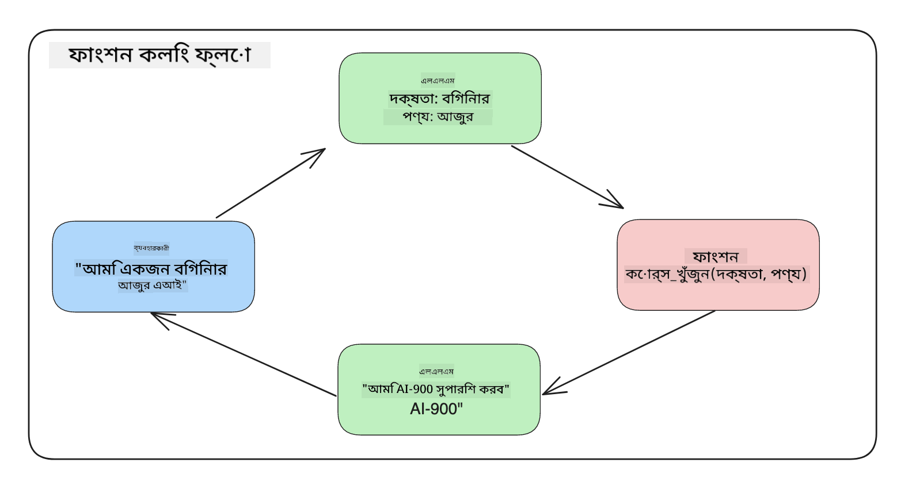
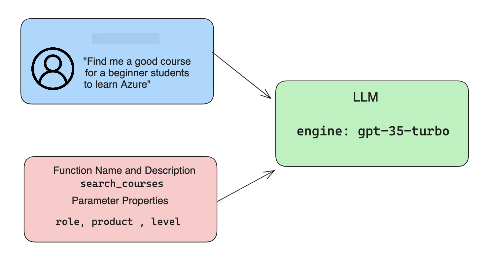

<!--
CO_OP_TRANSLATOR_METADATA:
{
  "original_hash": "77a48a201447be19aa7560706d6f93a0",
  "translation_date": "2025-07-09T14:28:21+00:00",
  "source_file": "11-integrating-with-function-calling/README.md",
  "language_code": "bn"
}
-->
# ফাংশন কলিংয়ের সাথে ইন্টিগ্রেশন

[](https://aka.ms/gen-ai-lesson11-gh?WT.mc_id=academic-105485-koreyst)

আপনি আগের পাঠগুলোতে বেশ কিছু বিষয় শিখেছেন। তবে, আমরা আরও উন্নতি করতে পারি। কিছু বিষয় আমরা ঠিক করতে পারি যেমন কিভাবে আরও সঙ্গতিপূর্ণ রেসপন্স ফরম্যাট পেতে পারি যাতে রেসপন্সের পরবর্তী ব্যবহারে সুবিধা হয়। এছাড়াও, আমরা চাইতে পারি অন্যান্য উৎস থেকে ডেটা যোগ করতে যাতে আমাদের অ্যাপ্লিকেশন আরও সমৃদ্ধ হয়।

উপরোক্ত সমস্যাগুলোই এই অধ্যায়ে সমাধান করার চেষ্টা করা হয়েছে।

## পরিচিতি

এই পাঠে আলোচনা করা হবে:

- ফাংশন কলিং কী এবং এর ব্যবহার ক্ষেত্র।
- Azure OpenAI ব্যবহার করে ফাংশন কল তৈরি করা।
- কিভাবে একটি অ্যাপ্লিকেশনে ফাংশন কল ইন্টিগ্রেট করা যায়।

## শেখার লক্ষ্য

এই পাঠ শেষ করার পর, আপনি সক্ষম হবেন:

- ফাংশন কলিং ব্যবহারের উদ্দেশ্য ব্যাখ্যা করতে।
- Azure OpenAI সার্ভিস ব্যবহার করে Function Call সেটআপ করতে।
- আপনার অ্যাপ্লিকেশনের ব্যবহারের জন্য কার্যকর ফাংশন কল ডিজাইন করতে।

## পরিস্থিতি: ফাংশন ব্যবহার করে আমাদের চ্যাটবট উন্নত করা

এই পাঠের জন্য, আমরা আমাদের শিক্ষা স্টার্টআপের জন্য একটি ফিচার তৈরি করতে চাই যা ব্যবহারকারীদের একটি চ্যাটবট ব্যবহার করে টেকনিক্যাল কোর্স খুঁজে পেতে সাহায্য করবে। আমরা তাদের দক্ষতা স্তর, বর্তমান ভূমিকা এবং আগ্রহের প্রযুক্তি অনুযায়ী কোর্স সাজেস্ট করব।

এই পরিস্থিতি সম্পন্ন করতে আমরা নিম্নলিখিত সমন্বয় ব্যবহার করব:

- `Azure OpenAI` ব্যবহার করে ব্যবহারকারীর জন্য একটি চ্যাট অভিজ্ঞতা তৈরি করা।
- `Microsoft Learn Catalog API` ব্যবহার করে ব্যবহারকারীর অনুরোধ অনুযায়ী কোর্স খুঁজে পাওয়া।
- `Function Calling` ব্যবহার করে ব্যবহারকারীর প্রশ্ন নিয়ে একটি ফাংশনে পাঠানো যা API অনুরোধ করবে।

শুরু করার জন্য, চলুন দেখি কেন আমরা প্রথমেই ফাংশন কলিং ব্যবহার করতে চাই:

## কেন Function Calling

ফাংশন কলিংয়ের আগে, LLM থেকে প্রাপ্ত রেসপন্স ছিল অসংগঠিত এবং অসঙ্গতিপূর্ণ। ডেভেলপারদের প্রতিটি রেসপন্সের ভিন্নতা সামলানোর জন্য জটিল ভ্যালিডেশন কোড লিখতে হতো। ব্যবহারকারীরা যেমন প্রশ্নের উত্তর পেতেন না, "স্টকহোমে বর্তমান আবহাওয়া কেমন?"। কারণ মডেলগুলো ছিল শুধুমাত্র প্রশিক্ষণের সময়ের ডেটার সীমাবদ্ধ।

Function Calling হলো Azure OpenAI সার্ভিসের একটি ফিচার যা নিম্নলিখিত সীমাবদ্ধতাগুলো কাটিয়ে উঠতে সাহায্য করে:

- **সঙ্গতিপূর্ণ রেসপন্স ফরম্যাট**। যদি আমরা রেসপন্স ফরম্যাট ভালোভাবে নিয়ন্ত্রণ করতে পারি, তাহলে সহজেই রেসপন্সকে অন্যান্য সিস্টেমে ইন্টিগ্রেট করা যায়।
- **বাহ্যিক ডেটা**। চ্যাট প্রসঙ্গে অ্যাপ্লিকেশনের অন্যান্য উৎস থেকে ডেটা ব্যবহার করার ক্ষমতা।

## একটি পরিস্থিতির মাধ্যমে সমস্যার চিত্রায়ন

> আমরা আপনাকে পরামর্শ দিচ্ছি [সংযুক্ত নোটবুকটি](../../../11-integrating-with-function-calling/python/aoai-assignment.ipynb) ব্যবহার করতে যদি আপনি নিচের পরিস্থিতি চালাতে চান। আপনি শুধু পড়েও যেতে পারেন কারণ আমরা একটি সমস্যা চিত্রায়ন করছি যেখানে ফাংশনগুলো সাহায্য করতে পারে।

চলুন একটি উদাহরণ দেখি যা রেসপন্স ফরম্যাট সমস্যাটি দেখায়:

ধরা যাক আমরা ছাত্রদের ডেটার একটি ডাটাবেস তৈরি করতে চাই যাতে আমরা তাদের জন্য সঠিক কোর্স সাজেস্ট করতে পারি। নিচে দুইটি ছাত্রের বর্ণনা দেওয়া হয়েছে যাদের ডেটা খুবই মিল রয়েছে।

1. আমাদের Azure OpenAI রিসোর্সের সাথে একটি সংযোগ তৈরি করুন:

   ```python
   import os
   import json
   from openai import AzureOpenAI
   from dotenv import load_dotenv
   load_dotenv()

   client = AzureOpenAI(
   api_key=os.environ['AZURE_OPENAI_API_KEY'],  # this is also the default, it can be omitted
   api_version = "2023-07-01-preview"
   )

   deployment=os.environ['AZURE_OPENAI_DEPLOYMENT']
   ```

   নিচে কিছু পাইথন কোড আছে যা Azure OpenAI এর সাথে সংযোগ কনফিগার করে যেখানে আমরা `api_type`, `api_base`, `api_version` এবং `api_key` সেট করি।

1. দুইটি ছাত্রের বর্ণনা তৈরি করা হচ্ছে ভেরিয়েবল `student_1_description` এবং `student_2_description` ব্যবহার করে।

   ```python
   student_1_description="Emily Johnson is a sophomore majoring in computer science at Duke University. She has a 3.7 GPA. Emily is an active member of the university's Chess Club and Debate Team. She hopes to pursue a career in software engineering after graduating."

   student_2_description = "Michael Lee is a sophomore majoring in computer science at Stanford University. He has a 3.8 GPA. Michael is known for his programming skills and is an active member of the university's Robotics Club. He hopes to pursue a career in artificial intelligence after finishing his studies."
   ```

   আমরা উপরের ছাত্র বর্ণনাগুলো LLM-এ পাঠাতে চাই যাতে ডেটা পার্স করা যায়। এই ডেটা পরে আমাদের অ্যাপ্লিকেশনে ব্যবহার করা যাবে, API-তে পাঠানো যাবে বা ডাটাবেসে সংরক্ষণ করা যাবে।

1. চলুন দুইটি একই রকম প্রম্পট তৈরি করি যেখানে আমরা LLM-কে নির্দেশ দিচ্ছি কোন তথ্য আমরা জানতে চাই:

   ```python
   prompt1 = f'''
   Please extract the following information from the given text and return it as a JSON object:

   name
   major
   school
   grades
   club

   This is the body of text to extract the information from:
   {student_1_description}
   '''

   prompt2 = f'''
   Please extract the following information from the given text and return it as a JSON object:

   name
   major
   school
   grades
   club

   This is the body of text to extract the information from:
   {student_2_description}
   '''
   ```

   উপরের প্রম্পটগুলো LLM-কে তথ্য বের করতে এবং JSON ফরম্যাটে রেসপন্স দিতে নির্দেশ দেয়।

1. প্রম্পট এবং Azure OpenAI সংযোগ সেটআপ করার পর, আমরা এখন `openai.ChatCompletion` ব্যবহার করে প্রম্পটগুলো LLM-এ পাঠাব। আমরা প্রম্পট `messages` ভেরিয়েবলে রাখব এবং রোল `user` হিসেবে নির্ধারণ করব। এটি ব্যবহারকারীর চ্যাটবটের জন্য একটি মেসেজ লেখার অনুকরণ।

   ```python
   # response from prompt one
   openai_response1 = client.chat.completions.create(
   model=deployment,
   messages = [{'role': 'user', 'content': prompt1}]
   )
   openai_response1.choices[0].message.content

   # response from prompt two
   openai_response2 = client.chat.completions.create(
   model=deployment,
   messages = [{'role': 'user', 'content': prompt2}]
   )
   openai_response2.choices[0].message.content
   ```

এখন আমরা উভয় রিকোয়েস্ট LLM-এ পাঠাতে পারি এবং প্রাপ্ত রেসপন্স পরীক্ষা করতে পারি যেমন `openai_response1['choices'][0]['message']['content']`।

1. শেষ পর্যন্ত, আমরা রেসপন্সকে JSON ফরম্যাটে রূপান্তর করতে পারি `json.loads` কল করে:

   ```python
   # Loading the response as a JSON object
   json_response1 = json.loads(openai_response1.choices[0].message.content)
   json_response1
   ```

   রেসপন্স ১:

   ```json
   {
     "name": "Emily Johnson",
     "major": "computer science",
     "school": "Duke University",
     "grades": "3.7",
     "club": "Chess Club"
   }
   ```

   রেসপন্স ২:

   ```json
   {
     "name": "Michael Lee",
     "major": "computer science",
     "school": "Stanford University",
     "grades": "3.8 GPA",
     "club": "Robotics Club"
   }
   ```

   যদিও প্রম্পট একই এবং বর্ণনাগুলো মিল রয়েছে, আমরা দেখতে পাচ্ছি `Grades` প্রপার্টির মান ভিন্নভাবে ফরম্যাট হয়েছে, যেমন কখনও `3.7` আবার কখনও `3.7 GPA`।

   এই ফলাফল কারণ LLM লিখিত প্রম্পটের অসংগঠিত ডেটা নিয়ে আবার অসংগঠিত ডেটা রিটার্ন করে। আমাদের একটি কাঠামোবদ্ধ ফরম্যাট দরকার যাতে আমরা জানি ডেটা সংরক্ষণ বা ব্যবহারের সময় কী আশা করতে হবে।

তাহলে আমরা কিভাবে ফরম্যাটিং সমস্যা সমাধান করব? ফাংশন কলিং ব্যবহার করে আমরা নিশ্চিত করতে পারি যে আমরা কাঠামোবদ্ধ ডেটা পাই। ফাংশন কলিং ব্যবহার করার সময়, LLM আসলে কোনো ফাংশন কল বা রান করে না। পরিবর্তে, আমরা LLM-এর জন্য একটি কাঠামো তৈরি করি যা সে তার রেসপন্সে অনুসরণ করবে। আমরা সেই কাঠামোবদ্ধ রেসপন্স ব্যবহার করে জানব কোন ফাংশন আমাদের অ্যাপ্লিকেশনে চালাতে হবে।



আমরা তারপর ফাংশন থেকে প্রাপ্ত ডেটা নিয়ে আবার LLM-এ পাঠাতে পারি। LLM তখন ব্যবহারকারীর প্রশ্নের উত্তর দিতে প্রাকৃতিক ভাষায় রেসপন্স করবে।

## ফাংশন কল ব্যবহারের ব্যবহার ক্ষেত্রসমূহ

অনেক ধরনের ব্যবহার ক্ষেত্র আছে যেখানে ফাংশন কল আপনার অ্যাপ উন্নত করতে পারে, যেমন:

- **বাহ্যিক টুল কল করা**। চ্যাটবট ব্যবহারকারীদের প্রশ্নের উত্তর দিতে চমৎকার। ফাংশন কলিং ব্যবহার করে, চ্যাটবট ব্যবহারকারীর মেসেজ থেকে নির্দিষ্ট কাজ সম্পন্ন করতে পারে। উদাহরণস্বরূপ, একজন ছাত্র চ্যাটবটকে বলতে পারে "আমার শিক্ষককে একটি ইমেইল পাঠাও বলছি আমি এই বিষয়ের জন্য আরও সাহায্য চাই"। এটি একটি ফাংশন কল করতে পারে `send_email(to: string, body: string)`।

- **API বা ডাটাবেস কোয়েরি তৈরি করা**। ব্যবহারকারীরা প্রাকৃতিক ভাষায় তথ্য খুঁজতে পারে যা একটি ফরম্যাটেড কোয়েরি বা API অনুরোধে রূপান্তরিত হয়। উদাহরণস্বরূপ, একজন শিক্ষক জিজ্ঞেস করতে পারেন "কে সেই ছাত্ররা শেষ অ্যাসাইনমেন্ট সম্পন্ন করেছে?" যা একটি ফাংশন কল করতে পারে `get_completed(student_name: string, assignment: int, current_status: string)`।

- **কাঠামোবদ্ধ ডেটা তৈরি করা**। ব্যবহারকারীরা একটি টেক্সট ব্লক বা CSV নিয়ে LLM ব্যবহার করে গুরুত্বপূর্ণ তথ্য বের করতে পারে। উদাহরণস্বরূপ, একজন ছাত্র শান্তি চুক্তি সম্পর্কিত উইকিপিডিয়া আর্টিকেল থেকে AI ফ্ল্যাশকার্ড তৈরি করতে পারে। এটি একটি ফাংশন ব্যবহার করে করা যেতে পারে `get_important_facts(agreement_name: string, date_signed: string, parties_involved: list)`।

## আপনার প্রথম Function Call তৈরি করা

ফাংশন কল তৈরি করার প্রক্রিয়ায় ৩টি প্রধান ধাপ রয়েছে:

1. আপনার ফাংশনগুলোর একটি তালিকা এবং একটি ব্যবহারকারীর মেসেজ নিয়ে Chat Completions API কল করা।
2. মডেলের রেসপন্স পড়ে একটি অ্যাকশন সম্পাদন করা, যেমন একটি ফাংশন বা API কল চালানো।
3. আপনার ফাংশনের রেসপন্স নিয়ে আবার Chat Completions API কল করা যাতে সেই তথ্য ব্যবহার করে ব্যবহারকারীর জন্য একটি রেসপন্স তৈরি করা যায়।



### ধাপ ১ - মেসেজ তৈরি করা

প্রথম ধাপ হলো একটি ব্যবহারকারীর মেসেজ তৈরি করা। এটি ডায়নামিকভাবে একটি টেক্সট ইনপুট থেকে নেওয়া হতে পারে অথবা আপনি এখানে একটি মান নির্ধারণ করতে পারেন। যদি এটি আপনার প্রথমবার Chat Completions API ব্যবহার হয়, তাহলে আমাদের মেসেজের `role` এবং `content` নির্ধারণ করতে হবে।

`role` হতে পারে `system` (নিয়ম তৈরি করা), `assistant` (মডেল) অথবা `user` (শেষ ব্যবহারকারী)। ফাংশন কলিংয়ের জন্য আমরা এটিকে `user` হিসেবে নির্ধারণ করব এবং একটি উদাহরণ প্রশ্ন দেব।

```python
messages= [ {"role": "user", "content": "Find me a good course for a beginner student to learn Azure."} ]
```

বিভিন্ন রোল নির্ধারণ করে LLM বুঝতে পারে এটি সিস্টেমের কথা নাকি ব্যবহারকারীর, যা একটি কথোপকথনের ইতিহাস গড়তে সাহায্য করে।

### ধাপ ২ - ফাংশন তৈরি করা

পরবর্তী ধাপে, আমরা একটি ফাংশন এবং তার প্যারামিটারগুলো নির্ধারণ করব। এখানে আমরা শুধু একটি ফাংশন ব্যবহার করব যার নাম `search_courses` তবে আপনি একাধিক ফাংশন তৈরি করতে পারেন।

> **Important** : ফাংশনগুলো LLM-কে পাঠানো সিস্টেম মেসেজের অংশ এবং এটি আপনার টোকেনের পরিমাণে অন্তর্ভুক্ত হবে।

নিচে, আমরা ফাংশনগুলো একটি অ্যারে হিসেবে তৈরি করছি। প্রতিটি আইটেম একটি ফাংশন এবং এর প্রপার্টি হলো `name`, `description` এবং `parameters`:

```python
functions = [
   {
      "name":"search_courses",
      "description":"Retrieves courses from the search index based on the parameters provided",
      "parameters":{
         "type":"object",
         "properties":{
            "role":{
               "type":"string",
               "description":"The role of the learner (i.e. developer, data scientist, student, etc.)"
            },
            "product":{
               "type":"string",
               "description":"The product that the lesson is covering (i.e. Azure, Power BI, etc.)"
            },
            "level":{
               "type":"string",
               "description":"The level of experience the learner has prior to taking the course (i.e. beginner, intermediate, advanced)"
            }
         },
         "required":[
            "role"
         ]
      }
   }
]
```

প্রতিটি ফাংশন ইনস্ট্যান্সের বিস্তারিত:

- `name` - ফাংশনের নাম যা কল করতে চাই।
- `description` - ফাংশন কীভাবে কাজ করে তার বর্ণনা। এখানে স্পষ্ট ও নির্দিষ্ট হওয়া জরুরি।
- `parameters` - একটি তালিকা যা মডেলকে রেসপন্সে কোন মান এবং ফরম্যাটে তথ্য দিতে হবে তা নির্ধারণ করে। প্যারামিটার অ্যারেতে আইটেম থাকে যাদের প্রপার্টি হলো:
  1. `type` - ডেটার ধরন যা প্রপার্টিতে থাকবে।
  2. `properties` - নির্দিষ্ট মানের তালিকা যা মডেল তার রেসপন্সে ব্যবহার করবে।
      1. `name` - প্রপার্টির নাম যা মডেল তার ফরম্যাটেড রেসপন্সে ব্যবহার করবে, যেমন `product`।
      2. `type` - প্রপার্টির ডেটা টাইপ, যেমন `string`।
      3. `description` - নির্দিষ্ট প্রপার্টির বর্ণনা।

একটি ঐচ্ছিক প্রপার্টি `required` আছে - ফাংশন কল সম্পন্ন করার জন্য প্রয়োজনীয় প্রপার্টি।

### ধাপ ৩ - ফাংশন কল করা

একটি ফাংশন নির্ধারণ করার পর, এখন এটি Chat Completion API কলের মধ্যে অন্তর্ভুক্ত করতে হবে। আমরা এটি `functions` প্যারামিটার যোগ করে করি। এখানে `functions=functions`।

`function_call` সেট করার অপশনও আছে `auto` হিসেবে। এর মানে হলো আমরা LLM-কে সিদ্ধান্ত নিতে দেব কোন ফাংশন কল করতে হবে ব্যবহারকারীর মেসেজের ভিত্তিতে, নিজে নির্ধারণ না করে।

নিচে কিছু কোড আছে যেখানে `ChatCompletion.create` কল করা হয়েছে, লক্ষ্য করুন কিভাবে `functions=functions` এবং `function_call="auto"` সেট করা হয়েছে এবং LLM-কে ফাংশন কলের সিদ্ধান্ত দেওয়া হয়েছে:

```python
response = client.chat.completions.create(model=deployment,
                                        messages=messages,
                                        functions=functions,
                                        function_call="auto")

print(response.choices[0].message)
```

এখন প্রাপ্ত রেসপন্স দেখতে এরকম:

```json
{
  "role": "assistant",
  "function_call": {
    "name": "search_courses",
    "arguments": "{\n  \"role\": \"student\",\n  \"product\": \"Azure\",\n  \"level\": \"beginner\"\n}"
  }
}
```

এখানে দেখা যাচ্ছে ফাংশন `search_courses` কল হয়েছে এবং কোন আর্গুমেন্ট দিয়ে কল হয়েছে তা `arguments` প্রপার্টিতে JSON রেসপন্সে আছে।

LLM বুঝতে পেরেছে যে ফাংশনের আর্গুমেন্টের জন্য ডেটা পাওয়া গেছে কারণ এটি `messages` প্যারামিটারে প্রেরিত মান থেকে তথ্য বের করেছে। নিচে `messages` এর মান স্মরণ করিয়ে দেওয়া হলো:

```python
messages= [ {"role": "user", "content": "Find me a good course for a beginner student to learn Azure."} ]
```

আপনি দেখতে পাচ্ছেন, `student`, `Azure` এবং `beginner` `messages` থেকে বের করে ফাংশনের ইনপুট হিসেবে সেট করা হয়েছে। ফাংশন ব্যবহার করে এইভাবে তথ্য বের করা খুবই কার্যকর, পাশাপাশি LLM-কে কাঠামোবদ্ধ রেসপন্স দিতে সাহায্য করে এবং পুনঃব্যবহারযোগ্য ফাংশনালিটি দেয়।

পরবর্তী ধাপে, আমরা দেখব কিভাবে এটি আমাদের অ্যাপে ব্যবহার করা যায়।

## অ্যাপ্লিকেশনে ফাংশন কল ইন্টিগ্রেশন

LLM থেকে কাঠামোবদ্ধ রেসপন্স পরীক্ষা করার পর, আমরা এখন এটি একটি অ্যাপ্লিকেশনে ইন্টিগ্রেট করতে পারি।

### ফ্লো ম্যানেজমেন্ট

আমাদের অ্যাপ্লিকেশনে ইন্টিগ্রেট করার জন্য নিচের ধাপগুলো নেব:

1. প্রথমে OpenAI সার্ভিসে কল করে মেসেজ একটি ভেরিয়েবল `response_message` এ সংরক্ষণ করব।

   ```python
   response_message = response.choices[0].message
   ```

1. এখন আমরা একটি ফাংশন ডিফাইন করব যা Microsoft Learn API কল করে কোর্সের তালিকা আনবে:

   ```python
   import requests

   def search_courses(role, product, level):
     url = "https://learn.microsoft.com/api/catalog/"
     params = {
        "role": role,
        "product": product,
        "level": level
     }
     response = requests.get(url, params=params)
     modules = response.json()["modules"]
     results = []
     for module in modules[:5]:
        title = module["title"]
        url = module["url"]
        results.append({"title": title, "url": url})
     return str(results)
   ```

   লক্ষ্য করুন আমরা এখন একটি বাস্তব পাইথন ফাংশন তৈরি করছি যা `functions` ভেরিয়েবলে উল্লেখিত ফাংশনের নামের সাথে ম্যাপ করে। আমরা বাস্তব API কল করছি প্রয়োজনীয় ডেটা আনতে। এখানে আমরা Microsoft Learn API-তে ট্রেনিং মডিউল খুঁজছি।

ঠিক আছে, আমরা `functions` ভেরিয়েবল এবং একটি পাইথন ফাংশন তৈরি করেছি, এখন কিভাবে LLM-কে বলব এই দুইয়ের মধ্যে ম্যাপিং করতে যাতে আমাদের পাইথন ফাংশন কল হয়?

1. পাইথন ফাংশন কল করতে হবে কিনা দেখতে, আমাদের LLM রেসপন্সে `function_call` আছে কিনা দেখতে হবে এবং নির্দেশিত ফাংশন কল করতে হবে। নিচে কিভাবে চেক করবেন:

   ```python
   # Check if the model wants to call a function
   if response_message.function_call.name:
    print("Recommended Function call:")
    print(response_message.function_call.name)
    print()

    # Call the function.
    function_name = response_message.function_call.name

    available_functions = {
            "search_courses": search_courses,
    }
    function_to_call = available_functions[function_name]

    function_args = json.loads(response_message.function_call.arguments)
    function_response = function_to_call(**function_args)

    print("Output of function call:")
    print(function_response)
    print(type(function_response))


    # Add the assistant response and function response to the messages
    messages.append( # adding assistant response to messages
        {
            "role": response_message.role,
            "function_call": {
                "name": function_name,
                "arguments": response_message.function_call.arguments,
            },
            "content": None
        }
    )
    messages.append( # adding function response to messages
        {
            "role": "function",
            "name": function_name,
            "content":function_response,
        }
    )
   ```

   এই তিন লাইন নিশ্চিত করে আমরা ফাংশনের নাম, আর্গুমেন্ট বের করি এবং কল করি:

   ```python
   function_to_call = available_functions[function_name]

   function_args = json.loads(response_message.function_call.arguments)
   function_response = function_to_call(**function_args)
   ```

   নিচে আমাদের কোড চালানোর আউটপুট:

   **Output**

   ```Recommended Function call:
   {
     "name": "search_courses",
     "arguments": "{\n  \"role\": \"student\",\n  \"product\": \"Azure\",\n  \"level\": \"beginner\"\n}"
   }

   Output of function call:
   [{'title': 'Describe concepts of cryptography', 'url': 'https://learn.microsoft.com/training/modules/describe-concepts-of-cryptography/?
   WT.mc_id=api_CatalogApi'}, {'title': 'Introduction to audio classification with TensorFlow', 'url': 'https://learn.microsoft.com/en-
   us/training/modules/intro-audio-classification-tensorflow/?WT.mc_id=api_CatalogApi'}, {'title': 'Design a Performant Data Model in Azure SQL
   Database with Azure Data Studio', 'url': 'https://learn.microsoft.com/training/modules/design-a-data-model-with-ads/?
   WT.mc_id=api_CatalogApi'}, {'title': 'Getting started with the Microsoft Cloud Adoption Framework for Azure', 'url':
   'https://learn.microsoft.com/training/modules/cloud-adoption-framework-getting-started/?WT.mc_id=api_CatalogApi'}, {'title': 'Set up the
   Rust development environment', 'url': 'https://learn.microsoft.com/training/modules/rust-set-up-environment/?WT.mc_id=api_CatalogApi'}]
   <class 'str'>
   ```

1. এখন আমরা আপডেটেড মেসেজ `messages` LLM-এ পাঠাব যাতে আমরা API JSON ফরম্যাটের পরিবর্তে প্রাকৃতিক ভাষায় রেসপন্স পেতে পারি।

   ```python
   print("Messages in next request:")
   print(messages)
   print()

   second_response = client.chat.completions.create(
      messages=messages,
      model=deployment,
      function_call="auto",
      functions=functions,
      temperature=0
         )  # get a new response from GPT where it can see the function response


   print(second_response.choices[0].message)
   ```

   **Output**

   ```python
   {
     "role": "assistant",
     "content": "I found some good courses for beginner students to learn Azure:\n\n1. [Describe concepts of cryptography] (https://learn.microsoft.com/training/modules/describe-concepts-of-cryptography/?WT.mc_id=api_CatalogApi)\n2. [Introduction to audio classification with TensorFlow](https://learn.microsoft.com/training/modules/intro-audio-classification-tensorflow/?WT.mc_id=api_CatalogApi)\n3. [Design a Performant Data Model in Azure SQL Database with Azure Data Studio](https://learn.microsoft.com/training/modules/design-a-data-model-with-ads/?WT.mc_id=api_CatalogApi)\n4. [Getting started with the Microsoft Cloud Adoption Framework for Azure](https://learn.microsoft.com/training/modules/cloud-adoption-framework-getting-started/?WT.mc_id=api_CatalogApi)\n5. [Set up the Rust development environment](https://learn.microsoft.com/training/modules/rust-set-up-environment/?WT.mc_id=api_CatalogApi)\n\nYou can click on the links to access the courses."
   }

   ```

## অ্যাসাইনমেন্ট

Azure OpenAI Function Calling শেখা চালিয়ে যেতে আপনি তৈরি করতে পারেন:

- ফাংশনের আরও প্যারামিটার যা শিক্ষার্থীদের আরও কোর্স খুঁজে পেতে সাহায্য করবে।
- আরেকটি ফাংশন কল তৈরি করুন যা শিক্ষার্থীর মাতৃভাষার মতো আরও তথ্য নেবে।
- ফাংশন কল এবং/অথবা API কল থেকে উপযুক্ত কোর্স না পাওয়া গেলে এরর হ্যান্ডলিং তৈরি করুন।
## দুর্দান্ত কাজ! যাত্রা চালিয়ে যান

এই পাঠ শেষ করার পর, আমাদের [Generative AI Learning collection](https://aka.ms/genai-collection?WT.mc_id=academic-105485-koreyst) দেখুন যাতে আপনার Generative AI জ্ঞানে আরও উন্নতি করতে পারেন!

এবার Lesson 12-এ যান, যেখানে আমরা দেখব কিভাবে [AI অ্যাপ্লিকেশনের জন্য UX ডিজাইন করতে হয়](../12-designing-ux-for-ai-applications/README.md?WT.mc_id=academic-105485-koreyst)!

**অস্বীকৃতি**:  
এই নথিটি AI অনুবাদ সেবা [Co-op Translator](https://github.com/Azure/co-op-translator) ব্যবহার করে অনূদিত হয়েছে। আমরা যথাসাধ্য সঠিকতার চেষ্টা করি, তবে স্বয়ংক্রিয় অনুবাদে ত্রুটি বা অসঙ্গতি থাকতে পারে। মূল নথিটি তার নিজস্ব ভাষায়ই কর্তৃত্বপূর্ণ উৎস হিসেবে বিবেচিত হওয়া উচিত। গুরুত্বপূর্ণ তথ্যের জন্য পেশাদার মানব অনুবাদ গ্রহণ করার পরামর্শ দেওয়া হয়। এই অনুবাদের ব্যবহারে সৃষ্ট কোনো ভুল বোঝাবুঝি বা ভুল ব্যাখ্যার জন্য আমরা দায়ী নই।