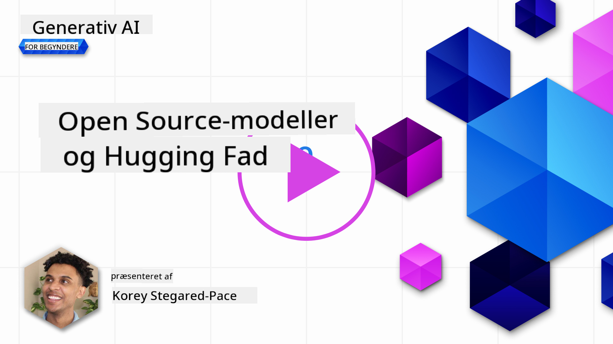
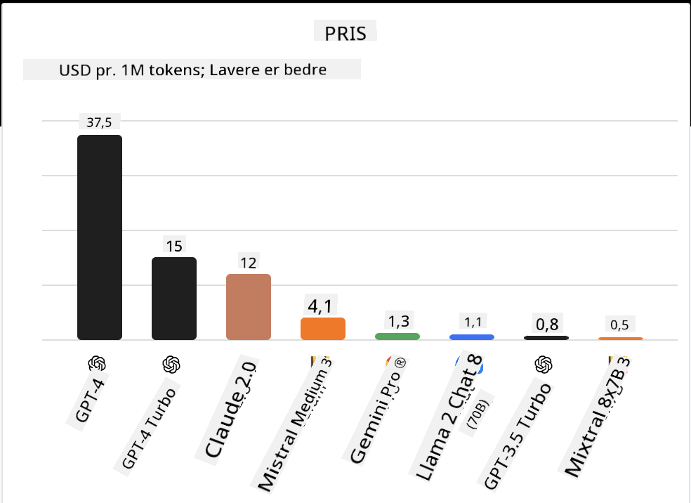
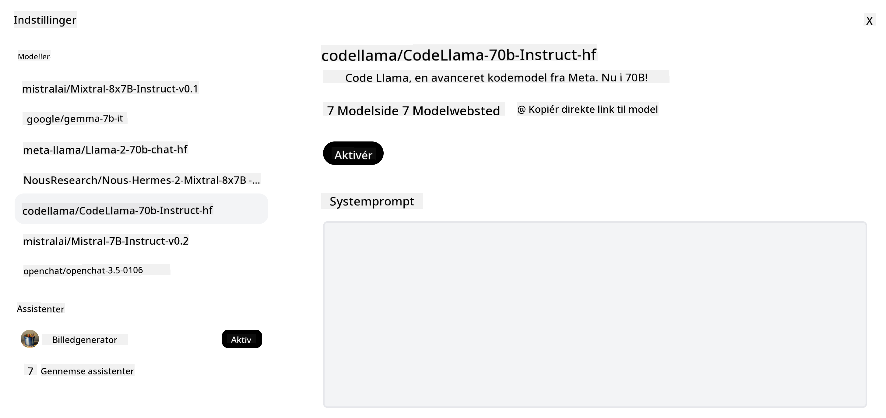

<!--
CO_OP_TRANSLATOR_METADATA:
{
  "original_hash": "0bba96e53ab841d99db731892a51fab8",
  "translation_date": "2025-07-09T17:10:55+00:00",
  "source_file": "16-open-source-models/README.md",
  "language_code": "da"
}
-->

## Introduktion

Verdenen af open source LLM’er er spændende og i konstant udvikling. Denne lektion har til formål at give et dybdegående indblik i open source modeller. Hvis du leder efter information om, hvordan proprietære modeller sammenlignes med open source modeller, kan du gå til ["Exploring and Comparing Different LLMs" lektionen](../02-exploring-and-comparing-different-llms/README.md?WT.mc_id=academic-105485-koreyst). Denne lektion vil også berøre emnet finjustering, men en mere detaljeret forklaring findes i ["Fine-Tuning LLMs" lektionen](../18-fine-tuning/README.md?WT.mc_id=academic-105485-koreyst).

## Læringsmål

- Få en forståelse af open source modeller  
- Forstå fordelene ved at arbejde med open source modeller  
- Udforske de åbne modeller, der findes på Hugging Face og Azure AI Studio  

## Hvad er Open Source Modeller?

Open source software har spillet en afgørende rolle i teknologiens vækst på tværs af forskellige områder. Open Source Initiative (OSI) har defineret [10 kriterier for software](https://web.archive.org/web/20241126001143/https://opensource.org/osd?WT.mc_id=academic-105485-koreyst) for at kunne klassificeres som open source. Kildekoden skal være frit tilgængelig under en licens godkendt af OSI.

Selvom udviklingen af LLM’er har lignende elementer som softwareudvikling, er processen ikke helt den samme. Dette har ført til megen debat i fællesskabet om definitionen af open source i forbindelse med LLM’er. For at en model kan opfylde den traditionelle definition af open source, bør følgende information være offentligt tilgængelig:

- Datasæt brugt til at træne modellen.  
- Fuldstændige modelvægtninger som en del af træningen.  
- Evalueringskoden.  
- Finjusteringskoden.  
- Fuldstændige modelvægtninger og træningsmålinger.  

Der findes i øjeblikket kun få modeller, der opfylder disse kriterier. [OLMo-modellen skabt af Allen Institute for Artificial Intelligence (AllenAI)](https://huggingface.co/allenai/OLMo-7B?WT.mc_id=academic-105485-koreyst) er et eksempel, der passer ind i denne kategori.

I denne lektion vil vi fremover omtale modellerne som "åbne modeller", da de muligvis ikke opfylder ovenstående kriterier på tidspunktet for skrivningen.

## Fordele ved Åbne Modeller

**Meget tilpasningsdygtige** – Da åbne modeller frigives med detaljeret træningsinformation, kan forskere og udviklere ændre modellens indre funktioner. Det gør det muligt at skabe meget specialiserede modeller, der er finjusteret til en bestemt opgave eller fagområde. Nogle eksempler på dette er kodegenerering, matematiske operationer og biologi.

**Omkostninger** – Omkostningen pr. token ved brug og implementering af disse modeller er lavere end for proprietære modeller. Når man bygger Generative AI-applikationer, bør man overveje forholdet mellem ydeevne og pris, når man arbejder med disse modeller i sin brugssituation.

  
Kilde: Artificial Analysis

**Fleksibilitet** – At arbejde med åbne modeller giver dig fleksibilitet i forhold til at bruge forskellige modeller eller kombinere dem. Et eksempel på dette er [HuggingChat Assistants](https://huggingface.co/chat?WT.mc_id=academic-105485-koreyst), hvor brugeren kan vælge den model, der skal anvendes, direkte i brugergrænsefladen:

## Udforskning af Forskellige Åbne Modeller

### Llama 2

[LLama2](https://huggingface.co/meta-llama?WT.mc_id=academic-105485-koreyst), udviklet af Meta, er en åben model, der er optimeret til chatbaserede applikationer. Det skyldes dens finjusteringsmetode, som inkluderede en stor mængde dialog og menneskelig feedback. Med denne metode producerer modellen flere resultater, der stemmer overens med menneskelige forventninger, hvilket giver en bedre brugeroplevelse.

Nogle eksempler på finjusterede versioner af Llama inkluderer [Japanese Llama](https://huggingface.co/elyza/ELYZA-japanese-Llama-2-7b?WT.mc_id=academic-105485-koreyst), som specialiserer sig i japansk, og [Llama Pro](https://huggingface.co/TencentARC/LLaMA-Pro-8B?WT.mc_id=academic-105485-koreyst), som er en forbedret version af basismodellen.

### Mistral

[Mistral](https://huggingface.co/mistralai?WT.mc_id=academic-105485-koreyst) er en åben model med stort fokus på høj ydeevne og effektivitet. Den bruger Mixture-of-Experts-tilgangen, som kombinerer en gruppe specialiserede ekspertmodeller i ét system, hvor visse modeller vælges afhængigt af inputtet. Det gør beregningen mere effektiv, da modeller kun håndterer de input, de er specialiserede i.

Nogle eksempler på finjusterede versioner af Mistral inkluderer [BioMistral](https://huggingface.co/BioMistral/BioMistral-7B?text=Mon+nom+est+Thomas+et+mon+principal?WT.mc_id=academic-105485-koreyst), som fokuserer på det medicinske område, og [OpenMath Mistral](https://huggingface.co/nvidia/OpenMath-Mistral-7B-v0.1-hf?WT.mc_id=academic-105485-koreyst), som udfører matematiske beregninger.

### Falcon

[Falcon](https://huggingface.co/tiiuae?WT.mc_id=academic-105485-koreyst) er en LLM skabt af Technology Innovation Institute (**TII**). Falcon-40B blev trænet på 40 milliarder parametre og har vist sig at præstere bedre end GPT-3 med et mindre beregningsbudget. Det skyldes brugen af FlashAttention-algoritmen og multiquery attention, som reducerer hukommelseskravene under inferens. Med denne reducerede inferenstid er Falcon-40B velegnet til chatapplikationer.

Nogle eksempler på finjusterede versioner af Falcon er [OpenAssistant](https://huggingface.co/OpenAssistant/falcon-40b-sft-top1-560?WT.mc_id=academic-105485-koreyst), en assistent bygget på åbne modeller, og [GPT4ALL](https://huggingface.co/nomic-ai/gpt4all-falcon?WT.mc_id=academic-105485-koreyst), som leverer højere ydeevne end basismodellen.

## Hvordan vælger man?

Der findes ikke ét entydigt svar på, hvordan man vælger en åben model. Et godt sted at starte er ved at bruge Azure AI Studios filterfunktion efter opgave. Det hjælper dig med at forstå, hvilke typer opgaver modellen er trænet til. Hugging Face vedligeholder også en LLM Leaderboard, som viser de bedst præsterende modeller baseret på visse målinger.

Når du vil sammenligne LLM’er på tværs af forskellige typer, er [Artificial Analysis](https://artificialanalysis.ai/?WT.mc_id=academic-105485-koreyst) en anden god ressource:

  
Kilde: Artificial Analysis

Hvis du arbejder med en specifik brugssituation, kan det være effektivt at søge efter finjusterede versioner, der fokuserer på samme område. At eksperimentere med flere åbne modeller for at se, hvordan de præsterer i forhold til dine og dine brugeres forventninger, er også en god fremgangsmåde.

## Næste skridt

Det bedste ved åbne modeller er, at du hurtigt kan komme i gang med at arbejde med dem. Tjek [Azure AI Studio Model Catalog](https://ai.azure.com?WT.mc_id=academic-105485-koreyst), som indeholder en specifik Hugging Face-samling med de modeller, vi har diskuteret her.

## Læringen stopper ikke her, fortsæt rejsen

Efter at have gennemført denne lektion, kan du tjekke vores [Generative AI Learning collection](https://aka.ms/genai-collection?WT.mc_id=academic-105485-koreyst) for at fortsætte med at udvikle din viden om Generative AI!

**Ansvarsfraskrivelse**:  
Dette dokument er blevet oversat ved hjælp af AI-oversættelsestjenesten [Co-op Translator](https://github.com/Azure/co-op-translator). Selvom vi bestræber os på nøjagtighed, bedes du være opmærksom på, at automatiserede oversættelser kan indeholde fejl eller unøjagtigheder. Det oprindelige dokument på dets oprindelige sprog bør betragtes som den autoritative kilde. For kritisk information anbefales professionel menneskelig oversættelse. Vi påtager os intet ansvar for misforståelser eller fejltolkninger, der opstår som følge af brugen af denne oversættelse.