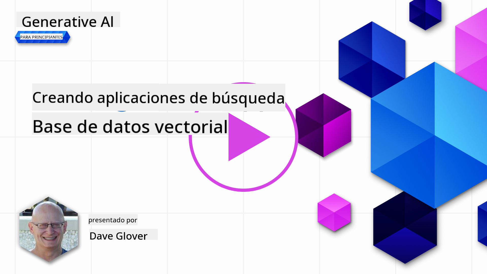
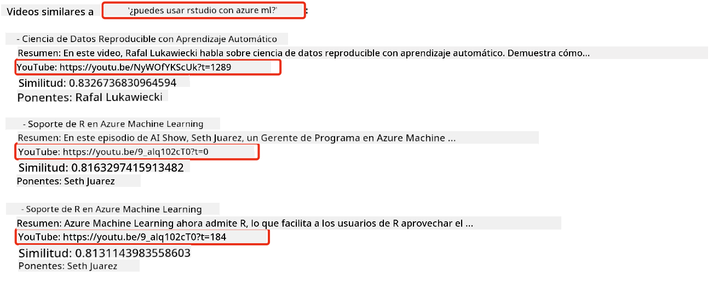
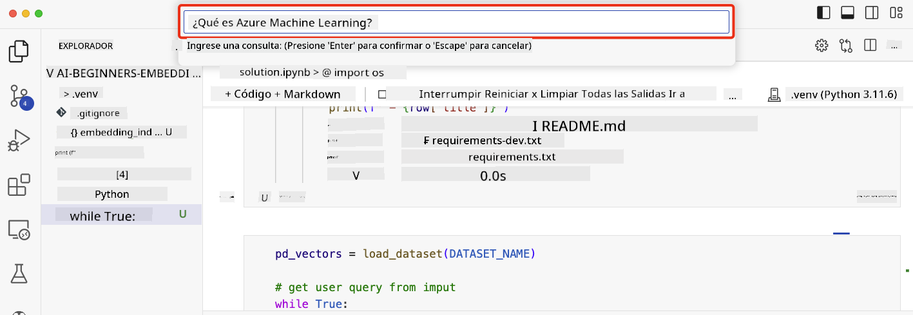

<!--
CO_OP_TRANSLATOR_METADATA:
{
  "original_hash": "d46aad0917a1a342d613e2c13d457da5",
  "translation_date": "2025-07-09T12:46:00+00:00",
  "source_file": "08-building-search-applications/README.md",
  "language_code": "es"
}
-->
# Construyendo aplicaciones de búsqueda

[](https://aka.ms/gen-ai-lesson8-gh?WT.mc_id=academic-105485-koreyst)

> > _Haz clic en la imagen de arriba para ver el video de esta lección_

Los LLMs no solo sirven para chatbots y generación de texto. También es posible crear aplicaciones de búsqueda usando Embeddings. Los Embeddings son representaciones numéricas de datos, también conocidas como vectores, y pueden usarse para búsquedas semánticas en datos.

En esta lección, vas a construir una aplicación de búsqueda para nuestra startup educativa. Nuestra startup es una organización sin fines de lucro que ofrece educación gratuita a estudiantes en países en desarrollo. Contamos con una gran cantidad de videos en YouTube que los estudiantes pueden usar para aprender sobre IA. Queremos crear una aplicación de búsqueda que permita a los estudiantes encontrar un video de YouTube escribiendo una pregunta.

Por ejemplo, un estudiante podría escribir '¿Qué son los Jupyter Notebooks?' o '¿Qué es Azure ML?' y la aplicación de búsqueda devolverá una lista de videos de YouTube relevantes para la pregunta y, mejor aún, la aplicación devolverá un enlace al lugar exacto en el video donde se encuentra la respuesta.

## Introducción

En esta lección cubriremos:

- Búsqueda semántica vs búsqueda por palabras clave.
- Qué son los Text Embeddings.
- Cómo crear un índice de Text Embeddings.
- Cómo buscar en un índice de Text Embeddings.

## Objetivos de aprendizaje

Al completar esta lección, podrás:

- Diferenciar entre búsqueda semántica y búsqueda por palabras clave.
- Explicar qué son los Text Embeddings.
- Crear una aplicación que use Embeddings para buscar datos.

## ¿Por qué construir una aplicación de búsqueda?

Crear una aplicación de búsqueda te ayudará a entender cómo usar Embeddings para buscar datos. También aprenderás a construir una aplicación que los estudiantes puedan usar para encontrar información rápidamente.

La lección incluye un índice de Embeddings de las transcripciones de YouTube del canal [AI Show](https://www.youtube.com/playlist?list=PLlrxD0HtieHi0mwteKBOfEeOYf0LJU4O1) de Microsoft. AI Show es un canal de YouTube que enseña sobre IA y aprendizaje automático. El índice de Embeddings contiene los Embeddings de cada transcripción de YouTube hasta octubre de 2023. Usarás este índice para construir la aplicación de búsqueda para nuestra startup. La aplicación devolverá un enlace al lugar en el video donde se encuentra la respuesta a la pregunta. Esta es una excelente forma para que los estudiantes encuentren la información que necesitan rápidamente.

A continuación, un ejemplo de una consulta semántica para la pregunta '¿se puede usar rstudio con azure ml?'. Observa la URL de YouTube, verás que contiene una marca de tiempo que te lleva al lugar exacto en el video donde está la respuesta.



## ¿Qué es la búsqueda semántica?

Quizás te preguntes, ¿qué es la búsqueda semántica? La búsqueda semántica es una técnica que utiliza la semántica, o el significado, de las palabras en una consulta para devolver resultados relevantes.

Aquí tienes un ejemplo de búsqueda semántica. Supongamos que quieres comprar un auto y buscas 'mi auto soñado'. La búsqueda semántica entiende que no estás `soñando` con un auto, sino que buscas tu auto `ideal`. La búsqueda semántica capta tu intención y devuelve resultados relevantes. La alternativa es la `búsqueda por palabras clave`, que buscaría literalmente sueños sobre autos y a menudo devuelve resultados irrelevantes.

## ¿Qué son los Text Embeddings?

[Text embeddings](https://en.wikipedia.org/wiki/Word_embedding?WT.mc_id=academic-105485-koreyst) son una técnica de representación de texto usada en [procesamiento de lenguaje natural](https://en.wikipedia.org/wiki/Natural_language_processing?WT.mc_id=academic-105485-koreyst). Los Text Embeddings son representaciones numéricas semánticas del texto. Los Embeddings se usan para representar datos de forma que una máquina pueda entender fácilmente. Existen muchos modelos para crear Text Embeddings; en esta lección nos enfocaremos en generar embeddings usando el modelo de OpenAI Embedding.

Aquí un ejemplo, imagina que el siguiente texto está en la transcripción de uno de los episodios del canal AI Show en YouTube:

```text
Today we are going to learn about Azure Machine Learning.
```

Pasaríamos el texto a la API de OpenAI Embedding y esta devolvería el siguiente embedding compuesto por 1536 números, también llamado vector. Cada número en el vector representa un aspecto diferente del texto. Para abreviar, aquí están los primeros 10 números del vector.

```python
[-0.006655829958617687, 0.0026128944009542465, 0.008792596869170666, -0.02446001023054123, -0.008540431968867779, 0.022071078419685364, -0.010703742504119873, 0.003311325330287218, -0.011632772162556648, -0.02187200076878071, ...]
```

## ¿Cómo se crea el índice de Embeddings?

El índice de Embeddings para esta lección fue creado con una serie de scripts en Python. Encontrarás los scripts junto con las instrucciones en el [README](./scripts/README.md?WT.mc_id=academic-105485-koreyst) dentro de la carpeta 'scripts' de esta lección. No necesitas ejecutar estos scripts para completar la lección, ya que el índice de Embeddings está proporcionado.

Los scripts realizan las siguientes operaciones:

1. Se descarga la transcripción de cada video de YouTube en la lista de reproducción [AI Show](https://www.youtube.com/playlist?list=PLlrxD0HtieHi0mwteKBOfEeOYf0LJU4O1).
2. Usando [OpenAI Functions](https://learn.microsoft.com/azure/ai-services/openai/how-to/function-calling?WT.mc_id=academic-105485-koreyst), se intenta extraer el nombre del orador de los primeros 3 minutos de la transcripción. El nombre del orador para cada video se almacena en el índice de Embeddings llamado `embedding_index_3m.json`.
3. Luego, el texto de la transcripción se divide en **segmentos de texto de 3 minutos**. Cada segmento incluye unas 20 palabras superpuestas con el siguiente segmento para asegurar que el Embedding no se corte y para proporcionar mejor contexto en la búsqueda.
4. Cada segmento de texto se pasa a la API de OpenAI Chat para resumirlo en 60 palabras. El resumen también se almacena en el índice de Embeddings `embedding_index_3m.json`.
5. Finalmente, el texto del segmento se pasa a la API de OpenAI Embedding. La API devuelve un vector de 1536 números que representan el significado semántico del segmento. El segmento junto con el vector de OpenAI Embedding se almacenan en el índice de Embeddings `embedding_index_3m.json`.

### Bases de datos vectoriales

Para simplificar la lección, el índice de Embeddings se almacena en un archivo JSON llamado `embedding_index_3m.json` y se carga en un DataFrame de Pandas. Sin embargo, en producción, el índice de Embeddings se almacenaría en una base de datos vectorial como [Azure Cognitive Search](https://learn.microsoft.com/training/modules/improve-search-results-vector-search?WT.mc_id=academic-105485-koreyst), [Redis](https://cookbook.openai.com/examples/vector_databases/redis/readme?WT.mc_id=academic-105485-koreyst), [Pinecone](https://cookbook.openai.com/examples/vector_databases/pinecone/readme?WT.mc_id=academic-105485-koreyst), [Weaviate](https://cookbook.openai.com/examples/vector_databases/weaviate/readme?WT.mc_id=academic-105485-koreyst), entre otras.

## Entendiendo la similitud coseno

Ya aprendimos sobre los text embeddings, el siguiente paso es aprender a usarlos para buscar datos y, en particular, encontrar los embeddings más similares a una consulta dada usando la similitud coseno.

### ¿Qué es la similitud coseno?

La similitud coseno es una medida de similitud entre dos vectores, también conocida como `búsqueda del vecino más cercano`. Para realizar una búsqueda por similitud coseno necesitas _vectorizar_ el texto de la _consulta_ usando la API de OpenAI Embedding. Luego calculas la _similitud coseno_ entre el vector de la consulta y cada vector en el índice de Embeddings. Recuerda que el índice tiene un vector para cada segmento de texto de la transcripción de YouTube. Finalmente, ordenas los resultados por similitud coseno y los segmentos con mayor similitud son los más parecidos a la consulta.

Desde un punto de vista matemático, la similitud coseno mide el coseno del ángulo entre dos vectores proyectados en un espacio multidimensional. Esta medida es útil porque dos documentos pueden estar alejados en distancia euclidiana por tamaño, pero aún así tener un ángulo pequeño entre ellos y por lo tanto una similitud coseno alta. Para más información sobre las ecuaciones de similitud coseno, consulta [Similitud coseno](https://en.wikipedia.org/wiki/Cosine_similarity?WT.mc_id=academic-105485-koreyst).

## Construyendo tu primera aplicación de búsqueda

A continuación, aprenderemos a construir una aplicación de búsqueda usando Embeddings. La aplicación permitirá a los estudiantes buscar un video escribiendo una pregunta. La aplicación devolverá una lista de videos relevantes para la pregunta y también un enlace al lugar en el video donde está la respuesta.

Esta solución fue construida y probada en Windows 11, macOS y Ubuntu 22.04 usando Python 3.10 o superior. Puedes descargar Python desde [python.org](https://www.python.org/downloads/?WT.mc_id=academic-105485-koreyst).

## Tarea - construir una aplicación de búsqueda para ayudar a los estudiantes

Presentamos nuestra startup al inicio de esta lección. Ahora es momento de que los estudiantes construyan una aplicación de búsqueda para sus evaluaciones.

En esta tarea, crearás los servicios de Azure OpenAI que se usarán para construir la aplicación de búsqueda. Crearás los siguientes servicios de Azure OpenAI. Necesitarás una suscripción de Azure para completar esta tarea.

### Iniciar Azure Cloud Shell

1. Inicia sesión en el [portal de Azure](https://portal.azure.com/?WT.mc_id=academic-105485-koreyst).
2. Selecciona el ícono de Cloud Shell en la esquina superior derecha del portal de Azure.
3. Selecciona **Bash** como tipo de entorno.

#### Crear un grupo de recursos

> Para estas instrucciones, usaremos el grupo de recursos llamado "semantic-video-search" en East US.
> Puedes cambiar el nombre del grupo de recursos, pero si cambias la ubicación de los recursos,
> revisa la [tabla de disponibilidad de modelos](https://aka.ms/oai/models?WT.mc_id=academic-105485-koreyst).

```shell
az group create --name semantic-video-search --location eastus
```

#### Crear un recurso de Azure OpenAI Service

Desde Azure Cloud Shell, ejecuta el siguiente comando para crear un recurso de Azure OpenAI Service.

```shell
az cognitiveservices account create --name semantic-video-openai --resource-group semantic-video-search \
    --location eastus --kind OpenAI --sku s0
```

#### Obtener el endpoint y las claves para usar en esta aplicación

Desde Azure Cloud Shell, ejecuta los siguientes comandos para obtener el endpoint y las claves del recurso Azure OpenAI Service.

```shell
az cognitiveservices account show --name semantic-video-openai \
   --resource-group  semantic-video-search | jq -r .properties.endpoint
az cognitiveservices account keys list --name semantic-video-openai \
   --resource-group semantic-video-search | jq -r .key1
```

#### Desplegar el modelo OpenAI Embedding

Desde Azure Cloud Shell, ejecuta el siguiente comando para desplegar el modelo OpenAI Embedding.

```shell
az cognitiveservices account deployment create \
    --name semantic-video-openai \
    --resource-group  semantic-video-search \
    --deployment-name text-embedding-ada-002 \
    --model-name text-embedding-ada-002 \
    --model-version "2"  \
    --model-format OpenAI \
    --sku-capacity 100 --sku-name "Standard"
```

## Solución

Abre el [notebook de solución](../../../08-building-search-applications/python/aoai-solution.ipynb) en GitHub Codespaces y sigue las instrucciones en el Jupyter Notebook.

Cuando ejecutes el notebook, se te pedirá ingresar una consulta. La caja de entrada se verá así:



## ¡Buen trabajo! Continúa aprendiendo

Después de completar esta lección, visita nuestra [colección de aprendizaje de IA Generativa](https://aka.ms/genai-collection?WT.mc_id=academic-105485-koreyst) para seguir mejorando tus conocimientos en IA Generativa.

¡Dirígete a la Lección 9 donde veremos cómo [construir aplicaciones de generación de imágenes](../09-building-image-applications/README.md?WT.mc_id=academic-105485-koreyst)!

**Aviso legal**:  
Este documento ha sido traducido utilizando el servicio de traducción automática [Co-op Translator](https://github.com/Azure/co-op-translator). Aunque nos esforzamos por la precisión, tenga en cuenta que las traducciones automáticas pueden contener errores o inexactitudes. El documento original en su idioma nativo debe considerarse la fuente autorizada. Para información crítica, se recomienda la traducción profesional realizada por humanos. No nos hacemos responsables de malentendidos o interpretaciones erróneas derivadas del uso de esta traducción.