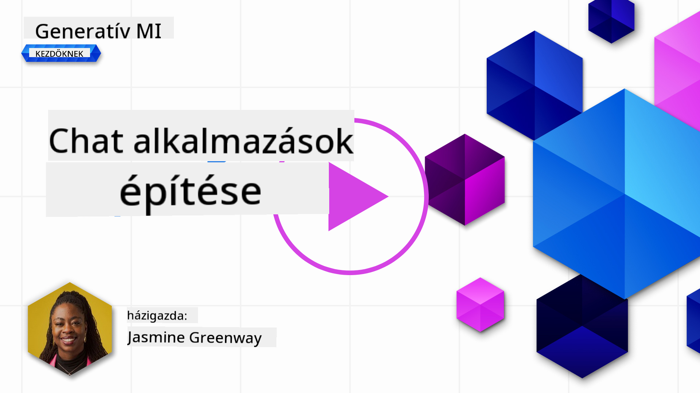
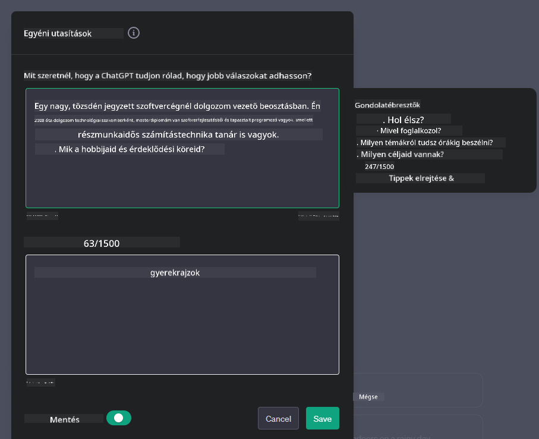

<!--
CO_OP_TRANSLATOR_METADATA:
{
  "original_hash": "ea4bbe640847aafbbba14dae4625e9af",
  "translation_date": "2025-07-09T12:37:39+00:00",
  "source_file": "07-building-chat-applications/README.md",
  "language_code": "hu"
}
-->
# Generatív MI-alapú csevegőalkalmazások fejlesztése

[](https://aka.ms/gen-ai-lessons7-gh?WT.mc_id=academic-105485-koreyst)

> _(Kattints a fenti képre a lecke videójának megtekintéséhez)_

Most, hogy láttuk, hogyan építhetünk szövegalkotó alkalmazásokat, nézzük meg a csevegőalkalmazásokat.

A csevegőalkalmazások mindennapjaink részévé váltak, és nem csupán alkalmi beszélgetések eszközei. Szerves részei az ügyfélszolgálatnak, a műszaki támogatásnak, sőt, akár kifinomult tanácsadó rendszereknek is. Valószínűleg nemrégiben te is kaptál segítséget egy csevegőalkalmazáson keresztül. Ahogy egyre fejlettebb technológiákat, például generatív MI-t integrálunk ezekbe a platformokba, nő a rendszer összetettsége, és vele együtt a kihívások is.

Néhány kérdés, amire választ kell találnunk:

- **Az alkalmazás fejlesztése**. Hogyan építhetjük hatékonyan és zökkenőmentesen ezeket az MI-alapú alkalmazásokat adott felhasználási esetekhez?
- **Felügyelet**. A telepítés után hogyan tudjuk monitorozni és biztosítani, hogy az alkalmazások a legmagasabb minőségi szinten működjenek, mind a funkcionalitás, mind a [felelős MI hat alapelve](https://www.microsoft.com/ai/responsible-ai?WT.mc_id=academic-105485-koreyst) betartása szempontjából?

Ahogy egyre inkább az automatizáció és a zökkenőmentes ember-gép interakciók kora felé haladunk, elengedhetetlen megérteni, hogyan alakítja át a generatív MI a csevegőalkalmazások terjedelmét, mélységét és alkalmazkodóképességét. Ez a lecke feltárja azokat az architekturális szempontokat, amelyek támogatják ezeket az összetett rendszereket, bemutatja a domain-specifikus feladatokra való finomhangolás módszereit, és értékeli azokat a mérőszámokat és megfontolásokat, amelyek a felelős MI alkalmazásához szükségesek.

## Bevezetés

Ez a lecke a következőket tárgyalja:

- Hatékony technikák csevegőalkalmazások fejlesztésére és integrálására.
- Testreszabás és finomhangolás alkalmazása az alkalmazásokon.
- Stratégiák és megfontolások a csevegőalkalmazások hatékony monitorozásához.

## Tanulási célok

A lecke végére képes leszel:

- Leírni a csevegőalkalmazások fejlesztésével és meglévő rendszerekbe való integrálásával kapcsolatos szempontokat.
- Testreszabni csevegőalkalmazásokat adott felhasználási esetekhez.
- Azonosítani a kulcsfontosságú mérőszámokat és megfontolásokat az MI-alapú csevegőalkalmazások minőségének hatékony monitorozásához és fenntartásához.
- Biztosítani, hogy a csevegőalkalmazások felelősen használják az MI-t.

## Generatív MI integrálása csevegőalkalmazásokba

A csevegőalkalmazások fejlesztése generatív MI segítségével nem csupán az intelligencia növeléséről szól; az architektúra, a teljesítmény és a felhasználói felület optimalizálásáról is, hogy minőségi felhasználói élményt nyújtsanak. Ez magában foglalja az architekturális alapok, az API-integrációk és a felhasználói felület szempontjainak vizsgálatát. Ez a rész átfogó útmutatót kínál a komplex területek eligazodásához, akár meglévő rendszerekbe illeszted be, akár önálló platformként építed fel őket.

A rész végére meglesz a szükséges szakértelmed a csevegőalkalmazások hatékony felépítéséhez és beillesztéséhez.

### Chatbot vagy csevegőalkalmazás?

Mielőtt belevágnánk a csevegőalkalmazások fejlesztésébe, hasonlítsuk össze a „chatbotokat” és az „MI-alapú csevegőalkalmazásokat”, amelyek eltérő szerepet és funkciókat töltenek be. Egy chatbot fő célja bizonyos beszélgetési feladatok automatizálása, például gyakran ismételt kérdések megválaszolása vagy csomagkövetés. Általában szabályalapú logika vagy összetett MI algoritmusok irányítják. Ezzel szemben egy MI-alapú csevegőalkalmazás sokkal tágabb környezet, amely különféle digitális kommunikációs formákat támogat, például szöveges, hang- és videócsevegést emberi felhasználók között. Meghatározó jellemzője egy generatív MI modell integrálása, amely árnyalt, emberihez hasonló beszélgetéseket szimulál, és válaszokat generál a különféle bemenetek és kontextuális jelek alapján. Egy generatív MI-alapú csevegőalkalmazás képes nyílt témájú beszélgetésekre, alkalmazkodik a változó kontextusokhoz, sőt kreatív vagy összetett párbeszédeket is létrehozhat.

Az alábbi táblázat összefoglalja a főbb különbségeket és hasonlóságokat, hogy jobban megértsük egyedi szerepüket a digitális kommunikációban.

| Chatbot                               | Generatív MI-alapú csevegőalkalmazás |
| ------------------------------------- | ------------------------------------ |
| Feladatorientált és szabályalapú      | Kontextusérzékeny                   |
| Gyakran nagyobb rendszerek része       | Egy vagy több chatbotot is tartalmazhat |
| Csak programozott funkciókra korlátozódik | Generatív MI modelleket használ     |
| Specializált és strukturált interakciók | Képes nyílt témájú beszélgetésekre  |

### Előre elkészített funkciók kihasználása SDK-kkal és API-kkal

Csevegőalkalmazás fejlesztésekor jó kiindulópont felmérni, mi áll már rendelkezésre. Az SDK-k és API-k használata előnyös stratégia több okból is. A jól dokumentált SDK-k és API-k integrálásával hosszú távon sikeresebbé teheted az alkalmazásodat, kezelve a skálázhatóság és karbantartás kihívásait.

- **Gyorsítja a fejlesztést és csökkenti a terheket**: Az előre elkészített funkciókra támaszkodva elkerülheted a költséges saját fejlesztést, így más, számodra fontosabb részekre koncentrálhatsz, például az üzleti logikára.
- **Jobb teljesítmény**: Ha mindent nulláról építesz, előbb-utóbb felmerül a kérdés: „Hogyan skálázódik? Képes az alkalmazás kezelni a hirtelen felhasználói rohamot?” A jól karbantartott SDK-k és API-k gyakran beépített megoldásokat kínálnak ezekre a problémákra.
- **Könnyebb karbantartás**: A frissítések és fejlesztések egyszerűbbek, mivel a legtöbb API és SDK csak egy könyvtár frissítését igényli az új verzió megjelenésekor.
- **Hozzáférés a legmodernebb technológiához**: Az olyan modellek használata, amelyeket finomhangoltak és kiterjedt adathalmazokon képeztek, természetes nyelvi képességekkel ruházza fel az alkalmazást.

Az SDK vagy API funkcióinak eléréséhez általában engedélyt kell szerezni a szolgáltatások használatára, ami gyakran egy egyedi kulcs vagy hitelesítő token használatával történik. Az OpenAI Python könyvtár segítségével megvizsgáljuk, hogyan néz ez ki a gyakorlatban. Ezt ki is próbálhatod a következő [OpenAI jegyzetfüzetben](../../../07-building-chat-applications/python/oai-assignment.ipynb) vagy az [Azure OpenAI Services jegyzetfüzetben](../../../07-building-chat-applications/python/aoai-assignment.ipynb) ehhez a leckéhez.

```python
import os
from openai import OpenAI

API_KEY = os.getenv("OPENAI_API_KEY","")

client = OpenAI(
    api_key=API_KEY
    )

chat_completion = client.chat.completions.create(model="gpt-3.5-turbo", messages=[{"role": "user", "content": "Suggest two titles for an instructional lesson on chat applications for generative AI."}])
```

A fenti példa a GPT-3.5 Turbo modellt használja a prompt kiegészítésére, de vedd észre, hogy az API kulcsot előzetesen be kell állítani. Kulcs nélkül hibát kapsz.

## Felhasználói élmény (UX)

Általános UX elvek érvényesek a csevegőalkalmazásokra, de itt néhány további szempont is fontosá válik a gépi tanulási komponensek miatt.

- **Ambiguitás kezelése**: A generatív MI modellek néha kétértelmű válaszokat adnak. Hasznos lehet egy olyan funkció, amely lehetővé teszi a felhasználók számára, hogy tisztázást kérjenek, ha ilyen problémába ütköznek.
- **Kontextus megőrzése**: A fejlett generatív MI modellek képesek megjegyezni a beszélgetés kontextusát, ami fontos lehet a felhasználói élmény szempontjából. Ha a felhasználók irányíthatják és kezelhetik a kontextust, az javítja az élményt, ugyanakkor kockázatot jelenthet érzékeny adatok megőrzése. Fontos megfontolni, mennyi ideig tároljuk ezeket az információkat, például megtartási szabályzat bevezetésével, hogy egyensúlyt teremtsünk a kontextus és az adatvédelem között.
- **Személyre szabás**: Az MI modellek tanulási és alkalmazkodási képessége révén személyre szabott élményt nyújtanak. A felhasználói profilokhoz hasonló funkciók nemcsak azt az érzést keltik, hogy a felhasználót megértik, hanem segítik a specifikus válaszok megtalálását, hatékonyabbá és kielégítőbbé téve az interakciót.

Egy ilyen személyre szabási példa az OpenAI ChatGPT „Egyéni utasítások” beállítása. Ez lehetővé teszi, hogy megadj olyan információkat magadról, amelyek fontos kontextust adhatnak a promptjaidhoz. Íme egy példa egy egyéni utasításra.



Ez a „profil” arra ösztönzi a ChatGPT-t, hogy egy tananyagot készítsen a láncolt listákról. Figyeld meg, hogy a ChatGPT figyelembe veszi, hogy a felhasználó mélyebb tananyagot szeretne a tapasztalatai alapján.


### A Microsoft rendszerüzenet keretrendszere nagy nyelvi modellekhez

[A Microsoft útmutatást adott](https://learn.microsoft.com/azure/ai-services/openai/concepts/system-message#define-the-models-output-format?WT.mc_id=academic-105485-koreyst) hatékony rendszerüzenetek írásához LLM-ek válaszainak generálásakor, négy területre bontva:

1. A modell célközönségének, képességeinek és korlátainak meghatározása.
2. A modell kimeneti formátumának definiálása.
3. Konkrét példák bemutatása, amelyek a modell kívánt viselkedését szemléltetik.
4. További viselkedési korlátok megadása.

### Akadálymentesség

Akár vizuális, hallási, mozgásbeli vagy kognitív fogyatékossággal él a felhasználó, egy jól megtervezett csevegőalkalmazásnak mindenki számára használhatónak kell lennie. Az alábbi lista konkrét funkciókat sorol fel, amelyek különböző fogyatékosságok esetén javítják az akadálymentességet.

- **Vizuális fogyatékosság esetén**: Magas kontrasztú témák és átméretezhető szöveg, képernyőolvasó kompatibilitás.
- **Hallási fogyatékosság esetén**: Szöveg-beszéddé és beszéd-szöveggé alakító funkciók, vizuális jelzések hangértesítésekhez.
- **Mozgáskorlátozottság esetén**: Billentyűzetes navigáció támogatása, hangparancsok.
- **Kognitív fogyatékosság esetén**: Egyszerűsített nyelvi opciók.

## Testreszabás és finomhangolás domain-specifikus nyelvi modellekhez

Képzelj el egy csevegőalkalmazást, amely érti a céged szakzsargonját, és előre látja a felhasználói bázis gyakori kérdéseit. Több megközelítés is létezik:

- **Domain-specifikus nyelvi modellek (DSL) használata**. A DSL egy adott területre specializált nyelvi modell, amely megérti annak fogalmait és helyzeteit.
- **Finomhangolás alkalmazása**. A finomhangolás a modell további képzése specifikus adatokkal.

## Testreszabás: DSL használata

A domain-specifikus nyelvi modellek (DSL modellek) használata növelheti a felhasználói elköteleződést, mivel specializált, kontextusban releváns interakciókat kínálnak. Ezek olyan modellek, amelyeket egy adott szakterület, iparág vagy téma megértésére és szöveg generálására képeztek vagy finomhangoltak. A DSL modellek használatának lehetőségei változatosak: lehet egyet nulláról tanítani, vagy meglévőket használni SDK-kon és API-kon keresztül. Egy másik lehetőség a finomhangolás, amikor egy előre betanított modellt adaptálunk egy adott domainre.

## Testreszabás: finomhangolás alkalmazása

A finomhangolást gyakran akkor alkalmazzák, ha egy előre betanított modell nem elég hatékony egy speciális területen vagy adott feladatban.

Például az orvosi kérdések összetettek és sok kontextust igényelnek. Amikor egy orvos diagnosztizál, számos tényezőt figyelembe vesz, például életmódot vagy meglévő betegségeket, és akár a legfrissebb orvosi szakirodalmat is felhasználhatja a diagnózis megerősítésére. Ilyen árnyalt helyzetekben egy általános célú MI csevegőalkalmazás nem lehet megbízható forrás.

### Példa: orvosi alkalmazás

Képzelj el egy csevegőalkalmazást, amely orvosi szakembereknek segít gyorsan hozzáférni kezelési irányelvekhez, gyógyszerkölcsönhatásokhoz vagy legfrissebb kutatási eredményekhez.

Egy általános modell megfelelő lehet alapvető orvosi kérdések megválaszolására vagy általános tanácsadásra, de nehézségekbe ütközhet az alábbi esetekben:

- **Nagyon specifikus vagy összetett esetek**. Például egy neurológus megkérdezheti: „Mik a jelenlegi legjobb gyakorlatok a gyógyszerrezisztens epilepszia kezelésére gyermekkorban?”
- **Hiányzó legfrissebb fejlesztések**. Egy általános modell nehezen tudja biztosítani a legújabb neurológiai és farmakológiai eredményeket tartalmazó választ.

Ilyen esetekben a modell finomhangolása egy speciális orvosi adathalmazon jelentősen javíthatja a bonyolult orvosi kérdések pontosabb és megbízhatóbb kezelését. Ehhez hozzáférés szükséges egy nagy és releváns adathalmazhoz, amely lefedi a domain-specifikus kihívásokat és kérdéseket.

## Szempontok a magas minőségű MI-alapú csevegőélményhez


| **Anomáliafelismerés**         | Eszközök és technikák a szokatlan minták azonosítására, amelyek nem felelnek meg a várt viselkedésnek.                        | Hogyan fogsz reagálni az anomáliákra?                                        |

### Felelős MI-gyakorlatok bevezetése csevegőalkalmazásokban

A Microsoft felelős MI-hez való hozzáállása hat alapelvet határozott meg, amelyeknek irányítaniuk kell az MI fejlesztését és használatát. Az alábbiakban megtalálod az alapelveket, azok meghatározását, valamint azt, hogy a csevegőfejlesztőnek mire kell figyelnie, és miért fontos ezeket komolyan venni.

| Alapelvek              | A Microsoft meghatározása                             | Figyelembe veendő szempontok a csevegőfejlesztő számára               | Miért fontos                                                                        |
| ---------------------- | ----------------------------------------------------- | -------------------------------------------------------------------- | ---------------------------------------------------------------------------------- |
| Méltányosság           | Az MI rendszereknek mindenkit igazságosan kell kezelniük. | Biztosítsd, hogy a csevegőalkalmazás ne diszkrimináljon a felhasználói adatok alapján. | A felhasználók bizalmának és befogadásának erősítése; jogi következmények elkerülése. |
| Megbízhatóság és biztonság | Az MI rendszereknek megbízhatóan és biztonságosan kell működniük. | Vezess be tesztelést és védelmi mechanizmusokat a hibák és kockázatok minimalizálására. | Felhasználói elégedettség biztosítása és esetleges károk megelőzése.                 |
| Adatvédelem és biztonság | Az MI rendszereknek biztonságosnak kell lenniük, és tiszteletben kell tartaniuk a magánszférát. | Alkalmazz erős titkosítást és adatvédelmi intézkedéseket.             | A felhasználók érzékeny adatainak védelme és az adatvédelmi törvények betartása.     |
| Befogadás              | Az MI rendszereknek mindenkit erősíteniük és bevonniuk kell az embereket. | Tervezd meg a felhasználói felületet úgy, hogy az hozzáférhető és könnyen használható legyen különböző közönségek számára. | Biztosítja, hogy szélesebb körben használható legyen az alkalmazás.                 |
| Átláthatóság           | Az MI rendszereknek érthetőnek kell lenniük.          | Biztosíts világos dokumentációt és magyarázatot az MI válaszairól.    | A felhasználók nagyobb valószínűséggel bíznak egy rendszerben, ha értik a döntések hátterét. |
| Felelősségre vonhatóság | Az embereknek felelősséget kell vállalniuk az MI rendszerekért. | Hozz létre egyértelmű folyamatot az MI döntések auditálására és fejlesztésére. | Lehetővé teszi a folyamatos fejlesztést és a hibák esetén a korrekciót.             |

## Feladat

Nézd meg a [feladatot](../../../07-building-chat-applications/python), amely végigvezet egy sor gyakorlaton az első csevegőparancsok futtatásától kezdve a szöveg osztályozásán és összefoglalásán át még sok másig. Figyeld meg, hogy a feladatok több programozási nyelven is elérhetők!

## Szép munka! Folytasd az utat

A lecke elvégzése után nézd meg a [Generatív MI tanulási gyűjteményünket](https://aka.ms/genai-collection?WT.mc_id=academic-105485-koreyst), hogy tovább fejleszthesd generatív MI ismereteidet!

Lépj tovább a 8. leckére, hogy megtudd, hogyan kezdhetsz el [keresőalkalmazásokat építeni](../08-building-search-applications/README.md?WT.mc_id=academic-105485-koreyst)!

**Jogi nyilatkozat**:  
Ez a dokumentum az AI fordító szolgáltatás, a [Co-op Translator](https://github.com/Azure/co-op-translator) segítségével készült. Bár a pontosságra törekszünk, kérjük, vegye figyelembe, hogy az automatikus fordítások hibákat vagy pontatlanságokat tartalmazhatnak. Az eredeti dokumentum az anyanyelvén tekintendő hiteles forrásnak. Fontos információk esetén professzionális emberi fordítást javaslunk. Nem vállalunk felelősséget a fordítás használatából eredő félreértésekért vagy téves értelmezésekért.