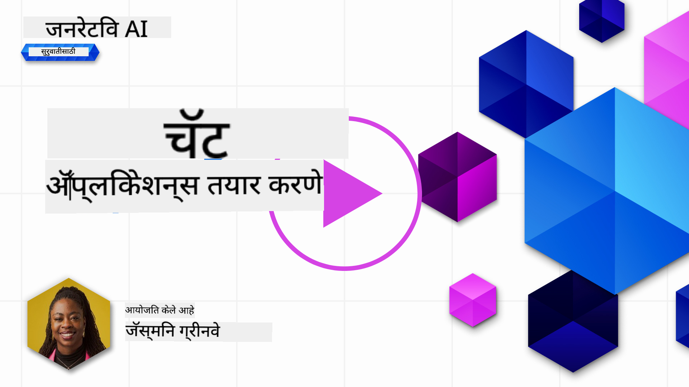
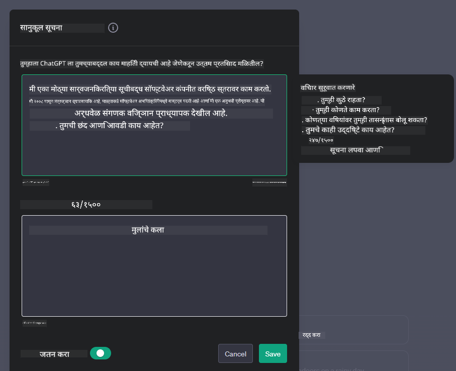

<!--
CO_OP_TRANSLATOR_METADATA:
{
  "original_hash": "ea4bbe640847aafbbba14dae4625e9af",
  "translation_date": "2025-07-09T12:22:49+00:00",
  "source_file": "07-building-chat-applications/README.md",
  "language_code": "mr"
}
-->
# जनरेटिव AI-शक्तीने चालणाऱ्या चॅट अनुप्रयोगांची निर्मिती

[](https://aka.ms/gen-ai-lessons7-gh?WT.mc_id=academic-105485-koreyst)

> _(वरील प्रतिमा क्लिक करून या धड्याचा व्हिडिओ पाहा)_

आता आपण पाहिले की आपण मजकूर-निर्मिती अॅप्स कसे तयार करू शकतो, तर चला चॅट अनुप्रयोगांकडे पाहूया.

चॅट अनुप्रयोग आपल्या दैनंदिन जीवनाचा अविभाज्य भाग बनले आहेत, जे फक्त साध्या संभाषणासाठी नव्हे तर ग्राहक सेवा, तांत्रिक सहाय्य आणि अगदी प्रगत सल्लागार प्रणालींचा भाग आहेत. कदाचित तुम्हाला अलीकडेच एखाद्या चॅट अनुप्रयोगाकडून मदत मिळाली असेल. जेव्हा आपण या प्लॅटफॉर्ममध्ये जनरेटिव AI सारख्या प्रगत तंत्रज्ञानाचा समावेश करतो, तेव्हा गुंतागुंत वाढते आणि त्याचबरोबर आव्हानंही वाढतात.

आपल्याला उत्तर द्यावयाच्या काही प्रश्नांमध्ये समाविष्ट आहेत:

- **अॅप तयार करणे**. विशिष्ट वापरासाठी या AI-शक्तीने चालणाऱ्या अनुप्रयोगांना प्रभावीपणे कसे तयार करावे आणि सहजपणे समाकलित करावे?
- **निगराणी**. एकदा तैनात केल्यानंतर, अनुप्रयोग कार्यक्षमतेने आणि [जबाबदार AI च्या सहा तत्त्वांचे](https://www.microsoft.com/ai/responsible-ai?WT.mc_id=academic-105485-koreyst) पालन करत आहेत याची कशी खात्री करावी?

आपोआप चालणाऱ्या आणि माणूस-मशीन संवादाच्या युगात पुढे जाताना, जनरेटिव AI चॅट अनुप्रयोगांच्या व्याप्ती, खोलाई आणि अनुकूलतेत कसा बदल घडवून आणतो हे समजून घेणे आवश्यक आहे. हा धडा या गुंतागुंतीच्या प्रणालींना आधार देणाऱ्या आर्किटेक्चरच्या पैलूंवर प्रकाश टाकेल, डोमेन-विशिष्ट कार्यांसाठी त्यांना कसे फाइन-ट्यून करायचे यावर चर्चा करेल, आणि जबाबदार AI तैनातीसाठी आवश्यक मेट्रिक्स आणि विचारसरणींचे मूल्यमापन करेल.

## परिचय

हा धडा खालील गोष्टींचा समावेश करतो:

- चॅट अनुप्रयोग प्रभावीपणे तयार करण्याच्या आणि समाकलित करण्याच्या तंत्रांचा आढावा.
- अनुप्रयोगांमध्ये सानुकूलन आणि फाइन-ट्यूनिंग कसे लागू करायचे.
- चॅट अनुप्रयोगांची प्रभावी निगराणी करण्याच्या धोरणे आणि विचार.

## शिकण्याचे उद्दिष्ट

या धड्याच्या शेवटी, तुम्ही सक्षम असाल:

- चॅट अनुप्रयोग तयार करताना आणि विद्यमान प्रणालींमध्ये समाकलित करताना विचारात घेण्याच्या बाबींचे वर्णन करणे.
- विशिष्ट वापरासाठी चॅट अनुप्रयोग सानुकूलित करणे.
- AI-शक्तीने चालणाऱ्या चॅट अनुप्रयोगांच्या गुणवत्तेची प्रभावी निगराणी आणि देखभाल करण्यासाठी महत्त्वाच्या मेट्रिक्स आणि विचार ओळखणे.
- चॅट अनुप्रयोग जबाबदारीने AI वापरतात याची खात्री करणे.

## जनरेटिव AI चॅट अनुप्रयोगांमध्ये समाकलित करणे

चॅट अनुप्रयोगांना जनरेटिव AI ने उंचावणे म्हणजे फक्त त्यांना हुशार बनवणे नाही; तर त्यांची आर्किटेक्चर, कार्यक्षमता आणि वापरकर्ता इंटरफेस यांचा दर्जा सुधारून उत्कृष्ट वापरकर्ता अनुभव देणे होय. यात आर्किटेक्चरल पाया, API समाकलन आणि UI विचारांचा अभ्यास समाविष्ट आहे. हा विभाग तुम्हाला या गुंतागुंतीच्या क्षेत्रांमध्ये मार्गदर्शन करण्यासाठी एक संपूर्ण रोडमॅप देण्याचा उद्देश ठेवतो, मग तुम्ही त्यांना विद्यमान प्रणालींमध्ये जोडत असाल किंवा स्वतंत्र प्लॅटफॉर्म म्हणून तयार करत असाल.

या विभागाच्या शेवटी, तुम्हाला चॅट अनुप्रयोग प्रभावीपणे तयार करण्यासाठी आणि समाकलित करण्यासाठी आवश्यक कौशल्ये प्राप्त होतील.

### चॅटबॉट की चॅट अनुप्रयोग?

चॅट अनुप्रयोग तयार करण्यापूर्वी, 'चॅटबॉट' आणि 'AI-शक्तीने चालणाऱ्या चॅट अनुप्रयोग' यांची तुलना करूया, कारण त्यांचे वेगळे कार्य आणि वैशिष्ट्ये आहेत. चॅटबॉटचा मुख्य उद्देश विशिष्ट संभाषणात्मक कार्ये स्वयंचलित करणे आहे, जसे की वारंवार विचारले जाणारे प्रश्नांची उत्तरे देणे किंवा पॅकेज ट्रॅक करणे. तो सामान्यतः नियम-आधारित लॉजिक किंवा गुंतागुंतीच्या AI अल्गोरिदमवर चालतो. त्याच्या उलट, AI-शक्तीने चालणारा चॅट अनुप्रयोग हा एक विस्तृत वातावरण आहे जो मानवी वापरकर्त्यांमधील मजकूर, आवाज आणि व्हिडिओ चॅटसारख्या विविध डिजिटल संवादांना सुलभ करतो. त्याची मुख्य वैशिष्ट्य म्हणजे जनरेटिव AI मॉडेलचा समावेश, जो सूक्ष्म, मानवी-समान संभाषणे तयार करतो, विविध इनपुट आणि संदर्भानुसार प्रतिसाद निर्माण करतो. जनरेटिव AI-शक्तीने चालणारा चॅट अनुप्रयोग मुक्त विषयांवर चर्चा करू शकतो, बदलत्या संभाषण संदर्भानुसार जुळवून घेऊ शकतो, आणि अगदी सर्जनशील किंवा गुंतागुंतीचे संवादही तयार करू शकतो.

खालील तक्ता त्यांच्या मुख्य फरक आणि साम्ये दाखवतो, ज्यामुळे त्यांची डिजिटल संवादातील वेगळी भूमिका समजून घेता येईल.

| चॅटबॉट                               | जनरेटिव AI-शक्तीने चालणारा चॅट अनुप्रयोग |
| ------------------------------------- | ------------------------------------------ |
| कार्य-केंद्रित आणि नियम-आधारित       | संदर्भ-जाणकार                              |
| मोठ्या प्रणालींमध्ये समाकलित केलेले   | एक किंवा अनेक चॅटबॉट होस्ट करू शकतो       |
| प्रोग्राम केलेल्या कार्यांपुरते मर्यादित | जनरेटिव AI मॉडेल्सचा समावेश               |
| विशेषीकृत आणि संरचित संवाद             | मुक्त विषयांवर चर्चा करण्यास सक्षम          |

### SDKs आणि APIs सह पूर्वनिर्मित कार्यक्षमता वापरणे

चॅट अनुप्रयोग तयार करताना, आधीपासून काय उपलब्ध आहे हे तपासणे एक चांगला प्रारंभिक टप्पा आहे. SDKs आणि APIs वापरून चॅट अनुप्रयोग तयार करणे अनेक कारणांसाठी फायदेशीर धोरण आहे. चांगल्या प्रकारे दस्तऐवजीकृत SDKs आणि APIs समाकलित करून, तुम्ही तुमच्या अनुप्रयोगाला दीर्घकालीन यशासाठी योग्य स्थान देत आहात, ज्यामुळे स्केलेबिलिटी आणि देखभाल संबंधित समस्या सोडवता येतात.

- **विकास प्रक्रिया वेगवान होते आणि ओव्हरहेड कमी होतो**: स्वतः कार्यक्षमता तयार करण्याच्या महागड्या प्रक्रियेऐवजी पूर्वनिर्मित कार्यक्षमता वापरल्याने तुम्ही तुमच्या अनुप्रयोगाच्या इतर महत्त्वाच्या भागांवर लक्ष केंद्रित करू शकता, जसे की व्यवसाय लॉजिक.
- **चांगली कार्यक्षमता**: कार्यक्षमता सुरुवातीपासून तयार करताना तुम्हाला "हे कसे स्केल होते? हा अनुप्रयोग अचानक वापरकर्त्यांच्या वाढीला कसा हाताळेल?" असे प्रश्न पडू शकतात. चांगल्या देखभालीखालील SDKs आणि APIs मध्ये या समस्यांसाठी अंतर्निर्मित उपाय असतात.
- **सुलभ देखभाल**: बहुतेक APIs आणि SDKs मध्ये नवीन आवृत्ती आल्यावर फक्त लायब्ररी अपडेट करणे आवश्यक असते, ज्यामुळे सुधारणा आणि अद्यतने सोपी होतात.
- **आधुनिक तंत्रज्ञानाचा वापर**: विस्तृत डेटासेटवर प्रशिक्षित आणि फाइन-ट्यून केलेले मॉडेल्स वापरल्याने तुमच्या अनुप्रयोगाला नैसर्गिक भाषा क्षमता मिळतात.

SDK किंवा API ची कार्यक्षमता वापरण्यासाठी सहसा दिलेल्या सेवा वापरण्याची परवानगी मिळवावी लागते, जी सामान्यतः युनिक की किंवा प्रमाणीकरण टोकनद्वारे होते. आपण OpenAI Python लायब्ररी वापरून हे कसे दिसते ते पाहू. तुम्ही स्वतःसाठी खालील [OpenAI साठी नोटबुक](../../../07-building-chat-applications/python/oai-assignment.ipynb) किंवा [Azure OpenAI Services साठी नोटबुक](../../../07-building-chat-applications/python/aoai-assignment.ipynb) वापरूनही प्रयत्न करू शकता.

```python
import os
from openai import OpenAI

API_KEY = os.getenv("OPENAI_API_KEY","")

client = OpenAI(
    api_key=API_KEY
    )

chat_completion = client.chat.completions.create(model="gpt-3.5-turbo", messages=[{"role": "user", "content": "Suggest two titles for an instructional lesson on chat applications for generative AI."}])
```

वरील उदाहरणात GPT-3.5 Turbo मॉडेल वापरून प्रॉम्प्ट पूर्ण केला आहे, पण लक्षात घ्या की API की आधी सेट केली जाते. की नसेल तर तुम्हाला त्रुटी येईल.

## वापरकर्ता अनुभव (UX)

सामान्य UX तत्त्वे चॅट अनुप्रयोगांवर लागू होतात, पण मशीन लर्निंग घटकांमुळे काही अतिरिक्त विचार महत्त्वाचे ठरतात.

- **अस्पष्टतेवर मात करण्याची यंत्रणा**: जनरेटिव AI मॉडेल कधी कधी अस्पष्ट उत्तरे तयार करतात. वापरकर्त्यांना स्पष्टीकरण मागण्याची सुविधा दिल्यास ही समस्या सोपी होते.
- **संदर्भ राखणे**: प्रगत जनरेटिव AI मॉडेल संभाषणातील संदर्भ लक्षात ठेवू शकतात, जे वापरकर्ता अनुभवासाठी आवश्यक आहे. वापरकर्त्यांना संदर्भ नियंत्रित करण्याची आणि व्यवस्थापित करण्याची क्षमता देणे चांगले आहे, पण त्यातून संवेदनशील माहिती जपण्याचा धोका निर्माण होतो. माहिती किती काळ साठवायची यासाठी धोरण (जसे की रिटेन्शन पॉलिसी) ठरवणे गोपनीयतेसाठी संतुलन साधू शकते.
- **वैयक्तिकरण**: शिकण्याची आणि जुळवून घेण्याची क्षमता असलेल्या AI मॉडेल्समुळे वापरकर्त्याला वैयक्तिक अनुभव मिळतो. वापरकर्ता प्रोफाइल सारख्या वैशिष्ट्यांमुळे वापरकर्त्याला समजल्याचा अनुभव येतो आणि विशिष्ट उत्तर शोधण्याचा प्रयत्न अधिक कार्यक्षम आणि समाधानकारक होतो.

वैयक्तिकरणाचे एक उदाहरण म्हणजे OpenAI च्या ChatGPT मधील "Custom instructions" सेटिंग्ज. यात तुम्ही तुमच्याबद्दल महत्त्वाची माहिती देऊ शकता जी प्रॉम्प्टसाठी संदर्भ ठरू शकते. खाली एक कस्टम इन्स्ट्रक्शनचे उदाहरण आहे.



हा "प्रोफाइल" ChatGPT ला लिंक्ड लिस्ट्सवर एक धडा योजना तयार करण्यास सांगतो. लक्षात घ्या की ChatGPT वापरकर्त्याच्या अनुभवावर आधारित अधिक सखोल धडा योजना तयार करते.


### मोठ्या भाषा मॉडेलसाठी Microsoft चे System Message Framework

[Microsoft ने मार्गदर्शन दिले आहे](https://learn.microsoft.com/azure/ai-services/openai/concepts/system-message#define-the-models-output-format?WT.mc_id=academic-105485-koreyst) LLMs कडून प्रतिसाद तयार करताना प्रभावी सिस्टम मेसेज लिहिण्यासाठी, जे ४ भागांमध्ये विभागले आहे:

1. मॉडेल कोणासाठी आहे, त्याच्या क्षमता आणि मर्यादा काय आहेत हे ठरवणे.
2. मॉडेलचा आउटपुट फॉरमॅट निश्चित करणे.
3. मॉडेलच्या अपेक्षित वर्तनाचे विशिष्ट उदाहरणे देणे.
4. अतिरिक्त वर्तनात्मक गार्डरेल्स प्रदान करणे.

### प्रवेशयोग्यता

वापरकर्त्याला दृष्टी, श्रवण, मोटर किंवा संज्ञानात्मक अडचणी असोत, एक चांगल्या डिझाइन केलेल्या चॅट अनुप्रयोगाचा वापर सर्वांनी करू शकावा. खालील यादी विविध वापरकर्ता अडचणींसाठी प्रवेशयोग्यता वाढवण्यासाठी विशिष्ट वैशिष्ट्ये दर्शवते.

- **दृष्टी अडचणीसाठी वैशिष्ट्ये**: उच्च कॉन्ट्रास्ट थीम्स आणि आकार बदलता येणारा मजकूर, स्क्रीन रीडर सुसंगतता.
- **श्रवण अडचणीसाठी वैशिष्ट्ये**: मजकूर-ते-ध्वनी आणि ध्वनी-ते-मजकूर कार्ये, ऑडिओ सूचना साठी दृश्य संकेत.
- **मोटर अडचणीसाठी वैशिष्ट्ये**: कीबोर्ड नेव्हिगेशन समर्थन, आवाज आदेश.
- **संज्ञानात्मक अडचणीसाठी वैशिष्ट्ये**: सोपी भाषा पर्याय.

## डोमेन-विशिष्ट भाषा मॉडेलसाठी सानुकूलन आणि फाइन-ट्यूनिंग

कल्पना करा की एक चॅट अनुप्रयोग तुमच्या कंपनीच्या विशेष भाषाशैलीला समजतो आणि वापरकर्त्यांच्या सामान्य प्रश्नांची अपेक्षा करतो. यासाठी काही पद्धती आहेत:

- **DSL मॉडेल्सचा वापर**. DSL म्हणजे डोमेन-विशिष्ट भाषा. तुम्ही विशिष्ट डोमेनवर प्रशिक्षित DSL मॉडेल वापरू शकता जे त्याच्या संकल्पना आणि परिस्थिती समजून घेते.
- **फाइन-ट्यूनिंग लागू करणे**. फाइन-ट्यूनिंग म्हणजे तुमच्या मॉडेलला विशिष्ट डेटासह अधिक प्रशिक्षण देणे.

## सानुकूलन: DSL वापरणे

डोमेन-विशिष्ट भाषा मॉडेल्स (DSL मॉडेल्स) वापरल्याने वापरकर्त्यांचा सहभाग वाढतो आणि विशेष, संदर्भानुसार संबंधित संवाद प्रदान होतात. हे असे मॉडेल आहे जे विशिष्ट क्षेत्र, उद्योग किंवा विषयाशी संबंधित मजकूर समजून घेण्यासाठी किंवा तयार करण्यासाठी प्रशिक्षित किंवा फाइन-ट्यून केलेले असते. DSL मॉडेल वापरण्याचे पर्याय म्हणजे सुरुवातीपासून प्रशिक्षण घेणे, किंवा SDKs आणि APIs द्वारे आधीपासून अस्तित्वात असलेले मॉडेल वापरणे. आणखी एक पर्याय म्हणजे फाइन-ट्यूनिंग, ज्यात आधीपासून प्रशिक्षित मॉडेलला विशिष्ट डोमेनसाठी अनुकूलित केले जाते.

## सानुकूलन: फाइन-ट्यूनिंग लागू करणे

फाइन-ट्यूनिंग सामान्यतः तेव्हा विचारात घेतले जाते जेव्हा पूर्वप्रशिक्षित मॉडेल विशिष्ट डोमेन किंवा कार्यासाठी अपुरी ठरते.

उदाहरणार्थ, वैद्यकीय प्रश्न गुंतागुंतीचे असतात आणि त्यासाठी भरपूर संदर्भ आवश्यक असतो. जेव्हा वैद्यकीय व्यावसायिक रुग्णाचे निदान करतो, तेव्हा तो जीवनशैली, आधीच्या आजारांचा इतिहास यांसारख्या अनेक घटकांवर आधारित असतो, आणि कधीकधी अलीकडील वैद्यकीय संशोधनावरही अवलंबून असतो. अशा सूक्ष्म परिस्थितीत, सामान्य AI चॅट अनुप्रयोग विश्वासार्ह स्रोत ठरू शकत नाही.

### उदाहरण: वैद्यकीय अनुप्रयोग

वैद्यकीय व्यावसायिकांना उपचार मार्गदर्शक तत्त्वे, औषधांच्या परस्परसंवादांची माहिती किंवा अलीकडील संशोधन शोधण्यात मदत करणारा चॅट अनुप्रयोग विचारात घ्या.

सामान्य मॉडेल मूलभूत वैद्यकीय प्रश्नांची उत्तरे देऊ शकते किंवा सामान्य सल्ला देऊ शकते, पण खालील बाबतीत अडचण येऊ शकते:

- **अत्यंत विशिष्ट किंवा गुंतागुंतीच्या प्रकरणांमध्ये**. उदाहरणार्थ, न्यूरोलॉजिस्ट "बालरोगांमध्ये औषध-प्रतिरोधक एपिलेप्सी व्यवस्थापनासाठी सध्याच्या सर्वोत्तम पद्धती काय आहेत?" असे विचारू शकतो.
- **अलीकडील प्रगतींचा अभाव**. सामान्य मॉडेलला न्यूरोलॉजी आणि फार्माकोलॉजीतील अलीकडील प्रगतींचा समावेश करून सध्याचे उत्तर देणे कठीण जाऊ शकते.

अशा परिस्थितीत, वैद्यकीय विशिष्ट डेटासेटसह मॉडेलचे फाइन-ट्यूनिंग केल्यास या गुंतागुंतीच्या वैद्यकीय प्रश्नांना अधिक अचूक आणि विश्वासार्ह उत्तर देण्याची क्षमता वाढते. यासाठी मोठ्या आणि संबंधित डेटासेटची आवश्यकता असते जी डोमेन-विशिष्ट आव्हाने आणि प्रश्न प्रतिबिंबित करते.

## उच्च दर्जाचा AI-चालित चॅट अनुभवासाठी विचार

हा विभाग "उच्च दर्जाच्या" चॅट अनुप्रयोगांसाठी निकष मांडतो, ज्यात क्रियाशील मेट्रिक्सची नोंद आणि AI तंत्रज्ञानाचा जबाबदारीने वापर करण्याचा फ्रेमवर्क यांचा समावेश आहे.

### महत्त्वाचे मेट्रिक्स

उच्च दर्जाची कार्यक्षमता राखण्यासाठी, अनुप्रयोगाच्या कार्यक्षमतेसाठी आणि AI मॉडेल व वापरकर्ता अनुभवाच्या गुणवत्तेचे मूल्यमापन करण्यासाठी महत्त्वाच्या मेट्रिक्स आणि विचारांची नोंद ठेवणे आवश्यक आहे. खाली मूलभूत, AI आणि वापरकर्ता अनुभव मेट
| **असामान्य ओळख**         | अपेक्षित वर्तनाशी सुसंगत नसलेल्या अनोख्या नमुन्यांची ओळख करण्यासाठी साधने आणि तंत्रे.                        | असामान्य गोष्टींना तुम्ही कसे प्रतिसाद द्याल?                                        |

### चॅट अनुप्रयोगांमध्ये जबाबदार AI पद्धतींची अंमलबजावणी

Microsoft चा जबाबदार AI दृष्टिकोन सहा तत्त्वे ओळखतो जी AI विकास आणि वापरासाठी मार्गदर्शक असावीत. खाली तत्त्वे, त्यांची व्याख्या, आणि चॅट डेव्हलपरने काय विचार करावा आणि का त्याला गांभीर्याने घ्यावे याबाबत माहिती दिली आहे.

| तत्त्वे                 | Microsoft ची व्याख्या                                | चॅट डेव्हलपरसाठी विचार करण्यासारखे मुद्दे                                      | का महत्त्वाचे आहे                                                                     |
| ---------------------- | ----------------------------------------------------- | ---------------------------------------------------------------------- | -------------------------------------------------------------------------------------- |
| न्याय्यपणा               | AI प्रणालींनी सर्व लोकांशी न्याय्य वागावे.            | चॅट अनुप्रयोग वापरकर्त्यांच्या डेटावरून भेदभाव करू नये याची खात्री करा.  | वापरकर्त्यांमध्ये विश्वास आणि समावेशकता निर्माण करण्यासाठी; कायदेशीर परिणाम टाळण्यासाठी.                |
| विश्वासार्हता आणि सुरक्षितता | AI प्रणाली विश्वासार्ह आणि सुरक्षितपणे कार्य कराव्यात.        | चुकां आणि धोके कमी करण्यासाठी चाचणी आणि फेल-सेफ उपाय राबवा.         | वापरकर्त्यांचे समाधान सुनिश्चित करते आणि संभाव्य हानी टाळते.                                 |
| गोपनीयता आणि सुरक्षा   | AI प्रणाली सुरक्षित असाव्यात आणि गोपनीयतेचा आदर करावा.      | मजबूत एन्क्रिप्शन आणि डेटा संरक्षण उपाय राबवा.              | संवेदनशील वापरकर्ता डेटा सुरक्षित ठेवण्यासाठी आणि गोपनीयता कायद्यांचे पालन करण्यासाठी.                         |
| समावेशकता          | AI प्रणाली सर्वांना सशक्त कराव्यात आणि लोकांना गुंतवून ठेवाव्यात. | विविध प्रेक्षकांसाठी सुलभ आणि वापरण्यास सोपी UI/UX डिझाइन करा. | अधिक लोक अनुप्रयोग प्रभावीपणे वापरू शकतील याची खात्री करण्यासाठी.                   |
| पारदर्शकता           | AI प्रणाली समजण्यास सोपी असावीत.                  | AI प्रतिसादांसाठी स्पष्ट दस्तऐवजीकरण आणि कारणे द्या.            | वापरकर्ते निर्णय कसे घेतले जातात हे समजल्यास प्रणालीवर अधिक विश्वास ठेवतात. |
| जबाबदारी         | लोक AI प्रणालींसाठी जबाबदार असावेत.          | AI निर्णयांचे ऑडिटिंग आणि सुधारणा करण्यासाठी स्पष्ट प्रक्रिया तयार करा.     | चुका झाल्यास सुधारणा आणि सुधारात्मक उपाय शक्य होतात.               |

## असाइनमेंट

[assignment](../../../07-building-chat-applications/python) पहा, यात तुम्हाला तुमचे पहिले चॅट प्रॉम्प्ट चालवण्यापासून ते मजकूर वर्गीकरण आणि सारांश तयार करण्यापर्यंत अनेक सराव दिले आहेत. लक्षात घ्या की असाइनमेंट विविध प्रोग्रामिंग भाषांमध्ये उपलब्ध आहेत!

## छान काम! प्रवास सुरू ठेवा

हा धडा पूर्ण केल्यानंतर, आमच्या [Generative AI Learning collection](https://aka.ms/genai-collection?WT.mc_id=academic-105485-koreyst) मध्ये भेट द्या आणि तुमचे Generative AI ज्ञान अधिक वाढवा!

धडा 8 कडे जा आणि पाहा की तुम्ही कसे [search applications तयार करू शकता](../08-building-search-applications/README.md?WT.mc_id=academic-105485-koreyst)!

**अस्वीकरण**:  
हा दस्तऐवज AI अनुवाद सेवा [Co-op Translator](https://github.com/Azure/co-op-translator) वापरून अनुवादित केला आहे. आम्ही अचूकतेसाठी प्रयत्नशील असलो तरी, कृपया लक्षात घ्या की स्वयंचलित अनुवादांमध्ये चुका किंवा अचूकतेची कमतरता असू शकते. मूळ दस्तऐवज त्याच्या स्थानिक भाषेत अधिकृत स्रोत मानला जावा. महत्त्वाच्या माहितीसाठी व्यावसायिक मानवी अनुवाद करण्याची शिफारस केली जाते. या अनुवादाच्या वापरामुळे उद्भवलेल्या कोणत्याही गैरसमजुती किंवा चुकीच्या अर्थलागी आम्ही जबाबदार नाही.