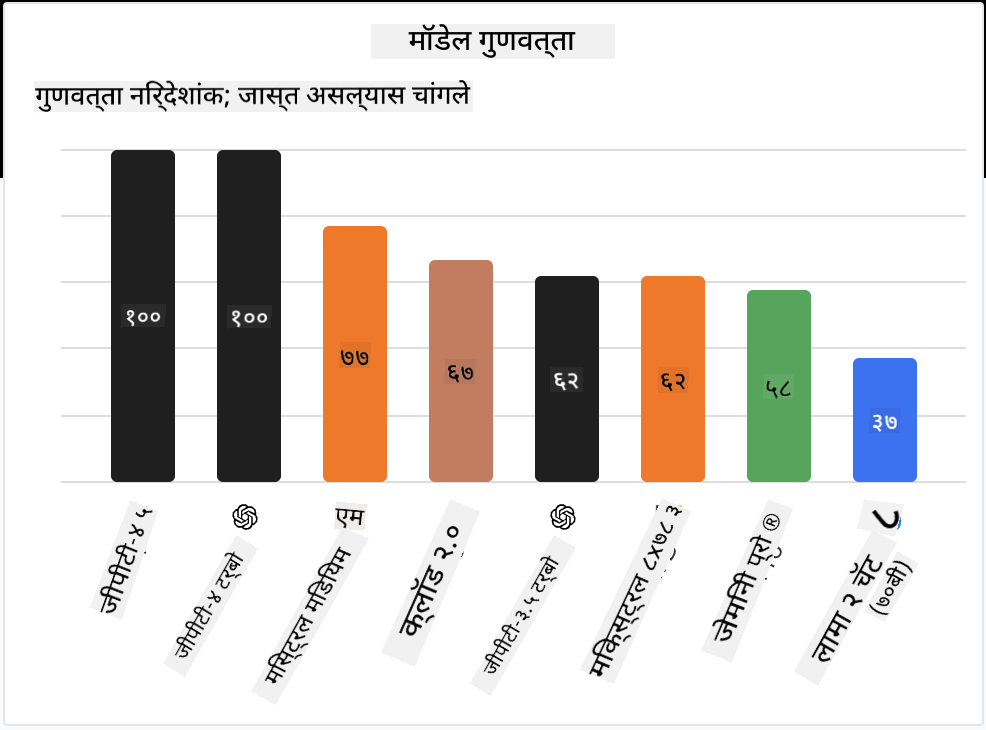

<!--
CO_OP_TRANSLATOR_METADATA:
{
  "original_hash": "0bba96e53ab841d99db731892a51fab8",
  "translation_date": "2025-07-09T17:07:21+00:00",
  "source_file": "16-open-source-models/README.md",
  "language_code": "mr"
}
-->

## परिचय

ओपन-सोर्स LLMs चा जग खूप रोमांचक आणि सतत बदलत असलेले आहे. हा धडा ओपन सोर्स मॉडेल्सवर सखोल माहिती देण्याचा उद्देश ठेवतो. जर तुम्हाला मालकीच्या मॉडेल्सची तुलना ओपन सोर्स मॉडेल्सशी कशी होते याबद्दल माहिती हवी असेल, तर ["Exploring and Comparing Different LLMs" धडा](../02-exploring-and-comparing-different-llms/README.md?WT.mc_id=academic-105485-koreyst) पहा. हा धडा फाइन-ट्यूनिंग या विषयावरही माहिती देईल, पण त्याबाबत अधिक सविस्तर स्पष्टीकरण ["Fine-Tuning LLMs" धडा](../18-fine-tuning/README.md?WT.mc_id=academic-105485-koreyst) मध्ये मिळेल.

## शिकण्याचे उद्दिष्ट

- ओपन सोर्स मॉडेल्सची समज प्राप्त करणे
- ओपन सोर्स मॉडेल्ससह काम करण्याचे फायदे समजून घेणे
- Hugging Face आणि Azure AI Studio वर उपलब्ध असलेल्या ओपन मॉडेल्सचा शोध घेणे

## ओपन सोर्स मॉडेल्स म्हणजे काय?

ओपन सोर्स सॉफ्टवेअरने विविध क्षेत्रांतील तंत्रज्ञानाच्या वाढीत महत्त्वाची भूमिका बजावली आहे. Open Source Initiative (OSI) ने [सॉफ्टवेअर ओपन सोर्स म्हणून वर्गीकृत करण्यासाठी 10 निकष](https://web.archive.org/web/20241126001143/https://opensource.org/osd?WT.mc_id=academic-105485-koreyst) ठरवले आहेत. स्रोत कोड OSI मान्यताप्राप्त परवान्याखाली खुलेपणाने शेअर केला पाहिजे.

LLMs च्या विकासात सॉफ्टवेअर विकासासारखे काही घटक असले तरी, प्रक्रिया अगदी तशीच नाही. त्यामुळे LLMs संदर्भातील ओपन सोर्सची व्याख्या यावर समुदायात बरेच चर्चेचे विषय आहेत. पारंपरिक ओपन सोर्स व्याख्येनुसार एखाद्या मॉडेलसाठी खालील माहिती सार्वजनिक असणे आवश्यक आहे:

- मॉडेल प्रशिक्षणासाठी वापरलेली डेटासेट्स
- प्रशिक्षणाचा भाग म्हणून पूर्ण मॉडेल वेट्स
- मूल्यांकन कोड
- फाइन-ट्यूनिंग कोड
- पूर्ण मॉडेल वेट्स आणि प्रशिक्षण मेट्रिक्स

सध्या या निकषांशी जुळणारे काहीच मॉडेल्स उपलब्ध आहेत. [Allen Institute for Artificial Intelligence (AllenAI) कडून तयार केलेले OLMo मॉडेल](https://huggingface.co/allenai/OLMo-7B?WT.mc_id=academic-105485-koreyst) या वर्गात येते.

या धड्यात, आम्ही पुढे "ओपन मॉडेल्स" असा उल्लेख करू कारण लेखनाच्या वेळी ते वरील निकषांशी पूर्णपणे जुळत नसतील.

## ओपन मॉडेल्सचे फायदे

**अत्यंत सानुकूलनीय** - ओपन मॉडेल्ससह प्रशिक्षणाची सविस्तर माहिती दिल्यामुळे संशोधक आणि विकसक मॉडेलच्या अंतर्गत भागांमध्ये बदल करू शकतात. यामुळे विशिष्ट कार्य किंवा अभ्यास क्षेत्रासाठी फाइन-ट्यून केलेले अत्यंत खास मॉडेल्स तयार करता येतात. यामध्ये कोड जनरेशन, गणितीय क्रिया आणि जीवशास्त्र यांसारख्या क्षेत्रांचा समावेश होतो.

**खर्च** - या मॉडेल्सचा वापर आणि तैनातीसाठी प्रति टोकन खर्च मालकीच्या मॉडेल्सच्या तुलनेत कमी असतो. जनरेटिव्ह AI अॅप्लिकेशन्स तयार करताना, तुमच्या वापराच्या बाबतीत या मॉडेल्सच्या कामगिरी आणि किमतीचा विचार करणे आवश्यक आहे.

  
स्रोत: Artificial Analysis

**लवचिकता** - ओपन मॉडेल्ससह काम करताना तुम्हाला वेगवेगळ्या मॉडेल्स वापरण्याची किंवा त्यांना एकत्र करण्याची लवचिकता मिळते. याचे उदाहरण म्हणजे [HuggingChat Assistants](https://huggingface.co/chat?WT.mc_id=academic-105485-koreyst), जिथे वापरकर्ता थेट यूजर इंटरफेसमध्ये वापरल्या जाणाऱ्या मॉडेलची निवड करू शकतो:

## वेगवेगळ्या ओपन मॉडेल्सचा शोध

### Llama 2

[LLama2](https://huggingface.co/meta-llama?WT.mc_id=academic-105485-koreyst), मेटा कडून विकसित केलेले, हे एक ओपन मॉडेल आहे जे चॅट-आधारित अॅप्लिकेशन्ससाठी ऑप्टिमाइझ केलेले आहे. त्याचे फाइन-ट्यूनिंग पद्धत मोठ्या प्रमाणात संवाद आणि मानवी अभिप्राय यांचा समावेश करते. या पद्धतीमुळे मॉडेल मानवी अपेक्षांशी अधिक सुसंगत परिणाम देते, ज्यामुळे वापरकर्त्याचा अनुभव सुधारतो.

Llama चे काही फाइन-ट्यून केलेले उदाहरणे म्हणजे [Japanese Llama](https://huggingface.co/elyza/ELYZA-japanese-Llama-2-7b?WT.mc_id=academic-105485-koreyst), जे जपानी भाषेत विशेष आहे, आणि [Llama Pro](https://huggingface.co/TencentARC/LLaMA-Pro-8B?WT.mc_id=academic-105485-koreyst), जे बेस मॉडेलचा सुधारित आवृत्ती आहे.

### Mistral

[Mistral](https://huggingface.co/mistralai?WT.mc_id=academic-105485-koreyst) हा एक ओपन मॉडेल आहे ज्याचा मुख्य लक्ष उच्च कार्यक्षमता आणि कार्यक्षमतेवर आहे. हे Mixture-of-Experts पद्धत वापरते, ज्यात तज्ञ मॉडेल्सचा समूह एकत्र करून एक प्रणाली तयार केली जाते, जिथे इनपुटनुसार विशिष्ट मॉडेल्स निवडले जातात. त्यामुळे गणना अधिक प्रभावी होते कारण मॉडेल्स फक्त त्यांच्या तज्ञतेच्या क्षेत्रातील इनपुटवर काम करतात.

Mistral चे काही फाइन-ट्यून केलेले उदाहरणे म्हणजे [BioMistral](https://huggingface.co/BioMistral/BioMistral-7B?text=Mon+nom+est+Thomas+et+mon+principal?WT.mc_id=academic-105485-koreyst), जे वैद्यकीय क्षेत्रावर लक्ष केंद्रित करते, आणि [OpenMath Mistral](https://huggingface.co/nvidia/OpenMath-Mistral-7B-v0.1-hf?WT.mc_id=academic-105485-koreyst), जे गणितीय गणना करते.

### Falcon

[Falcon](https://huggingface.co/tiiuae?WT.mc_id=academic-105485-koreyst) हा Technology Innovation Institute (**TII**) कडून तयार केलेला LLM आहे. Falcon-40B ला 40 अब्ज पॅरामीटर्सवर प्रशिक्षित केले गेले आहे, ज्याने कमी संगणकीय खर्चात GPT-3 पेक्षा चांगली कामगिरी दाखवली आहे. हे FlashAttention अल्गोरिदम आणि मल्टीक्वेरी अटेंशन वापरल्यामुळे शक्य झाले आहे, ज्यामुळे इन्फरन्स वेळेत मेमरीची गरज कमी होते. कमी इन्फरन्स वेळेमुळे Falcon-40B चॅट अॅप्लिकेशन्ससाठी योग्य आहे.

Falcon चे काही फाइन-ट्यून केलेले उदाहरणे म्हणजे [OpenAssistant](https://huggingface.co/OpenAssistant/falcon-40b-sft-top1-560?WT.mc_id=academic-105485-koreyst), जे ओपन मॉडेल्सवर आधारित असिस्टंट आहे, आणि [GPT4ALL](https://huggingface.co/nomic-ai/gpt4all-falcon?WT.mc_id=academic-105485-koreyst), जे बेस मॉडेलच्या तुलनेत अधिक चांगली कामगिरी देते.

## कसे निवडावे

ओपन मॉडेल निवडण्यासाठी एकच उत्तर नाही. सुरुवात करण्यासाठी Azure AI Studio च्या टास्कनुसार फिल्टर वापरणे चांगले ठरते. यामुळे तुम्हाला समजेल की मॉडेल कोणत्या प्रकारच्या कार्यांसाठी प्रशिक्षित आहे. Hugging Face देखील LLM Leaderboard ठेवते, जे काही मेट्रिक्सवर आधारित सर्वोत्तम कामगिरी करणारे मॉडेल्स दाखवते.

वेगवेगळ्या प्रकारांतील LLMs ची तुलना करताना, [Artificial Analysis](https://artificialanalysis.ai/?WT.mc_id=academic-105485-koreyst) हा एक उत्तम स्रोत आहे:

  
स्रोत: Artificial Analysis

जर तुम्ही विशिष्ट वापर प्रकरणावर काम करत असाल, तर त्याच क्षेत्रावर लक्ष केंद्रित केलेल्या फाइन-ट्यून केलेल्या आवृत्त्यांचा शोध घेणे उपयुक्त ठरू शकते. अनेक ओपन मॉडेल्स वापरून त्यांची कामगिरी तुमच्या आणि तुमच्या वापरकर्त्यांच्या अपेक्षांनुसार कशी आहे हे तपासणे ही एक चांगली पद्धत आहे.

## पुढील पावले

ओपन मॉडेल्सचा सर्वात मोठा फायदा म्हणजे त्यांच्यासह काम सुरू करणे खूप सोपे आहे. [Azure AI Studio Model Catalog](https://ai.azure.com?WT.mc_id=academic-105485-koreyst) पहा, ज्यात येथे चर्चिलेल्या मॉडेल्ससह Hugging Face ची एक खास कलेक्शन आहे.

## शिक्षण येथे थांबत नाही, प्रवास सुरू ठेवा

हा धडा पूर्ण केल्यानंतर, आमच्या [Generative AI Learning collection](https://aka.ms/genai-collection?WT.mc_id=academic-105485-koreyst) मध्ये जाऊन तुमचे Generative AI ज्ञान अधिक वाढवा!

**अस्वीकरण**:  
हा दस्तऐवज AI अनुवाद सेवा [Co-op Translator](https://github.com/Azure/co-op-translator) वापरून अनुवादित केला आहे. आम्ही अचूकतेसाठी प्रयत्नशील असलो तरी, कृपया लक्षात घ्या की स्वयंचलित अनुवादांमध्ये चुका किंवा अचूकतेची कमतरता असू शकते. मूळ दस्तऐवज त्याच्या स्थानिक भाषेत अधिकृत स्रोत मानला जावा. महत्त्वाच्या माहितीसाठी व्यावसायिक मानवी अनुवाद करण्याची शिफारस केली जाते. या अनुवादाच्या वापरामुळे उद्भवणाऱ्या कोणत्याही गैरसमजुती किंवा चुकीच्या अर्थलागी आम्ही जबाबदार नाही.