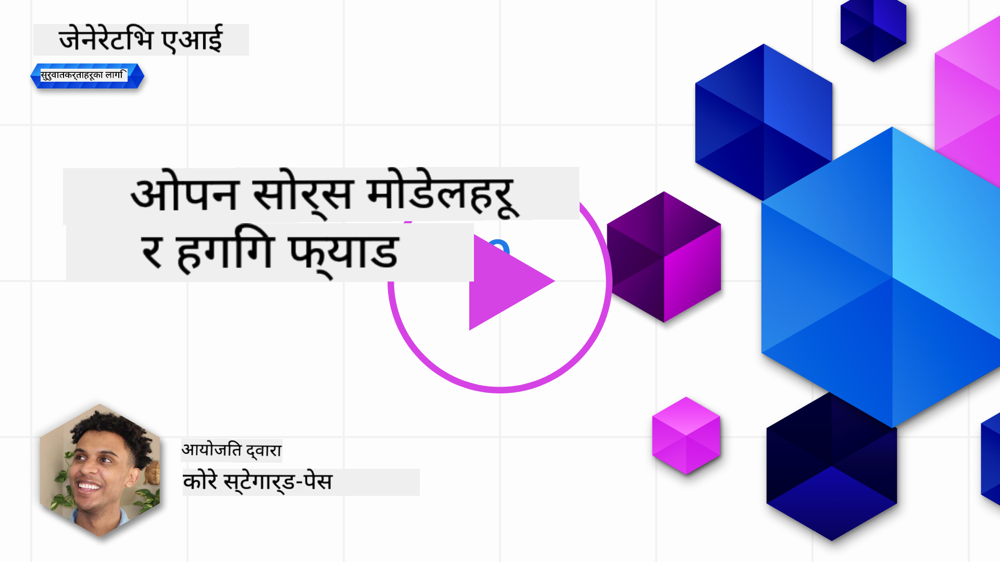

<!--
CO_OP_TRANSLATOR_METADATA:
{
  "original_hash": "0bba96e53ab841d99db731892a51fab8",
  "translation_date": "2025-07-09T17:07:42+00:00",
  "source_file": "16-open-source-models/README.md",
  "language_code": "ne"
}
-->

## परिचय

खुला स्रोत LLMs को संसार रोमाञ्चक र निरन्तर विकासशील छ। यो पाठले खुला स्रोत मोडेलहरूको गहिरो अवलोकन प्रदान गर्ने लक्ष्य राख्छ। यदि तपाईंलाई थाहा पाउन मन छ कि स्वामित्व भएका मोडेलहरू खुला स्रोत मोडेलहरूसँग कसरी तुलना गर्छन् भने, ["विभिन्न LLMs अन्वेषण र तुलना गर्ने" पाठ](../02-exploring-and-comparing-different-llms/README.md?WT.mc_id=academic-105485-koreyst) मा जानुहोस्। यो पाठले फाइन-ट्यूनिङको विषय पनि समेट्नेछ, तर विस्तृत व्याख्या ["Fine-Tuning LLMs" पाठ](../18-fine-tuning/README.md?WT.mc_id=academic-105485-koreyst) मा पाइन्छ।

## सिकाइका लक्ष्यहरू

- खुला स्रोत मोडेलहरूको बुझाइ प्राप्त गर्नु
- खुला स्रोत मोडेलहरूसँग काम गर्दा हुने फाइदाहरू बुझ्नु
- Hugging Face र Azure AI Studio मा उपलब्ध खुला मोडेलहरूको अन्वेषण गर्नु

## खुला स्रोत मोडेलहरू के हुन्?

खुला स्रोत सफ्टवेयरले विभिन्न क्षेत्रहरूमा प्रविधिको विकासमा महत्वपूर्ण भूमिका खेलेको छ। Open Source Initiative (OSI) ले सफ्टवेयरलाई खुला स्रोतको रूपमा वर्गीकरण गर्नका लागि [१० मापदण्डहरू](https://web.archive.org/web/20241126001143/https://opensource.org/osd?WT.mc_id=academic-105485-koreyst) परिभाषित गरेको छ। स्रोत कोड OSI द्वारा स्वीकृत लाइसेन्स अन्तर्गत खुला रूपमा साझा हुनुपर्छ।

LLMs को विकास सफ्टवेयर विकाससँग केही समान पक्षहरू भए पनि प्रक्रिया बिल्कुलै उस्तै छैन। यसले LLMs को सन्दर्भमा खुला स्रोतको परिभाषामा समुदायमा धेरै छलफल ल्याएको छ। परम्परागत खुला स्रोत परिभाषासँग मेल खाने मोडेलका लागि निम्न जानकारी सार्वजनिक रूपमा उपलब्ध हुनुपर्छ:

- मोडेल प्रशिक्षणमा प्रयोग भएका डेटासेटहरू।
- प्रशिक्षणको भागको रूपमा पूर्ण मोडेल वजनहरू।
- मूल्याङ्कन कोड।
- फाइन-ट्यूनिङ कोड।
- पूर्ण मोडेल वजन र प्रशिक्षण मेट्रिक्स।

हाल यी मापदण्डहरू पूरा गर्ने केही मोडेलहरू मात्र छन्। [Allen Institute for Artificial Intelligence (AllenAI) द्वारा सिर्जना गरिएको OLMo मोडेल](https://huggingface.co/allenai/OLMo-7B?WT.mc_id=academic-105485-koreyst) यस श्रेणीमा पर्छ।

यस पाठका लागि, हामी मोडेलहरूलाई "खुला मोडेलहरू" भनेर सम्बोधन गर्नेछौं किनभने लेखनको समयमा ती माथिका मापदण्डहरू पूरा नगर्न सक्छन्।

## खुला मोडेलहरूको फाइदाहरू

**अत्यन्त अनुकूलनयोग्य** - खुला मोडेलहरू विस्तृत प्रशिक्षण जानकारीसहित रिलिज गरिएका हुनाले, अनुसन्धानकर्ता र विकासकर्ताहरूले मोडेलका भित्री भागहरू परिमार्जन गर्न सक्छन्। यसले विशिष्ट कार्य वा अध्ययन क्षेत्रका लागि विशेष रूपमा फाइन-ट्यून गरिएको मोडेलहरू सिर्जना गर्न सक्षम बनाउँछ। जस्तै कोड उत्पादन, गणितीय अपरेसन र जीवविज्ञान।

**लागत** - यी मोडेलहरू प्रयोग र तैनाथ गर्दा टोकन प्रति लागत स्वामित्व भएका मोडेलहरू भन्दा कम हुन्छ। जेनेरेटिभ AI अनुप्रयोगहरू बनाउँदा, प्रदर्शन र मूल्यको सन्तुलन हेर्नु आवश्यक हुन्छ।

  
स्रोत: Artificial Analysis

**लचिलोपन** - खुला मोडेलहरूसँग काम गर्दा विभिन्न मोडेलहरू प्रयोग गर्ने वा तिनीहरूलाई संयोजन गर्ने लचिलोपन हुन्छ। उदाहरणका लागि [HuggingChat Assistants](https://huggingface.co/chat?WT.mc_id=academic-105485-koreyst) जहाँ प्रयोगकर्ताले सिधै प्रयोगकर्ता इन्टरफेसमा मोडेल चयन गर्न सक्छ:

## विभिन्न खुला मोडेलहरूको अन्वेषण

### Llama 2

[LLama2](https://huggingface.co/meta-llama?WT.mc_id=academic-105485-koreyst), Meta द्वारा विकास गरिएको, च्याट आधारित अनुप्रयोगहरूका लागि अनुकूलित खुला मोडेल हो। यसको फाइन-ट्यूनिङ विधिले ठूलो मात्रामा संवाद र मानव प्रतिक्रिया समावेश गरेको छ। यसले मोडेललाई मानव अपेक्षासँग मेल खाने परिणामहरू उत्पादन गर्न सक्षम बनाउँछ जसले प्रयोगकर्तालाई राम्रो अनुभव दिन्छ।

Llama का फाइन-ट्यून गरिएको केही संस्करणहरूमा [Japanese Llama](https://huggingface.co/elyza/ELYZA-japanese-Llama-2-7b?WT.mc_id=academic-105485-koreyst) जसले जापानी भाषामा विशेषज्ञता राख्छ र [Llama Pro](https://huggingface.co/TencentARC/LLaMA-Pro-8B?WT.mc_id=academic-105485-koreyst) जुन आधार मोडेलको सुधारिएको संस्करण हो।

### Mistral

[Mistral](https://huggingface.co/mistralai?WT.mc_id=academic-105485-koreyst) उच्च प्रदर्शन र दक्षतामा केन्द्रित खुला मोडेल हो। यसले Mixture-of-Experts विधि प्रयोग गर्छ जसले विशेषज्ञ मोडेलहरूको समूहलाई एउटै प्रणालीमा संयोजन गर्छ जहाँ इनपुट अनुसार केही मोडेलहरू चयन गरिन्छ। यसले गणना अधिक प्रभावकारी बनाउँछ किनभने मोडेलहरू केवल उनीहरू विशेषज्ञ भएका इनपुटहरूमा काम गर्छन्।

Mistral का फाइन-ट्यून गरिएको केही संस्करणहरूमा [BioMistral](https://huggingface.co/BioMistral/BioMistral-7B?text=Mon+nom+est+Thomas+et+mon+principal?WT.mc_id=academic-105485-koreyst) जुन चिकित्सा क्षेत्रमा केन्द्रित छ र [OpenMath Mistral](https://huggingface.co/nvidia/OpenMath-Mistral-7B-v0.1-hf?WT.mc_id=academic-105485-koreyst) जुन गणितीय गणना गर्छ।

### Falcon

[Falcon](https://huggingface.co/tiiuae?WT.mc_id=academic-105485-koreyst) Technology Innovation Institute (**TII**) द्वारा सिर्जना गरिएको LLM हो। Falcon-40B लाई ४० अर्ब प्यारामिटरमा प्रशिक्षण दिइएको छ जुन कम कम्प्युट बजेटमा GPT-3 भन्दा राम्रो प्रदर्शन देखाएको छ। यसको कारण FlashAttention एल्गोरिदम र मल्टिक्वेरी अटेन्सन हो जसले इन्फरेन्स समयमा मेमोरी आवश्यकतालाई कम गर्छ। यसले Falcon-40B लाई च्याट अनुप्रयोगहरूका लागि उपयुक्त बनाउँछ।

Falcon का फाइन-ट्यून गरिएको केही संस्करणहरूमा [OpenAssistant](https://huggingface.co/OpenAssistant/falcon-40b-sft-top1-560?WT.mc_id=academic-105485-koreyst) जुन खुला मोडेलहरूमा आधारित सहायक हो र [GPT4ALL](https://huggingface.co/nomic-ai/gpt4all-falcon?WT.mc_id=academic-105485-koreyst) जुन आधार मोडेलभन्दा उच्च प्रदर्शन दिन्छ।

## कसरी छनौट गर्ने

खुला मोडेल छनौट गर्न एउटै उत्तर छैन। सुरु गर्न राम्रो ठाउँ Azure AI Studio को टास्क अनुसार फिल्टर गर्ने सुविधा हो। यसले तपाईंलाई मोडेलले कुन प्रकारका कार्यहरूका लागि प्रशिक्षण पाएको छ बुझ्न मद्दत गर्छ। Hugging Face ले पनि LLM Leaderboard राख्छ जसले केही मेट्रिक्सका आधारमा उत्कृष्ट प्रदर्शन गर्ने मोडेलहरू देखाउँछ।

विभिन्न प्रकारका LLMs तुलना गर्न [Artificial Analysis](https://artificialanalysis.ai/?WT.mc_id=academic-105485-koreyst) अर्को राम्रो स्रोत हो:

  
स्रोत: Artificial Analysis

विशिष्ट प्रयोग केसमा काम गर्दा, सोही क्षेत्रमा केन्द्रित फाइन-ट्यून गरिएको संस्करणहरू खोज्नु प्रभावकारी हुन्छ। तपाईं र तपाईंका प्रयोगकर्ताहरूको अपेक्षाअनुसार प्रदर्शन कस्तो छ भनेर थाहा पाउन विभिन्न खुला मोडेलहरूसँग प्रयोग गर्नु अर्को राम्रो अभ्यास हो।

## अर्को कदमहरू

खुला मोडेलहरूको सबैभन्दा राम्रो पक्ष भनेको तपाईं छिट्टै काम सुरु गर्न सक्नुहुन्छ। [Azure AI Studio Model Catalog](https://ai.azure.com?WT.mc_id=academic-105485-koreyst) हेर्नुहोस्, जसमा यहाँ छलफल गरिएका मोडेलहरूको विशेष Hugging Face संग्रह छ।

## सिकाइ यहाँ रोकिँदैन, यात्रा जारी राख्नुहोस्

यो पाठ पूरा गरेपछि, हाम्रो [Generative AI Learning collection](https://aka.ms/genai-collection?WT.mc_id=academic-105485-koreyst) मा जानुहोस् र तपाईंको Generative AI ज्ञानलाई अझ उचाइमा पुर्‍याउनुहोस्!

**अस्वीकरण**:  
यो दस्तावेज AI अनुवाद सेवा [Co-op Translator](https://github.com/Azure/co-op-translator) प्रयोग गरी अनुवाद गरिएको हो। हामी शुद्धताका लागि प्रयासरत छौं, तर कृपया ध्यान दिनुहोस् कि स्वचालित अनुवादमा त्रुटि वा अशुद्धता हुन सक्छ। मूल दस्तावेज यसको मूल भाषामा नै अधिकारिक स्रोत मानिनुपर्छ। महत्वपूर्ण जानकारीका लागि व्यावसायिक मानव अनुवाद सिफारिस गरिन्छ। यस अनुवादको प्रयोगबाट उत्पन्न कुनै पनि गलतफहमी वा गलत व्याख्याका लागि हामी जिम्मेवार छैनौं।