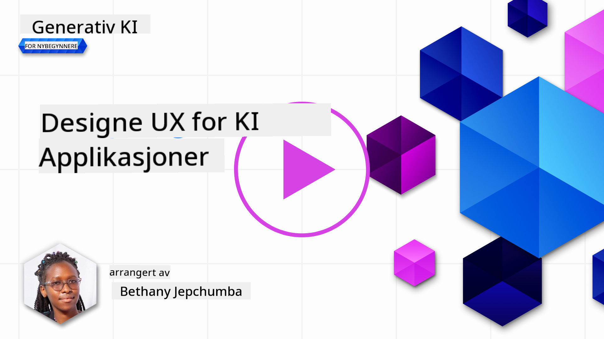
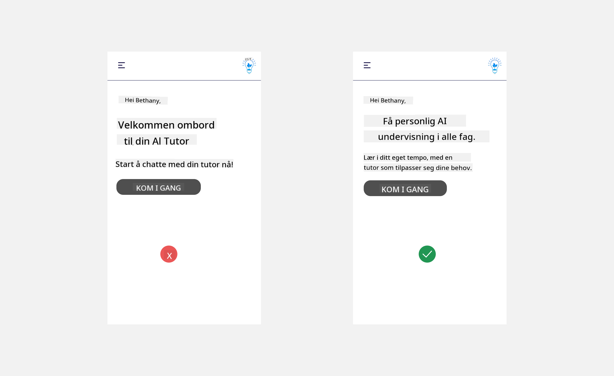
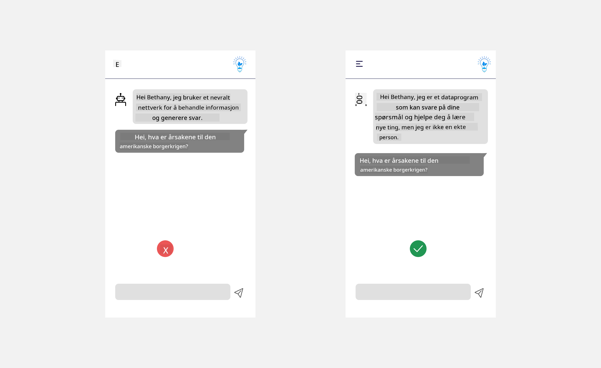
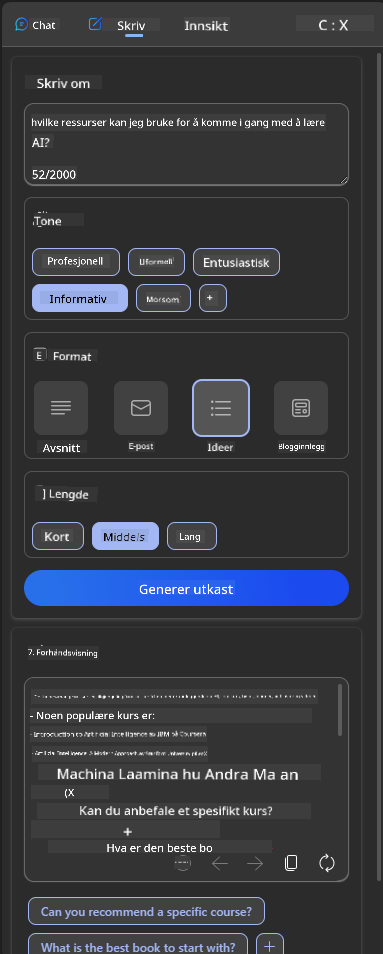
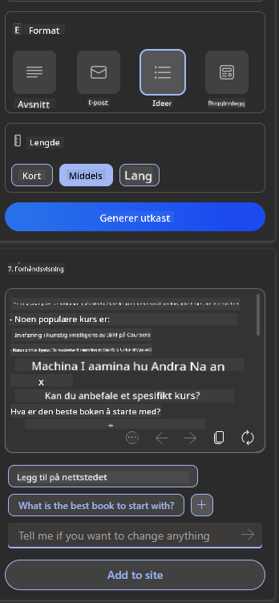

<!--
CO_OP_TRANSLATOR_METADATA:
{
  "original_hash": "ec385b41ee50579025d50cc03bfb3a25",
  "translation_date": "2025-07-09T14:59:32+00:00",
  "source_file": "12-designing-ux-for-ai-applications/README.md",
  "language_code": "no"
}
-->
# Utforming av UX for AI-applikasjoner

> _(Klikk på bildet over for å se video av denne leksjonen)_

Brukeropplevelse er en svært viktig del av å bygge apper. Brukere må kunne bruke appen din på en effektiv måte for å utføre oppgaver. Å være effektivt er én ting, men du må også designe apper slik at de kan brukes av alle, for å gjøre dem _tilgjengelige_. Dette kapitlet vil fokusere på dette området, slik at du forhåpentligvis ender opp med å designe en app som folk kan og vil bruke.

## Introduksjon

Brukeropplevelse handler om hvordan en bruker samhandler med og bruker et spesifikt produkt eller en tjeneste, enten det er et system, verktøy eller design. Når man utvikler AI-applikasjoner, fokuserer utviklere ikke bare på å sikre at brukeropplevelsen er effektiv, men også etisk. I denne leksjonen dekker vi hvordan man bygger kunstig intelligens (AI)-applikasjoner som møter brukerens behov.

Leksjonen vil dekke følgende områder:

- Introduksjon til brukeropplevelse og forståelse av brukerbehov
- Utforming av AI-applikasjoner for tillit og åpenhet
- Utforming av AI-applikasjoner for samarbeid og tilbakemelding

## Læringsmål

Etter å ha tatt denne leksjonen vil du kunne:

- Forstå hvordan du bygger AI-applikasjoner som møter brukerens behov.
- Designe AI-applikasjoner som fremmer tillit og samarbeid.

### Forutsetninger

Ta deg tid til å lese mer om [brukeropplevelse og design thinking.](https://learn.microsoft.com/training/modules/ux-design?WT.mc_id=academic-105485-koreyst)

## Introduksjon til brukeropplevelse og forståelse av brukerbehov

I vår fiktive utdanningsstartup har vi to hovedbrukere, lærere og elever. Hver av disse brukerne har unike behov. Et brukerorientert design setter brukeren i sentrum og sikrer at produktene er relevante og nyttige for dem de er ment for.

Applikasjonen bør være **nyttig, pålitelig, tilgjengelig og behagelig** for å gi en god brukeropplevelse.

### Brukervennlighet

Å være nyttig betyr at applikasjonen har funksjonalitet som samsvarer med dens tiltenkte formål, som for eksempel å automatisere vurderingsprosessen eller generere flashcards for repetisjon. En applikasjon som automatiserer vurderingsprosessen bør kunne tildele poeng til elevenes arbeid nøyaktig og effektivt basert på forhåndsdefinerte kriterier. På samme måte bør en applikasjon som genererer flashcards for repetisjon kunne lage relevante og varierte spørsmål basert på sine data.

### Pålitelighet

Å være pålitelig betyr at applikasjonen kan utføre oppgaven sin konsekvent og uten feil. Men AI, akkurat som mennesker, er ikke perfekt og kan gjøre feil. Applikasjonene kan støte på feil eller uventede situasjoner som krever menneskelig inngripen eller korrigering. Hvordan håndterer du feil? I siste del av denne leksjonen vil vi dekke hvordan AI-systemer og applikasjoner er designet for samarbeid og tilbakemelding.

### Tilgjengelighet

Å være tilgjengelig betyr å utvide brukeropplevelsen til brukere med ulike evner, inkludert de med funksjonsnedsettelser, slik at ingen blir ekskludert. Ved å følge retningslinjer og prinsipper for tilgjengelighet blir AI-løsninger mer inkluderende, brukbare og nyttige for alle brukere.

### Behagelig

Å være behagelig betyr at applikasjonen er hyggelig å bruke. En tiltalende brukeropplevelse kan ha en positiv effekt på brukeren, oppmuntre dem til å komme tilbake til applikasjonen og øke forretningsinntektene.

Ikke alle utfordringer kan løses med AI. AI kommer inn for å forbedre brukeropplevelsen, enten det er å automatisere manuelle oppgaver eller personalisere brukeropplevelser.

## Utforming av AI-applikasjoner for tillit og åpenhet

Å bygge tillit er avgjørende når man designer AI-applikasjoner. Tillit sikrer at en bruker er trygg på at applikasjonen vil utføre oppgaven, levere resultater konsekvent, og at resultatene er det brukeren trenger. En risiko i dette området er mistillit og overtrøst. Mistillit oppstår når en bruker har liten eller ingen tillit til et AI-system, noe som fører til at brukeren avviser applikasjonen din. Overtrøst oppstår når en bruker overvurderer kapasiteten til et AI-system, noe som fører til at brukeren stoler for mye på AI-systemet. For eksempel kan et automatisert vurderingssystem ved overtrøst føre til at læreren ikke korrekturleser noen av oppgavene for å sikre at vurderingssystemet fungerer godt. Dette kan resultere i urettferdige eller unøyaktige karakterer for elevene, eller tapte muligheter for tilbakemelding og forbedring.

To måter å sikre at tillit settes i sentrum av designet er forklarbarhet og kontroll.

### Forklarbarhet

Når AI hjelper til med å informere beslutninger, som å formidle kunnskap til fremtidige generasjoner, er det avgjørende at lærere og foreldre forstår hvordan AI-beslutninger tas. Dette er forklarbarhet – å forstå hvordan AI-applikasjoner tar beslutninger. Å designe for forklarbarhet inkluderer å legge til detaljer og eksempler på hva en AI-applikasjon kan gjøre. For eksempel, i stedet for "Kom i gang med AI-lærer", kan systemet bruke: "Oppsummer notatene dine for enklere repetisjon med AI."

Et annet eksempel er hvordan AI bruker bruker- og persondata. For eksempel kan en bruker med personaen student ha begrensninger basert på sin persona. AI-en kan ikke avsløre svar på spørsmål, men kan hjelpe brukeren med å tenke gjennom hvordan de kan løse et problem.

En siste viktig del av forklarbarhet er forenkling av forklaringer. Elever og lærere er kanskje ikke AI-eksperter, derfor bør forklaringer på hva applikasjonen kan eller ikke kan gjøre være forenklet og lett å forstå.

### Kontroll

Generativ AI skaper et samarbeid mellom AI og brukeren, hvor for eksempel en bruker kan endre prompt for ulike resultater. I tillegg, når et resultat er generert, bør brukere kunne endre resultatene, noe som gir dem en følelse av kontroll. For eksempel, når du bruker Bing, kan du tilpasse prompten basert på format, tone og lengde. I tillegg kan du legge til endringer i resultatet og modifisere det som vist nedenfor:

En annen funksjon i Bing som gir brukeren kontroll over applikasjonen, er muligheten til å velge å delta eller ikke delta i data som AI bruker. For en skoleapplikasjon kan en elev ønske å bruke sine egne notater samt lærernes ressurser som repetisjonsmateriale.

> Når du designer AI-applikasjoner, er intensjonalitet nøkkelen for å sikre at brukere ikke overtror systemet og setter urealistiske forventninger til dets evner. En måte å gjøre dette på er å skape friksjon mellom promptene og resultatene. Minn brukeren på at dette er AI og ikke et medmenneske.

## Utforming av AI-applikasjoner for samarbeid og tilbakemelding

Som nevnt tidligere, skaper generativ AI et samarbeid mellom bruker og AI. De fleste interaksjoner består av at en bruker skriver inn en prompt og AI genererer et resultat. Hva om resultatet er feil? Hvordan håndterer applikasjonen feil hvis de oppstår? Skylder AI på brukeren eller tar seg tid til å forklare feilen?

AI-applikasjoner bør bygges for å motta og gi tilbakemelding. Dette hjelper ikke bare AI-systemet å forbedre seg, men bygger også tillit hos brukerne. En tilbakemeldingssløyfe bør inkluderes i designet, et eksempel kan være en enkel tommel opp eller ned på resultatet.

En annen måte å håndtere dette på er å tydelig kommunisere systemets evner og begrensninger. Når en bruker gjør en feil ved å be om noe som går utover AI-ens kapasitet, bør det også finnes en måte å håndtere dette på, som vist nedenfor.

Systemfeil er vanlige i applikasjoner hvor brukeren kan trenge hjelp med informasjon utenfor AI-ens omfang, eller applikasjonen kan ha en grense for hvor mange spørsmål/emner en bruker kan generere sammendrag for. For eksempel kan en AI-applikasjon trent på data innen begrensede fag, for eksempel historie og matematikk, ikke kunne håndtere spørsmål om geografi. For å dempe dette kan AI-systemet gi et svar som: "Beklager, produktet vårt er trent med data innen følgende fag..., jeg kan ikke svare på spørsmålet du stilte."

AI-applikasjoner er ikke perfekte, derfor vil de gjøre feil. Når du designer applikasjonene dine, bør du sørge for å lage rom for tilbakemelding fra brukere og feilhåndtering på en enkel og lettfattelig måte.

## Oppgave

Ta en hvilken som helst AI-app du har bygget så langt, og vurder å implementere følgende steg i appen din:

- **Behagelig:** Tenk på hvordan du kan gjøre appen din mer behagelig. Legger du til forklaringer overalt? Oppmuntrer du brukeren til å utforske? Hvordan formulerer du feilmeldingene dine?

- **Brukervennlighet:** Bygger du en webapp? Sørg for at appen din kan navigeres både med mus og tastatur.

- **Tillit og åpenhet:** Ikke stol helt på AI og resultatene den gir, vurder hvordan du kan legge til et menneske i prosessen for å verifisere resultatet. Vurder også og implementer andre måter å oppnå tillit og åpenhet på.

- **Kontroll:** Gi brukeren kontroll over dataene de gir til applikasjonen. Implementer en måte for brukeren å velge å delta eller ikke delta i datainnsamling i AI-applikasjonen.

## Fortsett læringen din!

Etter å ha fullført denne leksjonen, sjekk ut vår [Generative AI Learning collection](https://aka.ms/genai-collection?WT.mc_id=academic-105485-koreyst) for å fortsette å utvikle kunnskapen din om generativ AI!

Gå videre til leksjon 13, hvor vi ser på hvordan man [sikrer AI-applikasjoner](../13-securing-ai-applications/README.md?WT.mc_id=academic-105485-koreyst)!

**Ansvarsfraskrivelse**:  
Dette dokumentet er oversatt ved hjelp av AI-oversettelsestjenesten [Co-op Translator](https://github.com/Azure/co-op-translator). Selv om vi streber etter nøyaktighet, vennligst vær oppmerksom på at automatiske oversettelser kan inneholde feil eller unøyaktigheter. Det opprinnelige dokumentet på originalspråket skal anses som den autoritative kilden. For kritisk informasjon anbefales profesjonell menneskelig oversettelse. Vi er ikke ansvarlige for eventuelle misforståelser eller feiltolkninger som oppstår ved bruk av denne oversettelsen.