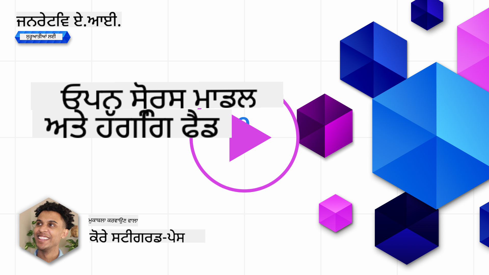
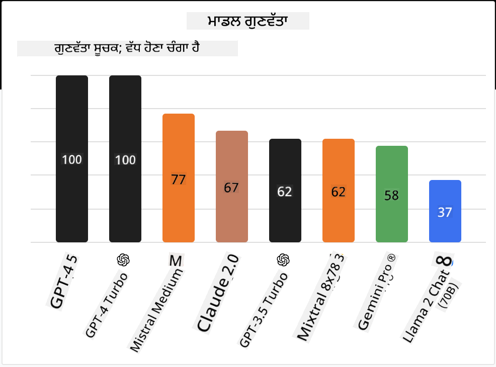

<!--
CO_OP_TRANSLATOR_METADATA:
{
  "original_hash": "0bba96e53ab841d99db731892a51fab8",
  "translation_date": "2025-07-09T17:08:01+00:00",
  "source_file": "16-open-source-models/README.md",
  "language_code": "pa"
}
-->

## ਪਰਿਚਯ

ਓਪਨ-ਸੋਰਸ LLMs ਦੀ ਦੁਨੀਆ ਰੋਮਾਂਚਕ ਅਤੇ ਲਗਾਤਾਰ ਵਿਕਾਸਸ਼ੀਲ ਹੈ। ਇਸ ਪਾਠ ਦਾ ਮਕਸਦ ਓਪਨ ਸੋਰਸ ਮਾਡਲਾਂ ਦੀ ਗਹਿਰਾਈ ਨਾਲ ਜਾਣਕਾਰੀ ਦੇਣਾ ਹੈ। ਜੇ ਤੁਸੀਂ ਜਾਣਨਾ ਚਾਹੁੰਦੇ ਹੋ ਕਿ ਪ੍ਰੋਪ੍ਰਾਇਟਰੀ ਮਾਡਲਾਂ ਦੀ ਤੁਲਨਾ ਓਪਨ ਸੋਰਸ ਮਾਡਲਾਂ ਨਾਲ ਕਿਵੇਂ ਹੁੰਦੀ ਹੈ, ਤਾਂ ["Exploring and Comparing Different LLMs" ਪਾਠ](../02-exploring-and-comparing-different-llms/README.md?WT.mc_id=academic-105485-koreyst) ਵੇਖੋ। ਇਸ ਪਾਠ ਵਿੱਚ ਫਾਈਨ-ਟਿਊਨਿੰਗ ਦਾ ਵਿਸ਼ਾ ਵੀ ਕਵਰ ਕੀਤਾ ਜਾਵੇਗਾ, ਪਰ ਇਸਦਾ ਵਿਸਥਾਰ ਨਾਲ ਵਰਣਨ ["Fine-Tuning LLMs" ਪਾਠ](../18-fine-tuning/README.md?WT.mc_id=academic-105485-koreyst) ਵਿੱਚ ਮਿਲੇਗਾ।

## ਸਿੱਖਣ ਦੇ ਲਕੜ

- ਓਪਨ ਸੋਰਸ ਮਾਡਲਾਂ ਦੀ ਸਮਝ ਪ੍ਰਾਪਤ ਕਰੋ
- ਓਪਨ ਸੋਰਸ ਮਾਡਲਾਂ ਨਾਲ ਕੰਮ ਕਰਨ ਦੇ ਫਾਇਦੇ ਸਮਝੋ
- Hugging Face ਅਤੇ Azure AI Studio 'ਤੇ ਉਪਲਬਧ ਓਪਨ ਮਾਡਲਾਂ ਦੀ ਖੋਜ ਕਰੋ

## ਓਪਨ ਸੋਰਸ ਮਾਡਲ ਕੀ ਹਨ?

ਓਪਨ ਸੋਰਸ ਸਾਫਟਵੇਅਰ ਨੇ ਵੱਖ-ਵੱਖ ਖੇਤਰਾਂ ਵਿੱਚ ਤਕਨਾਲੋਜੀ ਦੇ ਵਿਕਾਸ ਵਿੱਚ ਮਹੱਤਵਪੂਰਨ ਭੂਮਿਕਾ ਨਿਭਾਈ ਹੈ। Open Source Initiative (OSI) ਨੇ [ਸਾਫਟਵੇਅਰ ਲਈ 10 ਮਿਆਰ](https://web.archive.org/web/20241126001143/https://opensource.org/osd?WT.mc_id=academic-105485-koreyst) ਤੈਅ ਕੀਤੇ ਹਨ ਜੋ ਓਪਨ ਸੋਰਸ ਵਜੋਂ ਵਰਗੀਕ੍ਰਿਤ ਕੀਤਾ ਜਾ ਸਕੇ। ਸੋਰਸ ਕੋਡ ਨੂੰ OSI ਦੁਆਰਾ ਮਨਜ਼ੂਰਸ਼ੁਦਾ ਲਾਇਸੈਂਸ ਹੇਠ ਖੁੱਲ੍ਹਾ ਸਾਂਝਾ ਕੀਤਾ ਜਾਣਾ ਚਾਹੀਦਾ ਹੈ।

ਜਦੋਂ ਕਿ LLMs ਦਾ ਵਿਕਾਸ ਸਾਫਟਵੇਅਰ ਵਿਕਾਸ ਨਾਲ ਕੁਝ ਮਿਲਦੇ-ਜੁਲਦੇ ਤੱਤ ਰੱਖਦਾ ਹੈ, ਪਰ ਇਹ ਪ੍ਰਕਿਰਿਆ ਬਿਲਕੁਲ ਇੱਕੋ ਜਿਹੀ ਨਹੀਂ ਹੈ। ਇਸ ਕਾਰਨ ਕਮਿਊਨਿਟੀ ਵਿੱਚ LLMs ਦੇ ਸੰਦਰਭ ਵਿੱਚ ਓਪਨ ਸੋਰਸ ਦੀ ਪਰਿਭਾਸ਼ਾ 'ਤੇ ਕਾਫੀ ਚਰਚਾ ਹੋਈ ਹੈ। ਇੱਕ ਮਾਡਲ ਨੂੰ ਪਰੰਪਰਾਗਤ ਓਪਨ ਸੋਰਸ ਦੀ ਪਰਿਭਾਸ਼ਾ ਨਾਲ ਮੇਲ ਖਾਣ ਲਈ ਹੇਠਾਂ ਦਿੱਤੀ ਜਾਣਕਾਰੀ ਜਨਤਕ ਹੋਣੀ ਚਾਹੀਦੀ ਹੈ:

- ਮਾਡਲ ਨੂੰ ਟ੍ਰੇਨ ਕਰਨ ਲਈ ਵਰਤੇ ਗਏ ਡੇਟਾਸੈੱਟ
- ਟ੍ਰੇਨਿੰਗ ਦੇ ਹਿੱਸੇ ਵਜੋਂ ਪੂਰੇ ਮਾਡਲ ਵਜ਼ਨ
- ਮੁਲਾਂਕਣ ਕੋਡ
- ਫਾਈਨ-ਟਿਊਨਿੰਗ ਕੋਡ
- ਪੂਰੇ ਮਾਡਲ ਵਜ਼ਨ ਅਤੇ ਟ੍ਰੇਨਿੰਗ ਮੈਟ੍ਰਿਕਸ

ਇਸ ਮਿਆਰ ਨੂੰ ਮਿਲਦੇ ਕੁਝ ਹੀ ਮਾਡਲ ਇਸ ਸਮੇਂ ਉਪਲਬਧ ਹਨ। [Allen Institute for Artificial Intelligence (AllenAI) ਵੱਲੋਂ ਬਣਾਇਆ ਗਿਆ OLMo ਮਾਡਲ](https://huggingface.co/allenai/OLMo-7B?WT.mc_id=academic-105485-koreyst) ਇਸ ਸ਼੍ਰੇਣੀ ਵਿੱਚ ਆਉਂਦਾ ਹੈ।

ਇਸ ਪਾਠ ਲਈ, ਅਸੀਂ ਮਾਡਲਾਂ ਨੂੰ "ਓਪਨ ਮਾਡਲ" ਕਹਾਂਗੇ ਕਿਉਂਕਿ ਲਿਖਣ ਦੇ ਸਮੇਂ ਇਹ ਮਿਆਰ ਪੂਰੇ ਨਹੀਂ ਕਰਦੇ ਹੋ ਸਕਦੇ।

## ਓਪਨ ਮਾਡਲਾਂ ਦੇ ਫਾਇਦੇ

**ਬਹੁਤ ਜ਼ਿਆਦਾ ਕਸਟਮਾਈਜ਼ੇਬਲ** - ਕਿਉਂਕਿ ਓਪਨ ਮਾਡਲਾਂ ਨੂੰ ਵਿਸਥਾਰ ਨਾਲ ਟ੍ਰੇਨਿੰਗ ਜਾਣਕਾਰੀ ਦੇ ਨਾਲ ਜਾਰੀ ਕੀਤਾ ਜਾਂਦਾ ਹੈ, ਖੋਜਕਾਰ ਅਤੇ ਵਿਕਾਸਕਾਰ ਮਾਡਲ ਦੇ ਅੰਦਰੂਨੀ ਹਿੱਸਿਆਂ ਨੂੰ ਬਦਲ ਸਕਦੇ ਹਨ। ਇਸ ਨਾਲ ਖਾਸ ਕੰਮ ਜਾਂ ਖੇਤਰ ਲਈ ਬਹੁਤ ਹੀ ਵਿਸ਼ੇਸ਼ ਮਾਡਲ ਬਣਾਉਣ ਦੀ ਸਹੂਲਤ ਮਿਲਦੀ ਹੈ। ਉਦਾਹਰਨਾਂ ਵਿੱਚ ਕੋਡ ਜਨਰੇਸ਼ਨ, ਗਣਿਤੀ ਕਾਰਜ ਅਤੇ ਜੀਵ ਵਿਗਿਆਨ ਸ਼ਾਮਲ ਹਨ।

**ਲਾਗਤ** - ਇਹ ਮਾਡਲ ਵਰਤਣ ਅਤੇ ਤਾਇਨਾਤ ਕਰਨ ਦੀ ਲਾਗਤ ਪ੍ਰੋਪ੍ਰਾਇਟਰੀ ਮਾਡਲਾਂ ਨਾਲੋਂ ਘੱਟ ਹੁੰਦੀ ਹੈ। ਜਦੋਂ ਤੁਸੀਂ ਜਨਰੇਟਿਵ AI ਐਪਲੀਕੇਸ਼ਨਾਂ ਬਣਾਉਂਦੇ ਹੋ, ਤਾਂ ਆਪਣੇ ਕੇਸ ਲਈ ਇਹ ਮਾਡਲ ਵਰਤਦੇ ਸਮੇਂ ਪ੍ਰਦਰਸ਼ਨ ਅਤੇ ਕੀਮਤ ਦਾ ਮੁਕਾਬਲਾ ਕਰਨਾ ਚਾਹੀਦਾ ਹੈ।

  
ਸਰੋਤ: Artificial Analysis

**ਲਚੀਲਾਪਣ** - ਓਪਨ ਮਾਡਲਾਂ ਨਾਲ ਕੰਮ ਕਰਨ ਨਾਲ ਤੁਸੀਂ ਵੱਖ-ਵੱਖ ਮਾਡਲਾਂ ਨੂੰ ਵਰਤਣ ਜਾਂ ਜੋੜਨ ਵਿੱਚ ਲਚੀਲਾਪਣ ਪ੍ਰਾਪਤ ਕਰਦੇ ਹੋ। ਉਦਾਹਰਨ ਵਜੋਂ [HuggingChat Assistants](https://huggingface.co/chat?WT.mc_id=academic-105485-koreyst) ਹੈ, ਜਿੱਥੇ ਯੂਜ਼ਰ ਸਿੱਧਾ ਯੂਜ਼ਰ ਇੰਟਰਫੇਸ ਵਿੱਚ ਮਾਡਲ ਚੁਣ ਸਕਦਾ ਹੈ:

## ਵੱਖ-ਵੱਖ ਓਪਨ ਮਾਡਲਾਂ ਦੀ ਖੋਜ

### Llama 2

[LLama2](https://huggingface.co/meta-llama?WT.mc_id=academic-105485-koreyst), ਜੋ ਮੈਟਾ ਵੱਲੋਂ ਵਿਕਸਤ ਕੀਤਾ ਗਿਆ ਹੈ, ਇੱਕ ਓਪਨ ਮਾਡਲ ਹੈ ਜੋ ਚੈਟ-ਆਧਾਰਿਤ ਐਪਲੀਕੇਸ਼ਨਾਂ ਲਈ ਅਨੁਕੂਲਿਤ ਹੈ। ਇਹ ਇਸਦੇ ਫਾਈਨ-ਟਿਊਨਿੰਗ ਤਰੀਕੇ ਕਰਕੇ ਹੈ, ਜਿਸ ਵਿੱਚ ਵੱਡੀ ਮਾਤਰਾ ਵਿੱਚ ਸੰਵਾਦ ਅਤੇ ਮਨੁੱਖੀ ਫੀਡਬੈਕ ਸ਼ਾਮਲ ਹੈ। ਇਸ ਤਰੀਕੇ ਨਾਲ, ਮਾਡਲ ਮਨੁੱਖੀ ਉਮੀਦਾਂ ਦੇ ਅਨੁਕੂਲ ਨਤੀਜੇ ਦਿੰਦਾ ਹੈ ਜੋ ਬਿਹਤਰ ਯੂਜ਼ਰ ਅਨੁਭਵ ਪ੍ਰਦਾਨ ਕਰਦਾ ਹੈ।

Llama ਦੇ ਕੁਝ ਫਾਈਨ-ਟਿਊਨ ਕੀਤੇ ਵਰਜਨ ਹਨ [Japanese Llama](https://huggingface.co/elyza/ELYZA-japanese-Llama-2-7b?WT.mc_id=academic-105485-koreyst), ਜੋ ਜਪਾਨੀ ਵਿੱਚ ਮਾਹਿਰ ਹੈ ਅਤੇ [Llama Pro](https://huggingface.co/TencentARC/LLaMA-Pro-8B?WT.mc_id=academic-105485-koreyst), ਜੋ ਬੇਸ ਮਾਡਲ ਦਾ ਸੁਧਾਰਿਤ ਵਰਜਨ ਹੈ।

### Mistral

[Mistral](https://huggingface.co/mistralai?WT.mc_id=academic-105485-koreyst) ਇੱਕ ਓਪਨ ਮਾਡਲ ਹੈ ਜੋ ਉੱਚ ਪ੍ਰਦਰਸ਼ਨ ਅਤੇ ਕੁਸ਼ਲਤਾ 'ਤੇ ਧਿਆਨ ਕੇਂਦਰਿਤ ਕਰਦਾ ਹੈ। ਇਹ Mixture-of-Experts ਪਹੁੰਚ ਵਰਤਦਾ ਹੈ, ਜੋ ਵਿਸ਼ੇਸ਼ਗਿਆ ਮਾਡਲਾਂ ਦੇ ਸਮੂਹ ਨੂੰ ਇੱਕ ਸਿਸਟਮ ਵਿੱਚ ਜੋੜਦਾ ਹੈ, ਜਿੱਥੇ ਇਨਪੁੱਟ ਦੇ ਅਨੁਸਾਰ ਕੁਝ ਮਾਡਲ ਚੁਣੇ ਜਾਂਦੇ ਹਨ। ਇਸ ਨਾਲ ਗਣਨਾ ਜ਼ਿਆਦਾ ਪ੍ਰਭਾਵਸ਼ਾਲੀ ਬਣਦੀ ਹੈ ਕਿਉਂਕਿ ਮਾਡਲ ਸਿਰਫ ਉਹੀ ਇਨਪੁੱਟ ਸੰਭਾਲਦੇ ਹਨ ਜਿਨ੍ਹਾਂ ਵਿੱਚ ਉਹ ਮਾਹਿਰ ਹਨ।

Mistral ਦੇ ਕੁਝ ਫਾਈਨ-ਟਿਊਨ ਕੀਤੇ ਵਰਜਨ ਹਨ [BioMistral](https://huggingface.co/BioMistral/BioMistral-7B?text=Mon+nom+est+Thomas+et+mon+principal?WT.mc_id=academic-105485-koreyst), ਜੋ ਮੈਡੀਕਲ ਖੇਤਰ 'ਤੇ ਕੇਂਦਰਿਤ ਹੈ ਅਤੇ [OpenMath Mistral](https://huggingface.co/nvidia/OpenMath-Mistral-7B-v0.1-hf?WT.mc_id=academic-105485-koreyst), ਜੋ ਗਣਿਤੀ ਗਣਨਾ ਕਰਦਾ ਹੈ।

### Falcon

[Falcon](https://huggingface.co/tiiuae?WT.mc_id=academic-105485-koreyst) ਇੱਕ LLM ਹੈ ਜੋ Technology Innovation Institute (**TII**) ਵੱਲੋਂ ਬਣਾਇਆ ਗਿਆ ਹੈ। Falcon-40B ਨੂੰ 40 ਬਿਲੀਅਨ ਪੈਰਾਮੀਟਰਾਂ 'ਤੇ ਟ੍ਰੇਨ ਕੀਤਾ ਗਿਆ ਸੀ, ਜਿਸਨੇ ਘੱਟ ਕਮਪਿਊਟ ਬਜਟ ਨਾਲ GPT-3 ਨਾਲੋਂ ਵਧੀਆ ਪ੍ਰਦਰਸ਼ਨ ਦਿਖਾਇਆ ਹੈ। ਇਹ FlashAttention ਅਲਗੋਰਿਦਮ ਅਤੇ ਮਲਟੀਕੁਐਰੀ ਅਟੈਂਸ਼ਨ ਦੀ ਵਰਤੋਂ ਕਰਦਾ ਹੈ ਜੋ ਇਨਫਰੈਂਸ ਸਮੇਂ ਮੈਮੋਰੀ ਦੀ ਲੋੜ ਘਟਾਉਂਦਾ ਹੈ। ਇਸ ਘਟੇ ਹੋਏ ਇਨਫਰੈਂਸ ਸਮੇਂ ਨਾਲ, Falcon-40B ਚੈਟ ਐਪਲੀਕੇਸ਼ਨਾਂ ਲਈ ਉਚਿਤ ਹੈ।

Falcon ਦੇ ਕੁਝ ਫਾਈਨ-ਟਿਊਨ ਕੀਤੇ ਵਰਜਨ ਹਨ [OpenAssistant](https://huggingface.co/OpenAssistant/falcon-40b-sft-top1-560?WT.mc_id=academic-105485-koreyst), ਜੋ ਓਪਨ ਮਾਡਲਾਂ 'ਤੇ ਬਣਾਇਆ ਗਿਆ ਸਹਾਇਕ ਹੈ ਅਤੇ [GPT4ALL](https://huggingface.co/nomic-ai/gpt4all-falcon?WT.mc_id=academic-105485-koreyst), ਜੋ ਬੇਸ ਮਾਡਲ ਨਾਲੋਂ ਵਧੀਆ ਪ੍ਰਦਰਸ਼ਨ ਦਿੰਦਾ ਹੈ।

## ਕਿਵੇਂ ਚੁਣੀਏ

ਓਪਨ ਮਾਡਲ ਚੁਣਨ ਲਈ ਕੋਈ ਇੱਕ ਸਹੀ ਜਵਾਬ ਨਹੀਂ ਹੈ। ਸ਼ੁਰੂਆਤ ਲਈ Azure AI Studio ਦੇ ਟਾਸਕ ਫਿਲਟਰ ਫੀਚਰ ਦੀ ਵਰਤੋਂ ਕਰਨਾ ਚੰਗਾ ਹੈ। ਇਹ ਤੁਹਾਨੂੰ ਸਮਝਣ ਵਿੱਚ ਮਦਦ ਕਰੇਗਾ ਕਿ ਮਾਡਲ ਕਿਸ ਕਿਸਮ ਦੇ ਟਾਸਕ ਲਈ ਟ੍ਰੇਨ ਕੀਤਾ ਗਿਆ ਹੈ। Hugging Face ਵੀ ਇੱਕ LLM Leaderboard ਰੱਖਦਾ ਹੈ ਜੋ ਕੁਝ ਮੈਟ੍ਰਿਕਸ ਦੇ ਅਧਾਰ 'ਤੇ ਸਭ ਤੋਂ ਵਧੀਆ ਪ੍ਰਦਰਸ਼ਨ ਕਰਨ ਵਾਲੇ ਮਾਡਲ ਦਿਖਾਉਂਦਾ ਹੈ।

ਵੱਖ-ਵੱਖ ਕਿਸਮਾਂ ਦੇ LLMs ਦੀ ਤੁਲਨਾ ਕਰਨ ਲਈ, [Artificial Analysis](https://artificialanalysis.ai/?WT.mc_id=academic-105485-koreyst) ਇੱਕ ਹੋਰ ਵਧੀਆ ਸਰੋਤ ਹੈ:

  
ਸਰੋਤ: Artificial Analysis

ਜੇ ਤੁਸੀਂ ਕਿਸੇ ਖਾਸ ਵਰਤੋਂ ਦੇ ਕੇਸ 'ਤੇ ਕੰਮ ਕਰ ਰਹੇ ਹੋ, ਤਾਂ ਉਸੇ ਖੇਤਰ 'ਤੇ ਕੇਂਦਰਿਤ ਫਾਈਨ-ਟਿਊਨ ਕੀਤੇ ਵਰਜਨਾਂ ਦੀ ਖੋਜ ਕਰਨਾ ਪ੍ਰਭਾਵਸ਼ਾਲੀ ਹੋ ਸਕਦਾ ਹੈ। ਕਈ ਓਪਨ ਮਾਡਲਾਂ ਨਾਲ ਪ੍ਰਯੋਗ ਕਰਕੇ ਦੇਖੋ ਕਿ ਉਹ ਤੁਹਾਡੇ ਅਤੇ ਤੁਹਾਡੇ ਯੂਜ਼ਰਾਂ ਦੀਆਂ ਉਮੀਦਾਂ ਅਨੁਸਾਰ ਕਿਵੇਂ ਕੰਮ ਕਰਦੇ ਹਨ, ਇਹ ਵੀ ਇੱਕ ਚੰਗੀ ਪ੍ਰਥਾ ਹੈ।

## ਅਗਲੇ ਕਦਮ

ਓਪਨ ਮਾਡਲਾਂ ਦਾ ਸਭ ਤੋਂ ਵਧੀਆ ਹਿੱਸਾ ਇਹ ਹੈ ਕਿ ਤੁਸੀਂ ਇਨ੍ਹਾਂ ਨਾਲ ਬਹੁਤ ਜਲਦੀ ਕੰਮ ਸ਼ੁਰੂ ਕਰ ਸਕਦੇ ਹੋ। [Azure AI Studio Model Catalog](https://ai.azure.com?WT.mc_id=academic-105485-koreyst) ਨੂੰ ਵੇਖੋ, ਜਿਸ ਵਿੱਚ Hugging Face ਦਾ ਇੱਕ ਖਾਸ ਕਲੈਕਸ਼ਨ ਹੈ ਜਿਸ ਵਿੱਚ ਇੱਥੇ ਚਰਚਾ ਕੀਤੇ ਮਾਡਲ ਸ਼ਾਮਲ ਹਨ।

## ਸਿੱਖਣਾ ਇੱਥੇ ਨਹੀਂ ਰੁਕਦਾ, ਯਾਤਰਾ ਜਾਰੀ ਰੱਖੋ

ਇਸ ਪਾਠ ਨੂੰ ਪੂਰਾ ਕਰਨ ਤੋਂ ਬਾਅਦ, ਸਾਡੀ [Generative AI Learning collection](https://aka.ms/genai-collection?WT.mc_id=academic-105485-koreyst) ਨੂੰ ਵੇਖੋ ਤਾਂ ਜੋ ਤੁਸੀਂ ਆਪਣੀ Generative AI ਦੀ ਜਾਣਕਾਰੀ ਨੂੰ ਹੋਰ ਉੱਚਾ ਕਰ ਸਕੋ!

**ਅਸਵੀਕਾਰੋਪੱਤਰ**:  
ਇਹ ਦਸਤਾਵੇਜ਼ AI ਅਨੁਵਾਦ ਸੇਵਾ [Co-op Translator](https://github.com/Azure/co-op-translator) ਦੀ ਵਰਤੋਂ ਕਰਕੇ ਅਨੁਵਾਦਿਤ ਕੀਤਾ ਗਿਆ ਹੈ। ਜਦੋਂ ਕਿ ਅਸੀਂ ਸਹੀਤਾ ਲਈ ਕੋਸ਼ਿਸ਼ ਕਰਦੇ ਹਾਂ, ਕਿਰਪਾ ਕਰਕੇ ਧਿਆਨ ਰੱਖੋ ਕਿ ਸਵੈਚਾਲਿਤ ਅਨੁਵਾਦਾਂ ਵਿੱਚ ਗਲਤੀਆਂ ਜਾਂ ਅਸਮਰਥਤਾਵਾਂ ਹੋ ਸਕਦੀਆਂ ਹਨ। ਮੂਲ ਦਸਤਾਵੇਜ਼ ਆਪਣੀ ਮੂਲ ਭਾਸ਼ਾ ਵਿੱਚ ਪ੍ਰਮਾਣਿਕ ਸਰੋਤ ਮੰਨਿਆ ਜਾਣਾ ਚਾਹੀਦਾ ਹੈ। ਮਹੱਤਵਪੂਰਨ ਜਾਣਕਾਰੀ ਲਈ, ਪੇਸ਼ੇਵਰ ਮਨੁੱਖੀ ਅਨੁਵਾਦ ਦੀ ਸਿਫਾਰਸ਼ ਕੀਤੀ ਜਾਂਦੀ ਹੈ। ਅਸੀਂ ਇਸ ਅਨੁਵਾਦ ਦੀ ਵਰਤੋਂ ਤੋਂ ਉਤਪੰਨ ਕਿਸੇ ਵੀ ਗਲਤਫਹਿਮੀ ਜਾਂ ਗਲਤ ਵਿਆਖਿਆ ਲਈ ਜ਼ਿੰਮੇਵਾਰ ਨਹੀਂ ਹਾਂ।