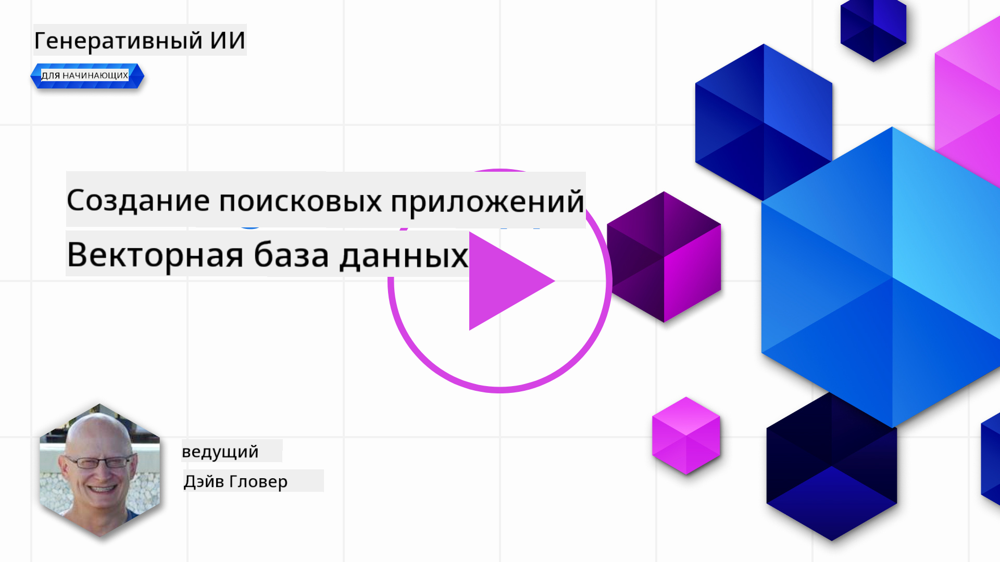
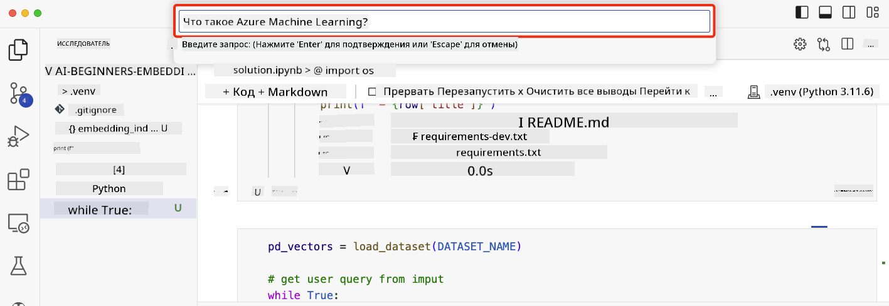

<!--
CO_OP_TRANSLATOR_METADATA:
{
  "original_hash": "d46aad0917a1a342d613e2c13d457da5",
  "translation_date": "2025-07-09T12:46:45+00:00",
  "source_file": "08-building-search-applications/README.md",
  "language_code": "ru"
}
-->
# Создание поисковых приложений

[](https://aka.ms/gen-ai-lesson8-gh?WT.mc_id=academic-105485-koreyst)

> > _Нажмите на изображение выше, чтобы посмотреть видео этого урока_

Большие языковые модели — это не только чат-боты и генерация текста. С помощью эмбеддингов можно создавать поисковые приложения. Эмбеддинги — это числовые представления данных, также известные как векторы, которые используются для семантического поиска информации.

В этом уроке вы создадите поисковое приложение для нашего образовательного стартапа. Наш стартап — некоммерческая организация, предоставляющая бесплатное образование студентам из развивающихся стран. У нас есть большое количество видео на YouTube, которые студенты могут использовать для изучения ИИ. Мы хотим создать поисковое приложение, которое позволит студентам искать видео на YouTube, вводя вопрос.

Например, студент может ввести «Что такое Jupyter Notebooks?» или «Что такое Azure ML», и приложение выдаст список релевантных видео, а ещё лучше — ссылку на место в видео, где содержится ответ на вопрос.

## Введение

В этом уроке мы рассмотрим:

- Семантический поиск и поиск по ключевым словам.
- Что такое текстовые эмбеддинги.
- Создание индекса текстовых эмбеддингов.
- Поиск по индексу текстовых эмбеддингов.

## Цели обучения

После прохождения урока вы сможете:

- Отличать семантический поиск от поиска по ключевым словам.
- Объяснять, что такое текстовые эмбеддинги.
- Создавать приложение с использованием эмбеддингов для поиска данных.

## Зачем создавать поисковое приложение?

Создание поискового приложения поможет понять, как использовать эмбеддинги для поиска данных. Вы также научитесь создавать приложение, которое позволит студентам быстро находить нужную информацию.

В уроке используется индекс эмбеддингов транскриптов YouTube-канала Microsoft [AI Show](https://www.youtube.com/playlist?list=PLlrxD0HtieHi0mwteKBOfEeOYf0LJU4O1). AI Show — это канал, обучающий ИИ и машинному обучению. Индекс эмбеддингов содержит эмбеддинги для каждого транскрипта видео до октября 2023 года. Вы будете использовать этот индекс для создания поискового приложения для нашего стартапа. Приложение возвращает ссылку на место в видео, где находится ответ на вопрос. Это отличный способ для студентов быстро находить нужную информацию.

Ниже пример семантического запроса «можно ли использовать rstudio с azure ml?». Обратите внимание на URL YouTube — в нем есть отметка времени, которая ведет к месту в видео с ответом на вопрос.


## Что такое семантический поиск?

Возможно, вы задаётесь вопросом, что такое семантический поиск? Это метод поиска, который использует смысл слов в запросе, чтобы вернуть релевантные результаты.

Вот пример семантического поиска. Допустим, вы хотите купить машину и ищете «машина моей мечты». Семантический поиск понимает, что вы не просто мечтаете о машине, а ищете свою идеальную машину. Он учитывает ваш замысел и возвращает релевантные результаты. Альтернатива — поиск по ключевым словам, который буквально ищет слова «мечта» и «машина» и часто выдает нерелевантные результаты.

## Что такое текстовые эмбеддинги?

[Текстовые эмбеддинги](https://en.wikipedia.org/wiki/Word_embedding?WT.mc_id=academic-105485-koreyst) — это способ представления текста, используемый в [обработке естественного языка](https://en.wikipedia.org/wiki/Natural_language_processing?WT.mc_id=academic-105485-koreyst). Эмбеддинги — это семантические числовые представления текста. Они позволяют представить данные в форме, удобной для обработки машиной. Существует множество моделей для создания текстовых эмбеддингов, в этом уроке мы сосредоточимся на генерации эмбеддингов с помощью модели OpenAI Embedding.

Вот пример: представьте, что следующий текст взят из транскрипта одного из эпизодов AI Show на YouTube:

```text
Today we are going to learn about Azure Machine Learning.
```

Мы передаем этот текст в OpenAI Embedding API, который возвращает эмбеддинг — вектор из 1536 чисел. Каждое число в векторе отражает разные аспекты текста. Для краткости приведены первые 10 чисел в векторе.

```python
[-0.006655829958617687, 0.0026128944009542465, 0.008792596869170666, -0.02446001023054123, -0.008540431968867779, 0.022071078419685364, -0.010703742504119873, 0.003311325330287218, -0.011632772162556648, -0.02187200076878071, ...]
```

## Как создается индекс эмбеддингов?

Индекс эмбеддингов для этого урока был создан с помощью серии скриптов на Python. Скрипты и инструкции находятся в [README](./scripts/README.md?WT.mc_id=academic-105485-koreyst) в папке `scripts` этого урока. Запускать скрипты для выполнения урока не обязательно, так как индекс эмбеддингов уже предоставлен.

Скрипты выполняют следующие действия:

1. Загружают транскрипты каждого видео из плейлиста [AI Show](https://www.youtube.com/playlist?list=PLlrxD0HtieHi0mwteKBOfEeOYf0LJU4O1).
2. С помощью [OpenAI Functions](https://learn.microsoft.com/azure/ai-services/openai/how-to/function-calling?WT.mc_id=academic-105485-koreyst) пытаются извлечь имя говорящего из первых 3 минут транскрипта. Имя говорящего для каждого видео сохраняется в индексе эмбеддингов `embedding_index_3m.json`.
3. Транскрипт разбивается на **текстовые сегменты по 3 минуты**. Каждый сегмент включает около 20 слов из следующего сегмента для перекрытия, чтобы эмбеддинг не обрывался и обеспечивался лучший контекст для поиска.
4. Каждый сегмент передается в OpenAI Chat API для создания краткого резюме из 60 слов. Резюме также сохраняется в индексе `embedding_index_3m.json`.
5. Наконец, текст сегмента передается в OpenAI Embedding API, который возвращает вектор из 1536 чисел, отражающий семантическое значение сегмента. Сегмент вместе с вектором сохраняется в индексе `embedding_index_3m.json`.

### Векторные базы данных

Для упрощения урока индекс эмбеддингов хранится в JSON-файле `embedding_index_3m.json` и загружается в Pandas DataFrame. Однако в реальных условиях индекс обычно хранится в векторной базе данных, например, в [Azure Cognitive Search](https://learn.microsoft.com/training/modules/improve-search-results-vector-search?WT.mc_id=academic-105485-koreyst), [Redis](https://cookbook.openai.com/examples/vector_databases/redis/readme?WT.mc_id=academic-105485-koreyst), [Pinecone](https://cookbook.openai.com/examples/vector_databases/pinecone/readme?WT.mc_id=academic-105485-koreyst), [Weaviate](https://cookbook.openai.com/examples/vector_databases/weaviate/readme?WT.mc_id=academic-105485-koreyst) и других.

## Понимание косинусного сходства

Мы изучили текстовые эмбеддинги, теперь следующий шаг — научиться использовать их для поиска данных, а именно находить наиболее похожие эмбеддинги для заданного запроса с помощью косинусного сходства.

### Что такое косинусное сходство?

Косинусное сходство — это мера сходства между двумя векторами, также известная как `поиск ближайших соседей`. Для поиска по косинусному сходству нужно _векторизовать_ текст запроса с помощью OpenAI Embedding API. Затем вычислить _косинусное сходство_ между вектором запроса и каждым вектором в индексе эмбеддингов. Помните, что индекс содержит вектор для каждого текстового сегмента транскрипта YouTube. Наконец, отсортировать результаты по косинусному сходству — сегменты с наибольшим значением будут наиболее похожи на запрос.

С математической точки зрения, косинусное сходство измеряет косинус угла между двумя векторами в многомерном пространстве. Это полезно, потому что даже если два документа далеко друг от друга по евклидову расстоянию из-за размера, угол между ними может быть маленьким, а значит, косинусное сходство — высоким. Подробнее о формулах косинусного сходства смотрите в статье [Cosine similarity](https://en.wikipedia.org/wiki/Cosine_similarity?WT.mc_id=academic-105485-koreyst).

## Создание вашего первого поискового приложения

Далее мы научимся создавать поисковое приложение с использованием эмбеддингов. Приложение позволит студентам искать видео, вводя вопрос. Оно вернет список видео, релевантных вопросу, а также ссылку на место в видео с ответом.

Это решение было разработано и протестировано на Windows 11, macOS и Ubuntu 22.04 с Python 3.10 и выше. Python можно скачать с [python.org](https://www.python.org/downloads/?WT.mc_id=academic-105485-koreyst).

## Задание — создание поискового приложения для студентов

В начале урока мы рассказали о нашем стартапе. Теперь пришло время помочь студентам создать поисковое приложение для их заданий.

В этом задании вы создадите сервисы Azure OpenAI, которые понадобятся для построения поискового приложения. Для выполнения задания потребуется подписка Azure.

### Запуск Azure Cloud Shell

1. Войдите в [Azure портал](https://portal.azure.com/?WT.mc_id=academic-105485-koreyst).
2. Нажмите на иконку Cloud Shell в правом верхнем углу портала.
3. Выберите **Bash** в качестве типа среды.

#### Создание группы ресурсов

> В этих инструкциях используется группа ресурсов с именем "semantic-video-search" в регионе East US.
> Вы можете изменить имя группы ресурсов, но при смене региона проверьте [таблицу доступности моделей](https://aka.ms/oai/models?WT.mc_id=academic-105485-koreyst).

```shell
az group create --name semantic-video-search --location eastus
```

#### Создание ресурса Azure OpenAI Service

В Azure Cloud Shell выполните следующую команду для создания ресурса Azure OpenAI Service.

```shell
az cognitiveservices account create --name semantic-video-openai --resource-group semantic-video-search \
    --location eastus --kind OpenAI --sku s0
```

#### Получение endpoint и ключей для использования в приложении

В Azure Cloud Shell выполните команды для получения endpoint и ключей ресурса Azure OpenAI Service.

```shell
az cognitiveservices account show --name semantic-video-openai \
   --resource-group  semantic-video-search | jq -r .properties.endpoint
az cognitiveservices account keys list --name semantic-video-openai \
   --resource-group semantic-video-search | jq -r .key1
```

#### Развертывание модели OpenAI Embedding

В Azure Cloud Shell выполните команду для развертывания модели OpenAI Embedding.

```shell
az cognitiveservices account deployment create \
    --name semantic-video-openai \
    --resource-group  semantic-video-search \
    --deployment-name text-embedding-ada-002 \
    --model-name text-embedding-ada-002 \
    --model-version "2"  \
    --model-format OpenAI \
    --sku-capacity 100 --sku-name "Standard"
```

## Решение

Откройте [блокнот с решением](../../../08-building-search-applications/python/aoai-solution.ipynb) в GitHub Codespaces и следуйте инструкциям в Jupyter Notebook.

При запуске блокнота вам будет предложено ввести запрос. Поле ввода будет выглядеть так:



## Отличная работа! Продолжайте обучение

После завершения урока ознакомьтесь с нашей [коллекцией по генеративному ИИ](https://aka.ms/genai-collection?WT.mc_id=academic-105485-koreyst), чтобы продолжить развивать свои знания в области генеративного ИИ!

Переходите к уроку 9, где мы рассмотрим, как [создавать приложения для генерации изображений](../09-building-image-applications/README.md?WT.mc_id=academic-105485-koreyst)!

**Отказ от ответственности**:  
Этот документ был переведен с помощью сервиса автоматического перевода [Co-op Translator](https://github.com/Azure/co-op-translator). Несмотря на наши усилия по обеспечению точности, просим учитывать, что автоматические переводы могут содержать ошибки или неточности. Оригинальный документ на его исходном языке следует считать авторитетным источником. Для получения критически важной информации рекомендуется обращаться к профессиональному человеческому переводу. Мы не несем ответственности за любые недоразумения или неправильные толкования, возникшие в результате использования данного перевода.