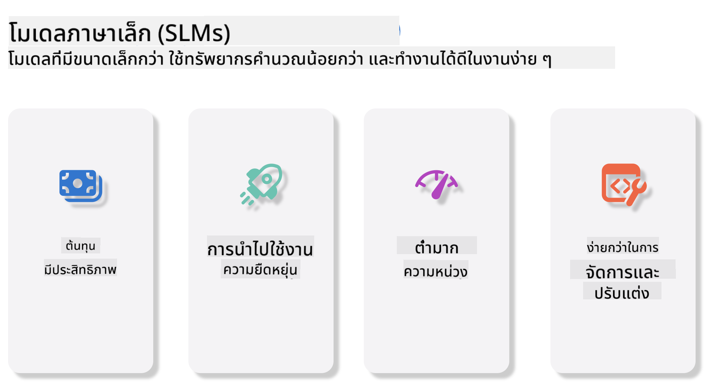
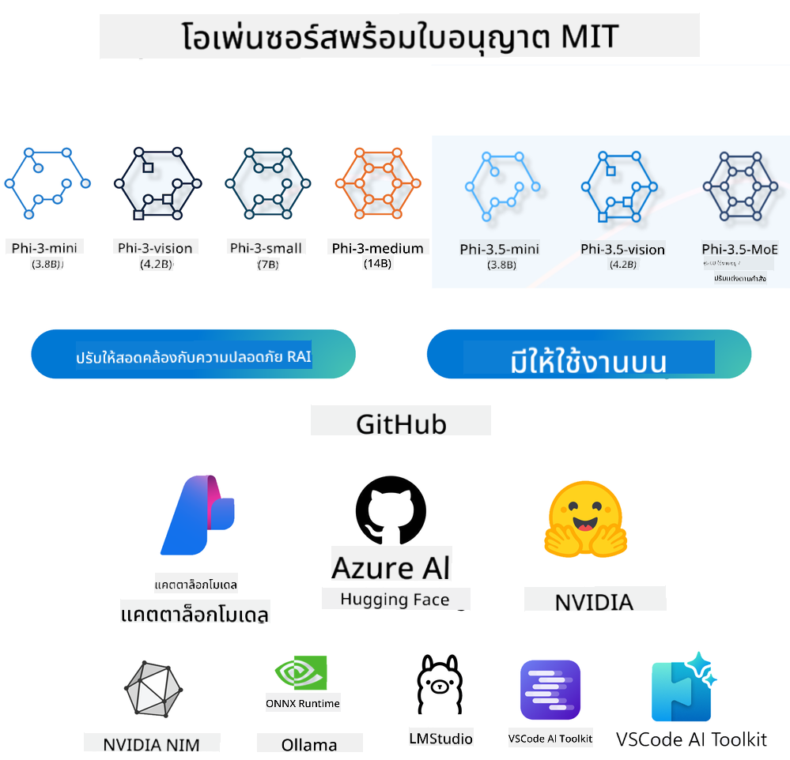

<!--
CO_OP_TRANSLATOR_METADATA:
{
  "original_hash": "124ad36cfe96f74038811b6e2bb93e9d",
  "translation_date": "2025-07-09T18:35:40+00:00",
  "source_file": "19-slm/README.md",
  "language_code": "th"
}
-->
# บทนำสู่โมเดลภาษาเล็กสำหรับ Generative AI สำหรับผู้เริ่มต้น  
Generative AI เป็นสาขาที่น่าตื่นเต้นของปัญญาประดิษฐ์ที่เน้นการสร้างระบบที่สามารถสร้างเนื้อหาใหม่ได้ เนื้อหานี้อาจเป็นได้ตั้งแต่ข้อความ ภาพ เพลง ไปจนถึงสภาพแวดล้อมเสมือนจริงทั้งหมด หนึ่งในแอปพลิเคชันที่น่าตื่นเต้นที่สุดของ generative AI คือในด้านโมเดลภาษา  

## โมเดลภาษาเลคคืออะไร?  

โมเดลภาษาเล็ก (SLM) คือเวอร์ชันที่ย่อขนาดลงของโมเดลภาษาใหญ่ (LLM) โดยใช้หลักการและเทคนิคทางสถาปัตยกรรมของ LLM แต่มีการใช้ทรัพยากรคำนวณที่น้อยลงอย่างมาก  

SLM เป็นกลุ่มย่อยของโมเดลภาษาที่ออกแบบมาเพื่อสร้างข้อความที่เหมือนมนุษย์ แตกต่างจากโมเดลขนาดใหญ่ เช่น GPT-4, SLM มีขนาดกะทัดรัดและมีประสิทธิภาพมากกว่า เหมาะสำหรับแอปพลิเคชันที่มีข้อจำกัดด้านทรัพยากรคอมพิวเตอร์ แม้จะมีขนาดเล็กกว่า แต่ก็ยังสามารถทำงานได้หลากหลาย โดยทั่วไป SLM ถูกสร้างขึ้นโดยการบีบอัดหรือกลั่นกรองจาก LLM เพื่อรักษาฟังก์ชันและความสามารถทางภาษาไว้ให้มากที่สุด การลดขนาดโมเดลนี้ช่วยลดความซับซ้อนโดยรวม ทำให้ SLM มีประสิทธิภาพทั้งในด้านการใช้หน่วยความจำและความต้องการคำนวณ แม้จะมีการปรับแต่งเหล่านี้ SLM ก็ยังสามารถทำงานด้านประมวลผลภาษาธรรมชาติ (NLP) ได้หลากหลาย เช่น  

- การสร้างข้อความ: สร้างประโยคหรือย่อหน้าที่สอดคล้องและเหมาะสมกับบริบท  
- การเติมข้อความ: ทำนายและเติมประโยคตามคำกระตุ้นที่กำหนด  
- การแปลภาษา: แปลงข้อความจากภาษาหนึ่งไปยังอีกภาษา  
- การสรุป: ย่อข้อความยาวให้สั้นลงและเข้าใจง่ายขึ้น  

แม้ว่าจะมีข้อจำกัดบางอย่างในเรื่องประสิทธิภาพหรือความลึกของความเข้าใจเมื่อเทียบกับโมเดลขนาดใหญ่  

## โมเดลภาษาเล็กทำงานอย่างไร?  
SLM ถูกฝึกด้วยข้อมูลข้อความจำนวนมาก ในระหว่างการฝึก โมเดลจะเรียนรู้รูปแบบและโครงสร้างของภาษา ทำให้สามารถสร้างข้อความที่ถูกต้องตามหลักไวยากรณ์และเหมาะสมกับบริบทได้ กระบวนการฝึกประกอบด้วย:  

- การเก็บรวบรวมข้อมูล: รวบรวมชุดข้อมูลข้อความขนาดใหญ่จากแหล่งต่างๆ  
- การเตรียมข้อมูล: ทำความสะอาดและจัดระเบียบข้อมูลให้เหมาะสมกับการฝึก  
- การฝึก: ใช้อัลกอริทึมการเรียนรู้ของเครื่องเพื่อสอนโมเดลให้เข้าใจและสร้างข้อความ  
- การปรับแต่ง: ปรับโมเดลเพื่อเพิ่มประสิทธิภาพในงานเฉพาะ  

การพัฒนา SLM สอดคล้องกับความต้องการที่เพิ่มขึ้นสำหรับโมเดลที่สามารถใช้งานในสภาพแวดล้อมที่มีข้อจำกัดด้านทรัพยากร เช่น อุปกรณ์มือถือหรือแพลตฟอร์ม edge computing ซึ่ง LLM ขนาดเต็มอาจไม่เหมาะสมเนื่องจากต้องการทรัพยากรสูง ด้วยการเน้นประสิทธิภาพ SLM จึงสร้างสมดุลระหว่างประสิทธิภาพและการเข้าถึง ช่วยให้สามารถนำไปใช้ในหลากหลายสาขาได้กว้างขึ้น  

  

## วัตถุประสงค์การเรียนรู้  

ในบทเรียนนี้ เราหวังว่าจะได้แนะนำความรู้เกี่ยวกับ SLM และผสมผสานกับ Microsoft Phi-3 เพื่อเรียนรู้สถานการณ์ต่างๆ ในเนื้อหาข้อความ วิสัยทัศน์ และ MoE  

เมื่อจบบทเรียนนี้ คุณควรจะสามารถตอบคำถามต่อไปนี้ได้:  

- SLM คืออะไร  
- ความแตกต่างระหว่าง SLM กับ LLM คืออะไร  
- Microsoft Phi-3/3.5 Family คืออะไร  
- วิธีการ inference Microsoft Phi-3/3.5 Family  

พร้อมหรือยัง? เริ่มกันเลย  

## ความแตกต่างระหว่างโมเดลภาษาใหญ่ (LLMs) และโมเดลภาษาเล็ก (SLMs)  

ทั้ง LLM และ SLM สร้างขึ้นบนพื้นฐานของหลักการเรียนรู้ของเครื่องแบบมีความน่าจะเป็น โดยใช้แนวทางที่คล้ายกันในด้านการออกแบบสถาปัตยกรรม วิธีการฝึก กระบวนการสร้างข้อมูล และเทคนิคการประเมินโมเดล อย่างไรก็ตาม มีปัจจัยสำคัญหลายประการที่ทำให้โมเดลทั้งสองประเภทนี้แตกต่างกัน  

## การใช้งานของโมเดลภาษาเล็ก  

SLM มีการใช้งานที่หลากหลาย เช่น:  

- แชทบอท: ให้บริการลูกค้าและโต้ตอบกับผู้ใช้ในรูปแบบการสนทนา  
- การสร้างเนื้อหา: ช่วยนักเขียนในการสร้างไอเดียหรือร่างบทความทั้งฉบับ  
- การศึกษา: ช่วยนักเรียนในการทำงานเขียนหรือเรียนรู้ภาษาใหม่  
- การเข้าถึง: สร้างเครื่องมือสำหรับผู้พิการ เช่น ระบบแปลงข้อความเป็นเสียง  

**ขนาด**  

ความแตกต่างหลักระหว่าง LLM และ SLM อยู่ที่ขนาดของโมเดล LLM เช่น ChatGPT (GPT-4) อาจมีพารามิเตอร์ประมาณ 1.76 ล้านล้านตัว ในขณะที่ SLM แบบโอเพนซอร์สอย่าง Mistral 7B มีพารามิเตอร์เพียงประมาณ 7 พันล้านตัว ความแตกต่างนี้เกิดจากสถาปัตยกรรมและกระบวนการฝึกที่ต่างกัน เช่น ChatGPT ใช้กลไก self-attention ในโครงสร้าง encoder-decoder ขณะที่ Mistral 7B ใช้ sliding window attention ซึ่งช่วยให้การฝึกมีประสิทธิภาพมากขึ้นในโมเดล decoder-only ความแตกต่างทางสถาปัตยกรรมนี้ส่งผลอย่างมากต่อความซับซ้อนและประสิทธิภาพของโมเดล  

**ความเข้าใจ**  

SLM มักถูกปรับแต่งให้ทำงานได้ดีในโดเมนเฉพาะ ทำให้มีความเชี่ยวชาญสูงแต่มีข้อจำกัดในการให้ความเข้าใจบริบทกว้างในหลายสาขาความรู้ ในทางกลับกัน LLM มุ่งเน้นจำลองความฉลาดเหมือนมนุษย์ในระดับที่ครอบคลุมมากกว่า โดยได้รับการฝึกด้วยชุดข้อมูลที่หลากหลายและขนาดใหญ่ ทำให้สามารถทำงานได้ดีในหลายโดเมน มีความยืดหยุ่นและปรับตัวได้สูง ดังนั้น LLM จึงเหมาะกับงานที่หลากหลาย เช่น การประมวลผลภาษาธรรมชาติและการเขียนโปรแกรม  

**การคำนวณ**  

การฝึกและใช้งาน LLM ต้องใช้ทรัพยากรจำนวนมาก โดยมักต้องใช้โครงสร้างพื้นฐานคอมพิวเตอร์ที่มี GPU จำนวนมาก เช่น การฝึก ChatGPT จากศูนย์อาจต้องใช้ GPU หลายพันตัวเป็นเวลานาน ในทางกลับกัน SLM ด้วยจำนวนพารามิเตอร์ที่น้อยกว่า จึงเข้าถึงได้ง่ายกว่าในแง่ของทรัพยากรคอมพิวเตอร์ โมเดลอย่าง Mistral 7B สามารถฝึกและรันบนเครื่องท้องถิ่นที่มี GPU ระดับกลางได้ แม้ว่าการฝึกยังต้องใช้เวลาหลายชั่วโมงและหลาย GPU  

**อคติ**  

อคติเป็นปัญหาที่รู้จักใน LLM ส่วนใหญ่เกิดจากลักษณะของข้อมูลฝึก ซึ่งมักเป็นข้อมูลดิบจากอินเทอร์เน็ตที่อาจขาดการแทนที่หรือบิดเบือนกลุ่มบางกลุ่ม มีการติดป้ายผิด หรือสะท้อนอคติทางภาษา เช่น สำเนียง ภูมิภาค และกฎไวยากรณ์ นอกจากนี้ ความซับซ้อนของสถาปัตยกรรม LLM อาจทำให้อคติเพิ่มขึ้นโดยไม่ถูกตรวจพบหากไม่มีการปรับแต่งอย่างระมัดระวัง ในทางกลับกัน SLM ที่ฝึกด้วยชุดข้อมูลเฉพาะโดเมนที่จำกัด มีแนวโน้มที่จะมีอคติน้อยกว่า แม้จะไม่ใช่ไม่มีเลย  

**การ inference**  

ขนาดที่เล็กลงของ SLM ทำให้มีข้อได้เปรียบอย่างมากในเรื่องความเร็วในการ inference สามารถสร้างผลลัพธ์ได้อย่างรวดเร็วบนฮาร์ดแวร์ท้องถิ่นโดยไม่ต้องใช้การประมวลผลแบบขนานจำนวนมาก ในขณะที่ LLM ด้วยขนาดและความซับซ้อน มักต้องใช้ทรัพยากรการประมวลผลแบบขนานจำนวนมากเพื่อให้ได้เวลาตอบสนองที่ยอมรับได้ การมีผู้ใช้หลายคนพร้อมกันยังทำให้เวลาตอบสนองของ LLM ช้าลง โดยเฉพาะเมื่อใช้งานในระดับขนาดใหญ่  

สรุปแล้ว แม้ว่า LLM และ SLM จะมีพื้นฐานร่วมกันในด้านการเรียนรู้ของเครื่อง แต่มีความแตกต่างอย่างมากในเรื่องขนาดโมเดล ความต้องการทรัพยากร ความเข้าใจบริบท ความเสี่ยงต่ออคติ และความเร็วในการ inference ความแตกต่างเหล่านี้สะท้อนถึงความเหมาะสมในการใช้งานที่แตกต่างกัน โดย LLM มีความยืดหยุ่นสูงแต่ใช้ทรัพยากรมาก ในขณะที่ SLM มีประสิทธิภาพเฉพาะโดเมนและใช้ทรัพยากรน้อยกว่า  

***หมายเหตุ：ในบทนี้เราจะใช้ Microsoft Phi-3 / 3.5 เป็นตัวอย่างในการแนะนำ SLM***  

## แนะนำ Phi-3 / Phi-3.5 Family  

Phi-3 / 3.5 Family มุ่งเน้นไปที่สถานการณ์การใช้งานด้านข้อความ วิสัยทัศน์ และ Agent (MoE)  

### Phi-3 / 3.5 Instruct  

เน้นการสร้างข้อความ การเติมข้อความสนทนา และการสกัดข้อมูลเนื้อหา เป็นต้น  

**Phi-3-mini**  

โมเดลภาษาขนาด 3.8B มีให้ใช้งานบน Microsoft Azure AI Studio, Hugging Face และ Ollama โมเดล Phi-3 มีประสิทธิภาพดีกว่าโมเดลภาษาที่มีขนาดเท่ากันหรือใหญ่กว่าในเกณฑ์มาตรฐานสำคัญ (ดูตัวเลขเกณฑ์ด้านล่าง ยิ่งสูงยิ่งดี) Phi-3-mini มีประสิทธิภาพดีกว่าโมเดลที่มีขนาดใหญ่กว่าถึงสองเท่า ในขณะที่ Phi-3-small และ Phi-3-medium มีประสิทธิภาพดีกว่าโมเดลขนาดใหญ่ รวมถึง GPT-3.5  

**Phi-3-small & medium**  

ด้วยพารามิเตอร์เพียง 7B, Phi-3-small ชนะ GPT-3.5T ในเกณฑ์มาตรฐานด้านภาษา การให้เหตุผล การเขียนโค้ด และคณิตศาสตร์หลายรายการ  

Phi-3-medium ที่มี 14B พารามิเตอร์ ยังคงแนวโน้มนี้และมีประสิทธิภาพดีกว่า Gemini 1.0 Pro  

**Phi-3.5-mini**  

สามารถมองว่าเป็นการอัปเกรดของ Phi-3-mini แม้ว่าพารามิเตอร์จะไม่เปลี่ยนแปลง แต่เพิ่มความสามารถในการรองรับหลายภาษา (รองรับมากกว่า 20 ภาษา: อาหรับ จีน เช็ก เดนมาร์ก ดัตช์ อังกฤษ ฟินแลนด์ ฝรั่งเศส เยอรมัน ฮีบรู ฮังการี อิตาลี ญี่ปุ่น เกาหลี นอร์เวย์ โปแลนด์ โปรตุเกส รัสเซีย สเปน สวีเดน ไทย ตุรกี ยูเครน) และเพิ่มการรองรับบริบทยาวที่แข็งแกร่งขึ้น  

Phi-3.5-mini ที่มี 3.8B พารามิเตอร์ มีประสิทธิภาพดีกว่าโมเดลภาษาขนาดเดียวกันและเทียบเท่ากับโมเดลที่มีขนาดใหญ่กว่าสองเท่า  

### Phi-3 / 3.5 Vision  

เราสามารถมองว่าโมเดล Instruct ของ Phi-3/3.5 คือความสามารถของ Phi ในการเข้าใจ ส่วน Vision คือสิ่งที่ทำให้ Phi มี “ตา” เพื่อเข้าใจโลก  

**Phi-3-Vision**  

Phi-3-vision ที่มีพารามิเตอร์เพียง 4.2B ยังคงแนวโน้มนี้และมีประสิทธิภาพดีกว่าโมเดลขนาดใหญ่ เช่น Claude-3 Haiku และ Gemini 1.0 Pro V ในงานด้านการให้เหตุผลภาพทั่วไป OCR และการเข้าใจตารางและแผนภูมิ  

**Phi-3.5-Vision**  

Phi-3.5-Vision เป็นการอัปเกรดของ Phi-3-Vision เพิ่มการรองรับภาพหลายภาพ คุณสามารถมองว่าเป็นการพัฒนาด้านวิสัยทัศน์ ไม่เพียงแค่ดูภาพนิ่งได้ แต่ยังดูวิดีโอได้ด้วย  

Phi-3.5-vision มีประสิทธิภาพดีกว่าโมเดลขนาดใหญ่ เช่น Claude-3.5 Sonnet และ Gemini 1.5 Flash ในงาน OCR การเข้าใจตารางและแผนภูมิ และเทียบเท่าในงานให้เหตุผลความรู้ภาพทั่วไป รองรับการป้อนข้อมูลหลายเฟรม คือสามารถให้เหตุผลจากภาพหลายภาพพร้อมกัน  

### Phi-3.5-MoE  

***Mixture of Experts (MoE)*** ช่วยให้โมเดลถูกฝึกด้วยการใช้คำนวณน้อยลงมาก ซึ่งหมายความว่าคุณสามารถขยายขนาดโมเดลหรือชุดข้อมูลได้อย่างมากโดยใช้งบประมาณคำนวณเท่าเดิมกับโมเดลแบบหนาแน่น โดยเฉพาะอย่างยิ่ง โมเดล MoE ควรจะได้คุณภาพเทียบเท่ากับโมเดลแบบหนาแน่นในเวลาการฝึกที่เร็วกว่า  

Phi-3.5-MoE ประกอบด้วยโมดูลผู้เชี่ยวชาญ 16x3.8B Phi-3.5-MoE ที่มีพารามิเตอร์ใช้งานจริงเพียง 6.6B สามารถให้เหตุผล เข้าใจภาษา และคณิตศาสตร์ในระดับใกล้เคียงกับโมเดลที่ใหญ่กว่ามาก  

เราสามารถใช้โมเดล Phi-3/3.5 Family ตามสถานการณ์ต่างๆ แตกต่างจาก LLM ที่คุณสามารถนำ Phi-3/3.5-mini หรือ Phi-3/3.5-Vision ไปใช้งานบนอุปกรณ์ edge ได้  

## วิธีการใช้โมเดล Phi-3/3.5 Family  

เราหวังว่าจะใช้ Phi-3/3.5 ในสถานการณ์ต่างๆ ต่อไปนี้เราจะใช้ Phi-3/3.5 ตามสถานการณ์ต่างๆ  

  

### ความแตกต่างในการ inference ผ่าน Cloud API  

**GitHub Models**  

GitHub Models เป็นวิธีที่ตรงที่สุด คุณสามารถเข้าถึงโมเดล Phi-3/3.5-Instruct ได้อย่างรวดเร็วผ่าน GitHub Models ร่วมกับ Azure AI Inference SDK / OpenAI SDK คุณสามารถเรียก API ผ่านโค้ดเพื่อทำการเรียกใช้ Phi-3/3.5-Instruct ได้ นอกจากนี้ยังสามารถทดสอบผลลัพธ์ต่างๆ ผ่าน Playground  

- ตัวอย่าง: เปรียบเทียบผลลัพธ์ของ Phi-3-mini และ Phi-3.5-mini ในสถานการณ์ภาษาจีน  

  

  

**Azure AI Studio**  

หากต้องการใช้โมเดล vision และ MoE คุณสามารถใช้ Azure AI Studio เพื่อเรียกใช้งาน หากสนใจสามารถอ่าน Phi-3 Cookbook เพื่อเรียนรู้วิธีเรียก Phi-3/3.5 Instruct, Vision, MoE ผ่าน Azure AI Studio [คลิกที่ลิงก์นี้](https://github.com/microsoft/Phi-3CookBook/blob/main/md/02.QuickStart/AzureAIStudio_QuickStart.md?WT.mc_id=academic-105485-koreyst)  

**NVIDIA NIM**  

นอกจากโซลูชัน Model Catalog บนคลาวด์ที่ Azure และ GitHub ให้บริการแล้ว คุณยังสามารถใช้ [NVIDIA NIM](https://developer.nvidia.com/nim?WT.mc_id=academic-105485-koreyst) เพื่อเรียกใช้งานที่เกี่ยวข้องได้ คุณสามารถเยี่ยมชม NVIDIA NIM เพื่อทำการเรียก API ของ Phi-3/3.5 Family ได้ NVIDIA NIM (NVIDIA Inference Microservices) คือชุดไมโครเซอร์วิสสำหรับ inference ที่เร่งความเร็ว ช่วยให้นักพัฒนาสามารถปรับใช้โมเดล AI ได้อย่างมีประสิทธิภาพในสภาพแวดล้อมต่างๆ รวมถึงคลาวด์ ศูนย์ข้อมูล และเวิร์กสเตชัน  

คุณสมบัติสำคัญของ NVIDIA NIM ได้แก่:  

- **ง่ายต่อการปรับใช้:** NIM ช่วยให้ปรับใช้โมเดล AI ได้ด้วยคำสั่งเดียว ทำให้ง่ายต่อการผนวกเข้ากับเวิร์กโฟลว์ที่มีอยู่  
- **ประสิทธิภาพที่ปรับแต่งแล้ว:** ใช้เอนจิน inference ที่ปรับแต่งล่วงหน้าของ NVIDIA เช่น TensorRT และ TensorRT-LLM เพื่อให้ได้ความหน่วงต่ำและประสิทธิภาพสูง  
- **ความสามารถในการปรับขนาด:** NIM รองรับการปรับขนาดอัตโนมัติบน Kubernetes
- **ความปลอดภัยและการควบคุม:** องค์กรสามารถควบคุมข้อมูลและแอปพลิเคชันของตนเองได้โดยการโฮสต์ไมโครเซอร์วิส NIM บนโครงสร้างพื้นฐานที่จัดการเอง  
- **API มาตรฐาน:** NIM มี API ตามมาตรฐานอุตสาหกรรม ทำให้ง่ายต่อการสร้างและผสานรวมแอปพลิเคชัน AI เช่น แชทบอท ผู้ช่วย AI และอื่นๆ

NIM เป็นส่วนหนึ่งของ NVIDIA AI Enterprise ซึ่งมีเป้าหมายเพื่อทำให้การติดตั้งและใช้งานโมเดล AI ง่ายขึ้น พร้อมรับประกันว่าโมเดลจะทำงานได้อย่างมีประสิทธิภาพบน GPU ของ NVIDIA

- ตัวอย่างสาธิต: การใช้ Nividia NIM เรียก Phi-3.5-Vision-API  [[คลิกที่นี่](../../../19-slm/python/Phi-3-Vision-Nividia-NIM.ipynb)]


### การทำ Inference Phi-3/3.5 ในสภาพแวดล้อมท้องถิ่น  
การทำ Inference กับ Phi-3 หรือโมเดลภาษาอื่นๆ เช่น GPT-3 หมายถึงกระบวนการสร้างคำตอบหรือการทำนายจากข้อมูลที่ได้รับ เมื่อคุณป้อนคำถามหรือคำสั่งให้ Phi-3 มันจะใช้เครือข่ายประสาทเทียมที่ผ่านการฝึกมาแล้ว เพื่อวิเคราะห์รูปแบบและความสัมพันธ์ในข้อมูลที่ได้รับการฝึกฝน และคาดการณ์คำตอบที่เหมาะสมที่สุด

**Hugging Face Transformer**  
Hugging Face Transformers เป็นไลบรารีที่ทรงพลังสำหรับงานประมวลผลภาษาธรรมชาติ (NLP) และงานเรียนรู้ของเครื่องอื่นๆ โดยมีจุดเด่นดังนี้:

1. **โมเดลที่ผ่านการฝึกมาแล้ว:** มีโมเดลที่ผ่านการฝึกมาแล้วนับพันโมเดลสำหรับงานต่างๆ เช่น การจัดหมวดหมู่ข้อความ, การรู้จำชื่อเฉพาะ, การตอบคำถาม, การสรุปข้อความ, การแปลภาษา และการสร้างข้อความ

2. **รองรับหลายเฟรมเวิร์ก:** ไลบรารีรองรับเฟรมเวิร์กการเรียนรู้ลึกหลายตัว เช่น PyTorch, TensorFlow และ JAX ทำให้สามารถฝึกโมเดลในเฟรมเวิร์กหนึ่งและใช้งานในอีกเฟรมเวิร์กหนึ่งได้

3. **ความสามารถมัลติโมดอล:** นอกจาก NLP แล้ว Hugging Face Transformers ยังรองรับงานด้านคอมพิวเตอร์วิชัน (เช่น การจำแนกรูปภาพ, การตรวจจับวัตถุ) และการประมวลผลเสียง (เช่น การรู้จำเสียงพูด, การจำแนกเสียง)

4. **ใช้งานง่าย:** ไลบรารีมี API และเครื่องมือที่ช่วยให้ดาวน์โหลดและปรับแต่งโมเดลได้ง่าย เหมาะสำหรับทั้งผู้เริ่มต้นและผู้เชี่ยวชาญ

5. **ชุมชนและทรัพยากร:** Hugging Face มีชุมชนที่แข็งแกร่ง พร้อมเอกสาร คู่มือ และบทเรียนมากมายเพื่อช่วยให้ผู้ใช้เริ่มต้นและใช้งานไลบรารีได้เต็มที่  
[เอกสารอย่างเป็นทางการ](https://huggingface.co/docs/transformers/index?WT.mc_id=academic-105485-koreyst) หรือ [ที่เก็บ GitHub](https://github.com/huggingface/transformers?WT.mc_id=academic-105485-koreyst)

นี่เป็นวิธีที่ใช้กันอย่างแพร่หลาย แต่ก็ต้องการการเร่งด้วย GPU เพราะงานอย่าง Vision และ MoE ต้องการการคำนวณจำนวนมาก ซึ่งจะถูกจำกัดมากถ้าใช้ CPU โดยไม่ทำการควอนไทซ์

- ตัวอย่างสาธิต: ใช้ Transformer เรียก Phi-3.5-Instuct [คลิกที่นี่](../../../19-slm/python/phi35-instruct-demo.ipynb)

- ตัวอย่างสาธิต: ใช้ Transformer เรียก Phi-3.5-Vision [คลิกที่นี่](../../../19-slm/python/phi35-vision-demo.ipynb)

- ตัวอย่างสาธิต: ใช้ Transformer เรียก Phi-3.5-MoE [คลิกที่นี่](../../../19-slm/python/phi35_moe_demo.ipynb)

**Ollama**  
[Ollama](https://ollama.com/?WT.mc_id=academic-105485-koreyst) เป็นแพลตฟอร์มที่ออกแบบมาเพื่อให้ง่ายต่อการรันโมเดลภาษาขนาดใหญ่ (LLMs) บนเครื่องของคุณเอง รองรับโมเดลต่างๆ เช่น Llama 3.1, Phi 3, Mistral, และ Gemma 2 เป็นต้น แพลตฟอร์มนี้ช่วยรวบรวมเวทโมเดล การตั้งค่า และข้อมูลไว้ในแพ็กเกจเดียว ทำให้ผู้ใช้สามารถปรับแต่งและสร้างโมเดลของตัวเองได้ง่ายขึ้น Ollama รองรับ macOS, Linux และ Windows เป็นเครื่องมือที่ดีสำหรับการทดลองหรือใช้งาน LLMs โดยไม่ต้องพึ่งพาบริการคลาวด์ Ollama เป็นวิธีที่ตรงไปตรงมาที่สุด เพียงแค่รันคำสั่งต่อไปนี้

```bash

ollama run phi3.5

```


**ONNX Runtime สำหรับ GenAI**

[ONNX Runtime](https://github.com/microsoft/onnxruntime-genai?WT.mc_id=academic-105485-koreyst) เป็นเครื่องมือเร่งความเร็วสำหรับการทำ inference และการฝึกโมเดล machine learning ข้ามแพลตฟอร์ม ONNX Runtime สำหรับ Generative AI (GENAI) เป็นเครื่องมือทรงพลังที่ช่วยให้คุณรันโมเดล generative AI ได้อย่างมีประสิทธิภาพบนแพลตฟอร์มต่างๆ

## ONNX Runtime คืออะไร?  
ONNX Runtime เป็นโครงการโอเพนซอร์สที่ช่วยให้การทำ inference ของโมเดล machine learning มีประสิทธิภาพสูง รองรับโมเดลในรูปแบบ Open Neural Network Exchange (ONNX) ซึ่งเป็นมาตรฐานสำหรับการแทนโมเดล machine learning ONNX Runtime ช่วยให้ประสบการณ์ของลูกค้าเร็วขึ้นและลดต้นทุน รองรับโมเดลจากเฟรมเวิร์ก deep learning เช่น PyTorch และ TensorFlow/Keras รวมถึงไลบรารี machine learning แบบดั้งเดิม เช่น scikit-learn, LightGBM, XGBoost เป็นต้น ONNX Runtime เข้ากันได้กับฮาร์ดแวร์ ไดรเวอร์ และระบบปฏิบัติการหลากหลาย พร้อมเพิ่มประสิทธิภาพด้วยการใช้ฮาร์ดแวร์เร่งความเร็วควบคู่กับการปรับแต่งกราฟและการแปลงต่างๆ

## Generative AI คืออะไร?  
Generative AI หมายถึงระบบ AI ที่สามารถสร้างเนื้อหาใหม่ เช่น ข้อความ รูปภาพ หรือเพลง โดยอิงจากข้อมูลที่ได้รับการฝึกมา ตัวอย่างเช่น โมเดลภาษาอย่าง GPT-3 และโมเดลสร้างภาพอย่าง Stable Diffusion ไลบรารี ONNX Runtime สำหรับ GenAI ให้วงจร generative AI สำหรับโมเดล ONNX รวมถึงการทำ inference ด้วย ONNX Runtime, การประมวลผล logits, การค้นหาและการสุ่มตัวอย่าง, และการจัดการแคช KV

## ONNX Runtime สำหรับ GENAI  
ONNX Runtime สำหรับ GENAI ขยายความสามารถของ ONNX Runtime เพื่อรองรับโมเดล generative AI โดยมีฟีเจอร์สำคัญดังนี้:

- **รองรับแพลตฟอร์มหลากหลาย:** ทำงานได้บน Windows, Linux, macOS, Android และ iOS  
- **รองรับโมเดล:** รองรับโมเดล generative AI ยอดนิยมหลายตัว เช่น LLaMA, GPT-Neo, BLOOM และอื่นๆ  
- **เพิ่มประสิทธิภาพ:** มีการปรับแต่งสำหรับฮาร์ดแวร์เร่งความเร็วต่างๆ เช่น NVIDIA GPUs, AMD GPUs และอื่นๆ  
- **ใช้งานง่าย:** มี API สำหรับการผสานรวมเข้ากับแอปพลิเคชัน ช่วยให้สร้างข้อความ รูปภาพ และเนื้อหาอื่นๆ ได้ด้วยโค้ดน้อย  
- ผู้ใช้สามารถเรียกใช้เมธอด generate() ระดับสูง หรือรันแต่ละรอบของโมเดลในลูป โดยสร้างทีละโทเค็น และอัปเดตพารามิเตอร์การสร้างภายในลูปได้  
- ONNX Runtime ยังรองรับ greedy/beam search และ TopP, TopK sampling สำหรับสร้างลำดับโทเค็น พร้อมการประมวลผล logits ในตัว เช่น การลงโทษการทำซ้ำ และสามารถเพิ่มการให้คะแนนแบบกำหนดเองได้ง่าย

## เริ่มต้นใช้งาน  
เพื่อเริ่มต้นกับ ONNX Runtime สำหรับ GENAI คุณสามารถทำตามขั้นตอนดังนี้:

### ติดตั้ง ONNX Runtime:  
```Python
pip install onnxruntime
```  
### ติดตั้งส่วนขยาย Generative AI:  
```Python
pip install onnxruntime-genai
```

### รันโมเดล: ตัวอย่างง่ายๆ ใน Python:  
```Python
import onnxruntime_genai as og

model = og.Model('path_to_your_model.onnx')

tokenizer = og.Tokenizer(model)

input_text = "Hello, how are you?"

input_tokens = tokenizer.encode(input_text)

output_tokens = model.generate(input_tokens)

output_text = tokenizer.decode(output_tokens)

print(output_text) 
```  
### ตัวอย่างสาธิต: ใช้ ONNX Runtime GenAI เรียก Phi-3.5-Vision

```python

import onnxruntime_genai as og

model_path = './Your Phi-3.5-vision-instruct ONNX Path'

img_path = './Your Image Path'

model = og.Model(model_path)

processor = model.create_multimodal_processor()

tokenizer_stream = processor.create_stream()

text = "Your Prompt"

prompt = "<|user|>\n"

prompt += "<|image_1|>\n"

prompt += f"{text}<|end|>\n"

prompt += "<|assistant|>\n"

image = og.Images.open(img_path)

inputs = processor(prompt, images=image)

params = og.GeneratorParams(model)

params.set_inputs(inputs)

params.set_search_options(max_length=3072)

generator = og.Generator(model, params)

while not generator.is_done():

    generator.compute_logits()
    
    generator.generate_next_token()

    new_token = generator.get_next_tokens()[0]
    
    code += tokenizer_stream.decode(new_token)
    
    print(tokenizer_stream.decode(new_token), end='', flush=True)

```


**อื่นๆ**

นอกจากวิธีอ้างอิง ONNX Runtime และ Ollama เรายังสามารถทำงานกับโมเดลเชิงปริมาณโดยอ้างอิงจากวิธีของผู้ผลิตต่างๆ เช่น Apple MLX framework กับ Apple Metal, Qualcomm QNN กับ NPU, Intel OpenVINO กับ CPU/GPU เป็นต้น คุณยังสามารถหาข้อมูลเพิ่มเติมได้จาก [Phi-3 Cookbook](https://github.com/microsoft/phi-3cookbook?WT.mc_id=academic-105485-koreyst)


## เพิ่มเติม

เราได้เรียนรู้พื้นฐานของ Phi-3/3.5 Family แล้ว แต่ถ้าต้องการเรียนรู้เพิ่มเติมเกี่ยวกับ SLM จำเป็นต้องมีความรู้เพิ่มขึ้น คุณสามารถหาคำตอบได้ใน Phi-3 Cookbook หากต้องการเรียนรู้เพิ่มเติม กรุณาเยี่ยมชม [Phi-3 Cookbook](https://github.com/microsoft/phi-3cookbook?WT.mc_id=academic-105485-koreyst)

**ข้อจำกัดความรับผิดชอบ**:  
เอกสารนี้ได้รับการแปลโดยใช้บริการแปลภาษาอัตโนมัติ [Co-op Translator](https://github.com/Azure/co-op-translator) แม้เราจะพยายามให้ความถูกต้องสูงสุด แต่โปรดทราบว่าการแปลอัตโนมัติอาจมีข้อผิดพลาดหรือความไม่ถูกต้อง เอกสารต้นฉบับในภาษาต้นทางถือเป็นแหล่งข้อมูลที่เชื่อถือได้ สำหรับข้อมูลที่สำคัญ ขอแนะนำให้ใช้บริการแปลโดยผู้เชี่ยวชาญมนุษย์ เราไม่รับผิดชอบต่อความเข้าใจผิดหรือการตีความผิดใด ๆ ที่เกิดจากการใช้การแปลนี้