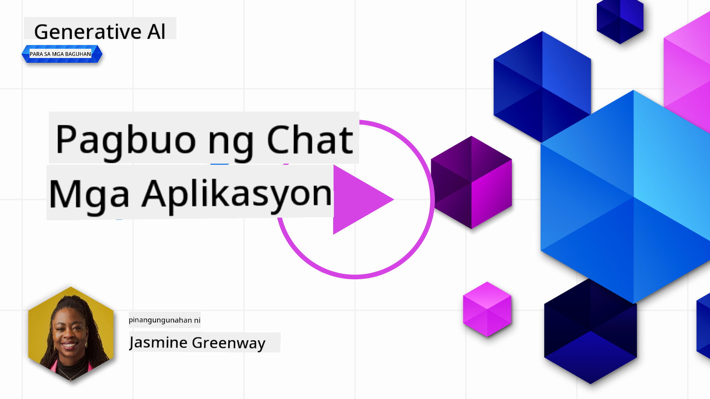
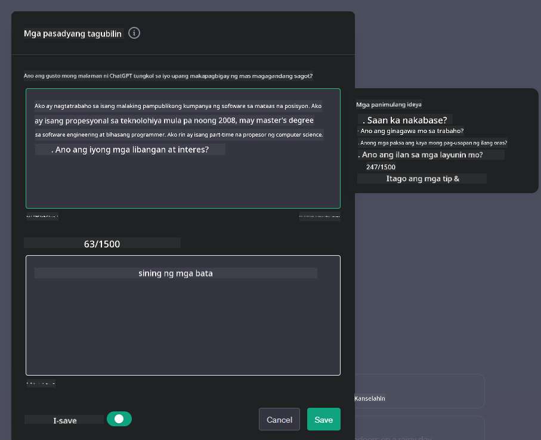
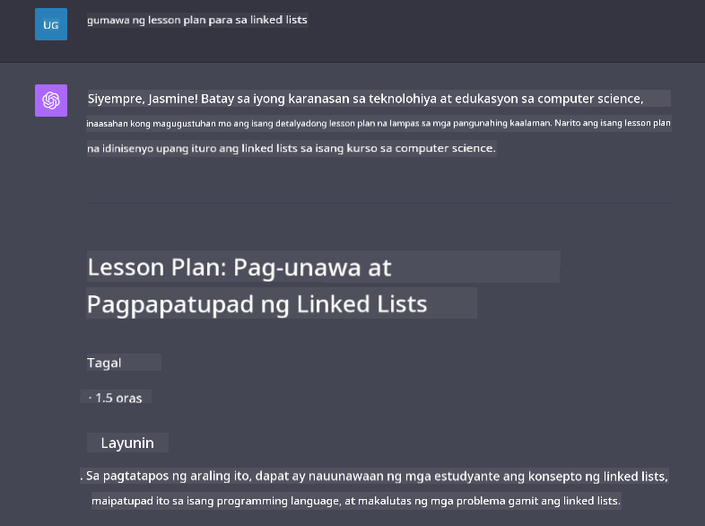

<!--
CO_OP_TRANSLATOR_METADATA:
{
  "original_hash": "ea4bbe640847aafbbba14dae4625e9af",
  "translation_date": "2025-07-09T12:36:14+00:00",
  "source_file": "07-building-chat-applications/README.md",
  "language_code": "tl"
}
-->
# Paggawa ng Mga Chat Application na Pinapagana ng Generative AI

[](https://aka.ms/gen-ai-lessons7-gh?WT.mc_id=academic-105485-koreyst)

> _(I-click ang larawan sa itaas para panoorin ang video ng araling ito)_

Ngayon na nakita na natin kung paano tayo makakagawa ng mga text-generation na app, tingnan naman natin ang mga chat application.

Ang mga chat application ay naging bahagi na ng ating pang-araw-araw na buhay, na hindi lang simpleng paraan ng pakikipag-usap. Mahalaga sila sa customer service, technical support, at maging sa mga sopistikadong advisory system. Malamang na nakatanggap ka ng tulong mula sa isang chat application kamakailan lang. Habang iniintegrate natin ang mas advanced na teknolohiya tulad ng generative AI sa mga platform na ito, tumataas ang antas ng komplikasyon pati na rin ang mga hamon.

Ilan sa mga tanong na kailangang masagot ay:

- **Paggawa ng app**. Paano tayo makakagawa nang epektibo at maayos na maipapasok ang mga AI-powered na application para sa mga partikular na gamit?
- **Pagmamanman**. Kapag nailunsad na, paano natin mamomonitor at masisiguro na gumagana ang mga application sa pinakamataas na kalidad, kapwa sa functionality at pagsunod sa [anim na prinsipyo ng responsible AI](https://www.microsoft.com/ai/responsible-ai?WT.mc_id=academic-105485-koreyst)?

Habang papasok tayo sa panahon ng automation at seamless na interaksyon ng tao at makina, mahalagang maunawaan kung paano binabago ng generative AI ang saklaw, lalim, at kakayahang umangkop ng mga chat application. Susuriin ng araling ito ang mga aspeto ng arkitektura na sumusuporta sa mga komplikadong sistemang ito, tatalakayin ang mga pamamaraan para sa fine-tuning para sa mga domain-specific na gawain, at susuriin ang mga sukatan at konsiderasyon para sa responsableng paggamit ng AI.

## Panimula

Saklaw ng araling ito ang:

- Mga teknik para sa epektibong paggawa at integrasyon ng mga chat application.
- Paano mag-apply ng customization at fine-tuning sa mga application.
- Mga estratehiya at konsiderasyon para sa epektibong pagmamanman ng mga chat application.

## Mga Layunin sa Pagkatuto

Sa pagtatapos ng araling ito, magagawa mong:

- Ilarawan ang mga konsiderasyon sa paggawa at integrasyon ng mga chat application sa mga umiiral na sistema.
- I-customize ang mga chat application para sa mga partikular na gamit.
- Tukuyin ang mga pangunahing sukatan at konsiderasyon para sa epektibong pagmamanman at pagpapanatili ng kalidad ng mga AI-powered na chat application.
- Masiguro na ginagamit ang AI nang responsable sa mga chat application.

## Pagsasama ng Generative AI sa mga Chat Application

Ang pagpapahusay ng mga chat application gamit ang generative AI ay hindi lang tungkol sa pagpapatalino sa mga ito; ito ay tungkol sa pag-optimize ng kanilang arkitektura, performance, at user interface upang makapaghatid ng mataas na kalidad na karanasan sa gumagamit. Kasama rito ang pagsusuri sa mga pundasyon ng arkitektura, integrasyon ng API, at mga konsiderasyon sa user interface. Layunin ng seksyong ito na bigyan ka ng komprehensibong gabay sa pag-navigate sa mga komplikadong aspetong ito, maging ito man ay pagdudugtong sa mga umiiral na sistema o paggawa ng mga standalone na platform.

Sa pagtatapos ng seksyong ito, magkakaroon ka ng kaalaman para sa epektibong paggawa at pagsasama ng mga chat application.

### Chatbot o Chat application?

Bago tayo sumabak sa paggawa ng mga chat application, ihambing muna natin ang 'chatbots' at 'AI-powered chat applications,' na may magkakaibang papel at gamit. Ang pangunahing layunin ng chatbot ay i-automate ang mga partikular na gawain sa pag-uusap, tulad ng pagsagot sa mga madalas itanong o pagsubaybay ng package. Karaniwan itong pinapatakbo ng rule-based na lohika o komplikadong AI algorithms. Sa kabilang banda, ang AI-powered chat application ay mas malawak na kapaligiran na dinisenyo para sa iba't ibang anyo ng digital na komunikasyon, tulad ng text, voice, at video chat sa pagitan ng mga tao. Ang pangunahing katangian nito ay ang integrasyon ng generative AI model na kayang gayahin ang masalimuot at parang-taong pag-uusap, na bumubuo ng mga sagot base sa malawak na input at konteksto. Ang generative AI-powered chat application ay kayang makipag-usap sa open-domain, umangkop sa nagbabagong konteksto ng pag-uusap, at makabuo pa ng malikhaing o komplikadong dialogo.

Ang talahanayan sa ibaba ay naglalahad ng mga pangunahing pagkakaiba at pagkakatulad upang mas maunawaan ang kanilang natatanging papel sa digital na komunikasyon.

| Chatbot                               | Generative AI-Powered Chat Application |
| ------------------------------------- | -------------------------------------- |
| Nakatuon sa gawain at batay sa patakaran | Marunong sa konteksto                  |
| Madalas na bahagi ng mas malalaking sistema | Maaaring mag-host ng isa o maraming chatbot |
| Limitado sa mga naka-program na function | May generative AI models               |
| Espesyalista at istrukturadong interaksyon | Kayang makipag-usap sa open-domain    |

### Paggamit ng mga pre-built na functionality gamit ang SDKs at APIs

Kapag gumagawa ng chat application, magandang simula ang pag-assess kung ano na ang mayroon. Ang paggamit ng SDKs at APIs sa paggawa ng chat application ay isang kapaki-pakinabang na estratehiya sa maraming dahilan. Sa pamamagitan ng integrasyon ng mga maayos na dokumentadong SDKs at APIs, inilalagay mo ang iyong application sa magandang posisyon para sa pangmatagalang tagumpay, na tinutugunan ang mga isyu sa scalability at maintenance.

- **Pinapabilis ang proseso ng pag-develop at binabawasan ang overhead**: Sa paggamit ng pre-built na functionality sa halip na gawin ito mula sa simula, mas makakapag-focus ka sa ibang aspeto ng iyong application na mas mahalaga, tulad ng business logic.
- **Mas mahusay na performance**: Kapag gumagawa mula sa simula, madalas mong itanong, "Paano ito mag-scale? Kaya ba ng app na ito ang biglaang pagdagsa ng mga user?" Ang mga maayos na SDK at API ay kadalasang may built-in na solusyon para dito.
- **Mas madaling maintenance**: Mas madali ang pag-update at pagpapabuti dahil kadalasan ay kailangan lang i-update ang library kapag may bagong bersyon.
- **Access sa pinakabagong teknolohiya**: Ang paggamit ng mga modelong na-fine tune at na-train sa malalawak na dataset ay nagbibigay sa iyong app ng natural language capabilities.

Ang pag-access sa functionality ng SDK o API ay karaniwang nangangailangan ng permiso sa paggamit ng mga serbisyong ibinibigay, madalas sa pamamagitan ng isang unique key o authentication token. Gagamitin natin ang OpenAI Python Library para ipakita kung paano ito ginagawa. Maaari mo rin itong subukan sa sarili mo gamit ang [notebook para sa OpenAI](../../../07-building-chat-applications/python/oai-assignment.ipynb) o [notebook para sa Azure OpenAI Services](../../../07-building-chat-applications/python/aoai-assignment.ipynb) para sa araling ito.

```python
import os
from openai import OpenAI

API_KEY = os.getenv("OPENAI_API_KEY","")

client = OpenAI(
    api_key=API_KEY
    )

chat_completion = client.chat.completions.create(model="gpt-3.5-turbo", messages=[{"role": "user", "content": "Suggest two titles for an instructional lesson on chat applications for generative AI."}])
```

Ang halimbawa sa itaas ay gumagamit ng GPT-3.5 Turbo model para tapusin ang prompt, ngunit mapapansin na na-set muna ang API key bago ito gawin. Makakatanggap ka ng error kung hindi mo ito na-set.

## User Experience (UX)

Ang mga pangkalahatang prinsipyo ng UX ay naaangkop sa mga chat application, ngunit narito ang ilang karagdagang konsiderasyon na lalong mahalaga dahil sa mga bahagi ng machine learning.

- **Paraan para tugunan ang kalabuan**: Paminsan-minsan, ang mga generative AI model ay nakabubuo ng mga sagot na malabo. Isang tampok na nagpapahintulot sa mga user na humingi ng paglilinaw ay makakatulong kapag naranasan nila ito.
- **Pagpapanatili ng konteksto**: Ang mga advanced na generative AI model ay may kakayahang tandaan ang konteksto sa loob ng pag-uusap, na mahalaga sa karanasan ng user. Ang pagbibigay sa mga user ng kontrol sa konteksto ay nagpapabuti ng UX, ngunit may panganib na maitala ang sensitibong impormasyon. Ang mga konsiderasyon tulad ng kung gaano katagal itatago ang impormasyon, gaya ng pagpapatupad ng retention policy, ay makakatulong na balansehin ang pangangailangan sa konteksto at privacy.
- **Personalization**: Sa kakayahang matuto at umangkop, nag-aalok ang AI ng personalisadong karanasan para sa user. Ang pag-aangkop ng UX gamit ang mga tampok tulad ng user profiles ay hindi lang nagpaparamdam sa user na naiintindihan siya, kundi tumutulong din sa paghahanap ng mga tiyak na sagot, na nagreresulta sa mas epektibo at kasiya-siyang interaksyon.

Isang halimbawa ng personalization ay ang "Custom instructions" na setting sa ChatGPT ng OpenAI. Pinapayagan ka nitong magbigay ng impormasyon tungkol sa iyong sarili na maaaring mahalagang konteksto para sa iyong mga prompt. Narito ang isang halimbawa ng custom instruction.



Ang "profile" na ito ay nag-uutos sa ChatGPT na gumawa ng lesson plan tungkol sa linked lists. Mapapansin na isinasaalang-alang ng ChatGPT na maaaring gusto ng user ng mas malalim na lesson plan base sa kanyang karanasan.



### Microsoft System Message Framework para sa Large Language Models

[Nagbigay ang Microsoft ng gabay](https://learn.microsoft.com/azure/ai-services/openai/concepts/system-message#define-the-models-output-format?WT.mc_id=academic-105485-koreyst) para sa pagsulat ng epektibong system messages kapag bumubuo ng mga sagot mula sa LLMs na nahahati sa 4 na bahagi:

1. Paglalarawan kung para kanino ang modelo, pati na rin ang mga kakayahan at limitasyon nito.
2. Paglalarawan ng format ng output ng modelo.
3. Pagbibigay ng mga partikular na halimbawa na nagpapakita ng inaasahang pag-uugali ng modelo.
4. Pagbibigay ng karagdagang mga behavioral guardrails.

### Accessibility

Kahit na ang user ay may visual, auditory, motor, o cognitive impairments, ang isang maayos na disenyo ng chat application ay dapat magamit ng lahat. Ang sumusunod na listahan ay naglalahad ng mga partikular na tampok na naglalayong mapabuti ang accessibility para sa iba't ibang uri ng kapansanan.

- **Mga tampok para sa Visual Impairment**: Mataas na contrast na tema at resizable na teksto, compatibility sa screen reader.
- **Mga tampok para sa Auditory Impairment**: Text-to-speech at speech-to-text na mga function, visual cues para sa audio notifications.
- **Mga tampok para sa Motor Impairment**: Suporta sa keyboard navigation, voice commands.
- **Mga tampok para sa Cognitive Impairment**: Mga opsyon para sa pinasimpleng wika.

## Customization at Fine-tuning para sa Domain-Specific Language Models

Isipin ang isang chat application na nakakaintindi ng jargon ng iyong kumpanya at inaasahan ang mga karaniwang tanong ng mga gumagamit nito. May ilang paraan na dapat banggitin:

- **Paggamit ng DSL models**. Ang DSL ay nangangahulugang domain specific language. Maaari kang gumamit ng tinatawag na DSL model na na-train sa isang partikular na domain upang maintindihan ang mga konsepto at senaryo nito.
- **Pag-apply ng fine-tuning**. Ang fine-tuning ay proseso ng karagdagang pag-train ng iyong modelo gamit ang partikular na data.

## Customization: Paggamit ng DSL

Ang paggamit ng domain-specific language models (DSL Models) ay maaaring magpahusay ng engagement ng user sa pamamagitan ng pagbibigay ng espesyal na, kontekstwal na mga interaksyon. Ito ay isang modelo na na-train o na-fine tune upang maintindihan at makabuo ng teksto na may kaugnayan sa isang partikular na larangan, industriya, o paksa. Ang mga opsyon sa paggamit ng DSL model ay maaaring mula sa pag-train mula sa simula, hanggang sa paggamit ng mga pre-existing na modelo sa pamamagitan ng SDKs at APIs. Isa pang opsyon ay ang fine-tuning, kung saan kinukuha ang isang pre-trained na modelo at inaangkop ito para sa isang partikular na domain.

## Customization: Pag-apply ng fine-tuning

Karaniwang iniisip ang fine-tuning kapag ang isang pre-trained na modelo ay kulang sa isang espesyalisadong domain o partikular na gawain.

Halimbawa, ang mga medikal na tanong ay komplikado at nangangailangan ng maraming konteksto. Kapag nag-diagnose ang isang medikal na propesyonal, ito ay base sa iba't ibang salik tulad ng lifestyle o mga pre-existing na kondisyon, at maaaring umasa pa sa mga bagong medikal na journal para patunayan ang diagnosis. Sa ganitong masalimuot na mga sitwasyon, ang isang general-purpose AI chat application ay hindi maaasahang sanggunian.

### Scenario: isang medikal na application

Isipin ang isang chat application na dinisenyo para tulungan ang mga medikal na practitioner sa pamamagitan ng mabilisang pag-access sa mga treatment guideline, drug interactions, o mga bagong research findings.

Maaaring sapat ang general-purpose na modelo para sagutin ang mga basic na tanong sa medisina o magbigay ng pangkalahatang payo, ngunit maaaring mahirapan ito sa mga sumusunod:

- **Napaka-espesipiko o komplikadong kaso**. Halimbawa, maaaring itanong ng neurologist sa application, "Ano ang mga kasalukuyang pinakamahusay na pamamaraan sa pamamahala ng drug-resistant epilepsy sa mga batang pasyente?"
- **Kakulangan sa mga bagong pag-unlad**. Maaaring mahirapan ang general-purpose na modelo na magbigay ng kasalukuyang sagot na isinasaalang-alang ang pinakabagong pag-unlad sa neurology at pharmacology.

Sa mga ganitong pagkakataon, ang fine-tuning ng modelo gamit ang espesyalisadong medical dataset ay makabuluhang nagpapabuti sa kakayahan nitong tugunan ang mga masalimuot na medikal na tanong nang mas tama at maaasahan. Nangangailangan ito ng access sa malaki at kaugnay na dataset na kumakatawan sa mga domain-specific na hamon at tanong na kailangang sagutin.

## Mga Konsiderasyon para sa Mataas na Kalidad na AI-Driven Chat Experience

Itong seksyon ay naglalahad ng mga pamantayan para sa "mataas na kalidad" na mga chat application, kabilang ang pagkuha ng mga actionable metrics at pagsunod sa isang framework na responsable sa paggamit ng AI technology.

### Pangunahing Sukatan

Para mapanatili ang mataas na kalidad ng performance ng isang application, mahalagang subaybayan ang mga pangunahing sukatan at konsiderasyon. Ang mga sukatang ito ay hindi lang nagsisiguro ng functionality ng application kundi sinusuri rin ang kalidad ng AI model at karanasan ng user. Narito ang listahan ng mga basic, AI, at user experience metrics na dapat isaalang-alang.

| Metric                        | Kahulugan                                                                                                             | Konsiderasyon para sa Developer ng Chat                                         |
| ----------------------------- | ---------------------------------------------------------------------------------------------------------------------- | ------------------------------------------------------------------------------ |
| **Uptime**                    | Sinusukat ang oras kung kailan ang application ay operational at naa-access ng mga user.                              | Paano mo babawasan ang downtime?                                               |
| **Response Time**             | Oras na kinakailangan ng application para sumagot sa tanong ng user.                                                  | Paano mo mapapabilis ang pagproseso ng query para mapabuti ang response time?  |
| **Precision**                 | Ratio ng tamang positibong prediksyon sa kabuuang bilang ng positibong prediksyon.                                    | Paano mo ivavalidate ang precision ng iyong modelo?                            |
| **Recall (Sensitivity)**      | Ratio ng tamang positibong prediksyon sa aktwal na bilang ng positibo.                                                | Paano mo susukatin at pagagandahin ang recall?                                |
| **F1 Score**                  | Harmonic mean ng precision at recall, na nagbabalanse sa pagitan ng dalawa.                                           | Ano ang target mong F1 Score? Paano mo babalansehin ang precision at recall?   |
| **Perplexity**                | Sinusukat kung gaano kahusay ang predicted probability distribution ng modelo kumpara sa aktwal na distribusyon ng data. | Paano mo babawasan ang perplexity?                                            |
| **User Satisfaction Metrics** | Sinusukat ang pananaw ng user sa application. Kadalasang kinokolekta sa pamamagitan ng surveys.                       | Gaano kadalas kang mangongolekta ng feedback? Paano ka mag-aadjust base rito?  |
| **Error Rate**                | Rate kung saan nagkakamali ang modelo sa pag-unawa o output.                                                         | Anong mga estratehiya ang mayroon ka para mabawasan ang error rate?            |
| **Retraining Cycles**         | Dalas kung kailan ina-update ang modelo para isama ang bagong data at insights.                                       | Gaano kadalas mo ire-retrain ang modelo? Ano ang mga trigger para sa retraining? |
| **Pagtuklas ng Anomalya**         | Mga kasangkapan at teknik para matukoy ang mga kakaibang pattern na hindi sumusunod sa inaasahang kilos.                        | Paano ka tutugon sa mga anomalya?                                        |

### Pagsasagawa ng Responsableng AI na Praktis sa Mga Chat Application

Ang pamamaraan ng Microsoft sa Responsableng AI ay nagtukoy ng anim na prinsipyo na dapat gabayan ang pagbuo at paggamit ng AI. Narito ang mga prinsipyo, ang kanilang kahulugan, at mga bagay na dapat isaalang-alang ng isang chat developer at kung bakit ito mahalaga.

| Prinsipyo              | Kahulugan ng Microsoft                                | Mga Dapat Isaalang-alang ng Chat Developer                            | Bakit Ito Mahalaga                                                                     |
| ---------------------- | ----------------------------------------------------- | -------------------------------------------------------------------- | -------------------------------------------------------------------------------------- |
| Katarungan             | Dapat patas ang pagtrato ng AI sa lahat ng tao.       | Siguraduhing hindi nagdidiskrimina ang chat application base sa datos ng user. | Para makabuo ng tiwala at inklusibidad sa mga gumagamit; iniiwasan ang legal na problema.                |
| Pagkakatiwalaan at Kaligtasan | Dapat maaasahan at ligtas ang pagganap ng AI.          | Magpatupad ng testing at mga fail-safe para mabawasan ang mga error at panganib. | Tinitiyak ang kasiyahan ng user at pinipigilan ang posibleng pinsala.                                 |
| Privacy at Seguridad   | Dapat ligtas ang AI at iginagalang ang privacy.        | Magpatupad ng matibay na encryption at mga hakbang sa proteksyon ng datos. | Para maprotektahan ang sensitibong datos ng user at sumunod sa mga batas sa privacy.                         |
| Inklusibidad           | Dapat bigyang kapangyarihan at makisali ang AI sa lahat. | Disenyuhin ang UI/UX na accessible at madaling gamitin para sa iba't ibang mga audience. | Tinitiyak na mas maraming tao ang epektibong makakagamit ng application.                   |
| Transparency           | Dapat maintindihan ang AI system.                      | Magbigay ng malinaw na dokumentasyon at paliwanag sa mga sagot ng AI. | Mas nagkakaroon ng tiwala ang mga user kung naiintindihan nila kung paano ginagawa ang mga desisyon. |
| Pananagutan            | Dapat may pananagutan ang mga tao sa AI system.        | Magtatag ng malinaw na proseso para sa pag-audit at pagpapabuti ng mga desisyon ng AI. | Nagbibigay-daan sa patuloy na pag-unlad at pagwawasto kapag may pagkakamali.               |

## Takdang-Aralin

Tingnan ang [assignment](../../../07-building-chat-applications/python) na magdadala sa iyo sa serye ng mga pagsasanay mula sa pagpapatakbo ng iyong unang chat prompts, hanggang sa pag-uuri at pagbubuod ng teksto at iba pa. Pansinin na ang mga takdang-aralin ay available sa iba't ibang programming languages!

## Mahusay na Gawain! Ipagpatuloy ang Paglalakbay

Pagkatapos matapos ang araling ito, bisitahin ang aming [Generative AI Learning collection](https://aka.ms/genai-collection?WT.mc_id=academic-105485-koreyst) upang ipagpatuloy ang pagpapalawak ng iyong kaalaman sa Generative AI!

Pumunta sa Lesson 8 upang makita kung paano ka makakapagsimula sa [pagbuo ng mga search application](../08-building-search-applications/README.md?WT.mc_id=academic-105485-koreyst)!

**Paalala**:  
Ang dokumentong ito ay isinalin gamit ang AI translation service na [Co-op Translator](https://github.com/Azure/co-op-translator). Bagamat nagsusumikap kami para sa katumpakan, pakatandaan na ang mga awtomatikong pagsasalin ay maaaring maglaman ng mga pagkakamali o di-tumpak na impormasyon. Ang orihinal na dokumento sa orihinal nitong wika ang dapat ituring na pangunahing sanggunian. Para sa mahahalagang impormasyon, inirerekomenda ang propesyonal na pagsasalin ng tao. Hindi kami mananagot sa anumang hindi pagkakaunawaan o maling interpretasyon na maaaring magmula sa paggamit ng pagsasaling ito.