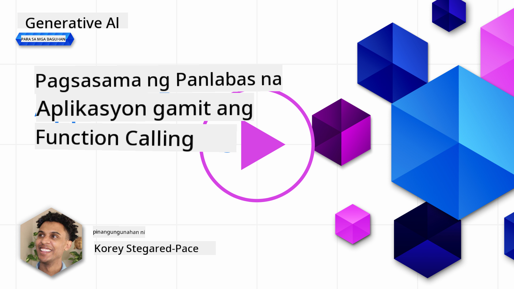
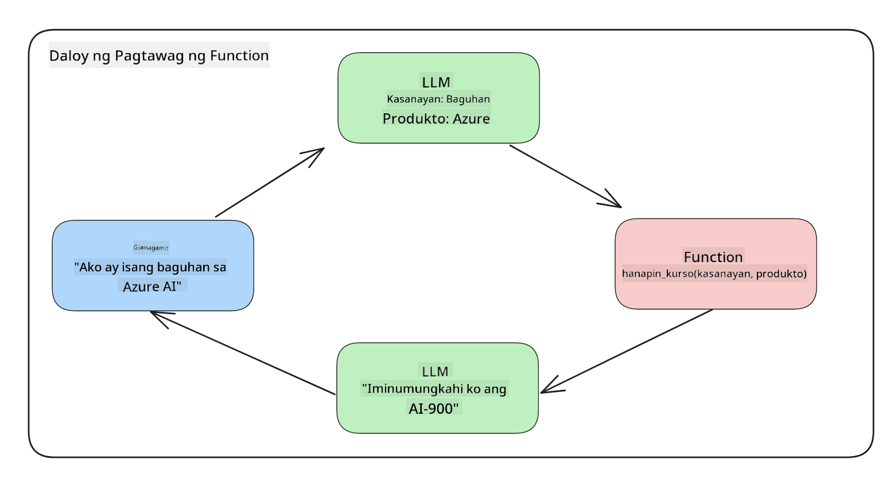
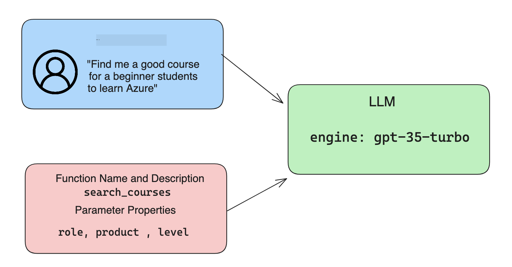

<!--
CO_OP_TRANSLATOR_METADATA:
{
  "original_hash": "77a48a201447be19aa7560706d6f93a0",
  "translation_date": "2025-07-09T14:40:07+00:00",
  "source_file": "11-integrating-with-function-calling/README.md",
  "language_code": "tl"
}
-->
# Pagsasama sa function calling

[](https://aka.ms/gen-ai-lesson11-gh?WT.mc_id=academic-105485-koreyst)

Marami ka nang natutunan sa mga naunang aralin. Ngunit maaari pa nating pagbutihin ito. Ilan sa mga bagay na maaari nating ayusin ay kung paano tayo makakakuha ng mas pare-parehong format ng sagot upang mas madali itong magamit sa mga susunod na proseso. Maaari rin nating idagdag ang datos mula sa ibang mga pinagmulan upang lalo pang pagyamanin ang ating aplikasyon.

Ang mga problemang nabanggit ay ang tatalakayin sa kabanatang ito.

## Panimula

Saklaw ng araling ito ang:

- Ipaliwanag kung ano ang function calling at ang mga gamit nito.
- Paggawa ng function call gamit ang Azure OpenAI.
- Paano isasama ang function call sa isang aplikasyon.

## Mga Layunin sa Pagkatuto

Sa pagtatapos ng araling ito, magagawa mong:

- Ipaliwanag ang layunin ng paggamit ng function calling.
- I-setup ang Function Call gamit ang Azure OpenAI Service.
- Magdisenyo ng epektibong function calls para sa gamit ng iyong aplikasyon.

## Senaryo: Pagpapabuti ng chatbot gamit ang mga function

Para sa araling ito, nais nating bumuo ng tampok para sa aming education startup na nagpapahintulot sa mga gumagamit na gumamit ng chatbot upang maghanap ng mga teknikal na kurso. Magrerekomenda tayo ng mga kurso na angkop sa kanilang antas ng kasanayan, kasalukuyang trabaho, at teknolohiyang interesado sila.

Upang makumpleto ang senaryong ito, gagamit tayo ng kombinasyon ng:

- `Azure OpenAI` para gumawa ng chat experience para sa gumagamit.
- `Microsoft Learn Catalog API` upang tulungan ang mga gumagamit na makahanap ng mga kurso base sa kanilang kahilingan.
- `Function Calling` upang kunin ang query ng gumagamit at ipadala ito sa isang function para gawin ang API request.

Para magsimula, tingnan muna natin kung bakit natin gustong gamitin ang function calling:

## Bakit Function Calling

Bago ang function calling, ang mga sagot mula sa LLM ay hindi nakaayos at hindi pare-pareho. Kinakailangan ng mga developer na magsulat ng komplikadong validation code upang matiyak na kaya nilang hawakan ang bawat uri ng sagot. Hindi makakuha ang mga gumagamit ng sagot tulad ng "Ano ang kasalukuyang panahon sa Stockholm?". Ito ay dahil limitado ang mga modelo sa oras kung kailan sila na-train.

Ang Function Calling ay isang tampok ng Azure OpenAI Service upang malampasan ang mga sumusunod na limitasyon:

- **Pare-parehong format ng sagot**. Kapag mas kontrolado natin ang format ng sagot, mas madali nating maisasama ang sagot sa iba pang mga sistema.
- **Panlabas na datos**. Kakayahang gamitin ang datos mula sa ibang pinagmulan ng aplikasyon sa konteksto ng chat.

## Paglalarawan ng problema sa pamamagitan ng senaryo

> Inirerekomenda naming gamitin ang [kasamang notebook](../../../11-integrating-with-function-calling/python/aoai-assignment.ipynb) kung nais mong patakbuhin ang senaryong ito. Maaari ka ring magbasa lang habang nilalarawan namin ang isang problema kung saan makakatulong ang mga function.

Tingnan natin ang halimbawa na nagpapakita ng problema sa format ng sagot:

Sabihin nating nais nating gumawa ng database ng datos ng mga estudyante upang makapag-suggest tayo ng tamang kurso para sa kanila. Sa ibaba ay may dalawang paglalarawan ng mga estudyante na halos magkapareho ang datos.

1. Gumawa ng koneksyon sa ating Azure OpenAI resource:

   ```python
   import os
   import json
   from openai import AzureOpenAI
   from dotenv import load_dotenv
   load_dotenv()

   client = AzureOpenAI(
   api_key=os.environ['AZURE_OPENAI_API_KEY'],  # this is also the default, it can be omitted
   api_version = "2023-07-01-preview"
   )

   deployment=os.environ['AZURE_OPENAI_DEPLOYMENT']
   ```

   Narito ang Python code para i-configure ang koneksyon sa Azure OpenAI kung saan itinakda natin ang `api_type`, `api_base`, `api_version` at `api_key`.

1. Gumawa ng dalawang paglalarawan ng estudyante gamit ang mga variable na `student_1_description` at `student_2_description`.

   ```python
   student_1_description="Emily Johnson is a sophomore majoring in computer science at Duke University. She has a 3.7 GPA. Emily is an active member of the university's Chess Club and Debate Team. She hopes to pursue a career in software engineering after graduating."

   student_2_description = "Michael Lee is a sophomore majoring in computer science at Stanford University. He has a 3.8 GPA. Michael is known for his programming skills and is an active member of the university's Robotics Club. He hopes to pursue a career in artificial intelligence after finishing his studies."
   ```

   Nais nating ipadala ang mga paglalarawan ng estudyante sa LLM upang i-parse ang datos. Magagamit ang datos na ito sa ating aplikasyon at maaaring ipadala sa API o itago sa database.

1. Gumawa tayo ng dalawang magkaparehong prompt kung saan tinuturo natin sa LLM kung anong impormasyon ang gusto nating makuha:

   ```python
   prompt1 = f'''
   Please extract the following information from the given text and return it as a JSON object:

   name
   major
   school
   grades
   club

   This is the body of text to extract the information from:
   {student_1_description}
   '''

   prompt2 = f'''
   Please extract the following information from the given text and return it as a JSON object:

   name
   major
   school
   grades
   club

   This is the body of text to extract the information from:
   {student_2_description}
   '''
   ```

   Ang mga prompt sa itaas ay nag-uutos sa LLM na kunin ang impormasyon at ibalik ang sagot sa format na JSON.

1. Pagkatapos i-setup ang mga prompt at koneksyon sa Azure OpenAI, ipapadala natin ang mga prompt sa LLM gamit ang `openai.ChatCompletion`. Itatago natin ang prompt sa variable na `messages` at itatalaga ang role bilang `user`. Ginagawa ito upang gayahin ang mensahe mula sa isang gumagamit na sinusulat sa chatbot.

   ```python
   # response from prompt one
   openai_response1 = client.chat.completions.create(
   model=deployment,
   messages = [{'role': 'user', 'content': prompt1}]
   )
   openai_response1.choices[0].message.content

   # response from prompt two
   openai_response2 = client.chat.completions.create(
   model=deployment,
   messages = [{'role': 'user', 'content': prompt2}]
   )
   openai_response2.choices[0].message.content
   ```

Ngayon ay maaari na nating ipadala ang parehong mga request sa LLM at suriin ang sagot na natanggap gamit ang `openai_response1['choices'][0]['message']['content']`.

1. Sa huli, maaari nating i-convert ang sagot sa JSON format gamit ang `json.loads`:

   ```python
   # Loading the response as a JSON object
   json_response1 = json.loads(openai_response1.choices[0].message.content)
   json_response1
   ```

   Sagot 1:

   ```json
   {
     "name": "Emily Johnson",
     "major": "computer science",
     "school": "Duke University",
     "grades": "3.7",
     "club": "Chess Club"
   }
   ```

   Sagot 2:

   ```json
   {
     "name": "Michael Lee",
     "major": "computer science",
     "school": "Stanford University",
     "grades": "3.8 GPA",
     "club": "Robotics Club"
   }
   ```

   Kahit na pareho ang mga prompt at halos magkapareho ang mga paglalarawan, makikita natin na ang mga halaga ng `Grades` ay iba ang format, minsan ay `3.7` lang o `3.7 GPA` halimbawa.

   Nangyayari ito dahil ang LLM ay tumatanggap ng hindi nakaayos na datos mula sa prompt at nagbabalik din ng hindi nakaayos na datos. Kailangan natin ng nakaayos na format upang malaman natin kung ano ang aasahan kapag iniimbak o ginamit ang datos.

Paano natin sosolusyunan ang problema sa format? Sa pamamagitan ng function calling, masisiguro nating makakatanggap tayo ng nakaayos na datos pabalik. Kapag gumagamit ng function calling, hindi talaga tumatawag o nagpapatakbo ang LLM ng mga function. Sa halip, gumagawa tayo ng istruktura na susundin ng LLM para sa mga sagot nito. Ginagamit natin ang mga nakaayos na sagot na ito upang malaman kung anong function ang tatawagin sa ating mga aplikasyon.



Maaari nating kunin ang ibinalik mula sa function at ipadala ito pabalik sa LLM. Sasagot ang LLM gamit ang natural na wika upang tugunan ang tanong ng gumagamit.

## Mga Gamit ng function calls

Maraming iba't ibang gamit kung saan makakatulong ang function calls sa iyong app tulad ng:

- **Pagtawag sa Panlabas na Tools**. Magaling ang mga chatbot sa pagbibigay ng sagot sa mga tanong ng gumagamit. Sa pamamagitan ng function calling, magagamit ng chatbot ang mga mensahe ng gumagamit upang tapusin ang ilang gawain. Halimbawa, maaaring hilingin ng isang estudyante sa chatbot na "Magpadala ng email sa aking guro na kailangan ko ng karagdagang tulong sa paksang ito". Maaari itong gumawa ng function call sa `send_email(to: string, body: string)`

- **Gumawa ng API o Database Queries**. Makakahanap ang mga gumagamit ng impormasyon gamit ang natural na wika na iko-convert sa nakaayos na query o API request. Halimbawa, maaaring itanong ng guro na "Sino ang mga estudyanteng nakatapos ng huling takdang-aralin" na tatawag sa function na `get_completed(student_name: string, assignment: int, current_status: string)`

- **Paggawa ng Nakaayos na Datos**. Maaaring kunin ng mga gumagamit ang isang teksto o CSV at gamitin ang LLM upang kunin ang mahahalagang impormasyon mula dito. Halimbawa, maaaring gawing AI flashcards ng isang estudyante ang isang Wikipedia article tungkol sa mga kasunduan sa kapayapaan. Magagawa ito gamit ang function na `get_important_facts(agreement_name: string, date_signed: string, parties_involved: list)`

## Paggawa ng Iyong Unang Function Call

Ang proseso ng paggawa ng function call ay may 3 pangunahing hakbang:

1. **Pagtawag** sa Chat Completions API gamit ang listahan ng iyong mga function at isang mensahe mula sa gumagamit.
2. **Pagbasa** ng sagot ng modelo upang magsagawa ng aksyon, halimbawa, magpatakbo ng function o API Call.
3. **Paggawa** ng panibagong tawag sa Chat Completions API gamit ang sagot mula sa iyong function upang gamitin ang impormasyong iyon sa paggawa ng sagot para sa gumagamit.



### Hakbang 1 - paggawa ng mga mensahe

Ang unang hakbang ay gumawa ng mensahe mula sa gumagamit. Maaari itong itakda nang dinamiko mula sa isang text input o maaari kang maglagay ng halaga dito. Kung ito ang unang beses mong gumamit ng Chat Completions API, kailangan nating tukuyin ang `role` at ang `content` ng mensahe.

Ang `role` ay maaaring `system` (gumagawa ng mga patakaran), `assistant` (ang modelo) o `user` (ang end-user). Para sa function calling, itatalaga natin ito bilang `user` at magbibigay ng halimbawa ng tanong.

```python
messages= [ {"role": "user", "content": "Find me a good course for a beginner student to learn Azure."} ]
```

Sa pamamagitan ng pagtatalaga ng iba't ibang role, malinaw sa LLM kung sino ang nagsasalita, ang system ba o ang user, na tumutulong upang makabuo ng kasaysayan ng pag-uusap na maaaring gamitin ng LLM.

### Hakbang 2 - paggawa ng mga function

Susunod, tutukuyin natin ang isang function at ang mga parameter nito. Gagamit tayo ng isang function dito na tinatawag na `search_courses` ngunit maaari kang gumawa ng maraming function.

> **Important** : Kasama ang mga function sa system message papunta sa LLM at kasama ito sa bilang ng mga token na mayroon ka.

Sa ibaba, ginagawa natin ang mga function bilang isang array ng mga item. Bawat item ay isang function at may mga property na `name`, `description` at `parameters`:

```python
functions = [
   {
      "name":"search_courses",
      "description":"Retrieves courses from the search index based on the parameters provided",
      "parameters":{
         "type":"object",
         "properties":{
            "role":{
               "type":"string",
               "description":"The role of the learner (i.e. developer, data scientist, student, etc.)"
            },
            "product":{
               "type":"string",
               "description":"The product that the lesson is covering (i.e. Azure, Power BI, etc.)"
            },
            "level":{
               "type":"string",
               "description":"The level of experience the learner has prior to taking the course (i.e. beginner, intermediate, advanced)"
            }
         },
         "required":[
            "role"
         ]
      }
   }
]
```

Ipapaliwanag natin nang mas detalyado ang bawat function instance:

- `name` - Pangalan ng function na nais nating tawagin.
- `description` - Paglalarawan kung paano gumagana ang function. Mahalaga dito na maging tiyak at malinaw.
- `parameters` - Listahan ng mga halaga at format na gusto mong gawin ng modelo sa sagot nito. Ang parameters array ay binubuo ng mga item na may mga sumusunod na property:
  1.  `type` - Uri ng datos kung saan itatago ang mga property.
  1.  `properties` - Listahan ng mga partikular na halaga na gagamitin ng modelo sa sagot nito
      1. `name` - Ang susi ay ang pangalan ng property na gagamitin ng modelo sa nakaayos nitong sagot, halimbawa, `product`.
      1. `type` - Uri ng datos ng property na ito, halimbawa, `string`.
      1. `description` - Paglalarawan ng partikular na property.

Mayroon ding opsyonal na property na `required` - mga kinakailangang property para makumpleto ang function call.

### Hakbang 3 - Paggawa ng function call

Pagkatapos tukuyin ang function, kailangan na natin itong isama sa tawag sa Chat Completion API. Ginagawa ito sa pamamagitan ng pagdagdag ng `functions` sa request. Sa kasong ito `functions=functions`.

May opsyon din na itakda ang `function_call` sa `auto`. Ibig sabihin nito, hahayaan natin ang LLM na magdesisyon kung aling function ang tatawagin base sa mensahe ng user sa halip na tayo ang magtalaga.

Narito ang code kung saan tinatawag natin ang `ChatCompletion.create`, pansinin kung paano natin itinakda ang `functions=functions` at `function_call="auto"` kaya binibigyan natin ang LLM ng pagpipilian kung kailan tatawagin ang mga function na ibinigay natin:

```python
response = client.chat.completions.create(model=deployment,
                                        messages=messages,
                                        functions=functions,
                                        function_call="auto")

print(response.choices[0].message)
```

Ganito ang hitsura ng sagot na bumalik:

```json
{
  "role": "assistant",
  "function_call": {
    "name": "search_courses",
    "arguments": "{\n  \"role\": \"student\",\n  \"product\": \"Azure\",\n  \"level\": \"beginner\"\n}"
  }
}
```

Makikita dito kung paano tinawag ang function na `search_courses` at kung anong mga argumento ang ginamit, na nakalista sa `arguments` property sa JSON na sagot.

Ang konklusyon ay nagawang hanapin ng LLM ang datos na babagay sa mga argumento ng function habang kinukuha ito mula sa halagang ibinigay sa `messages` parameter sa chat completion call. Narito ang paalala ng `messages` value:

```python
messages= [ {"role": "user", "content": "Find me a good course for a beginner student to learn Azure."} ]
```

Makikita mo na ang `student`, `Azure` at `beginner` ay nakuha mula sa `messages` at itinakda bilang input sa function. Ang paggamit ng mga function sa ganitong paraan ay mahusay para kunin ang impormasyon mula sa prompt at magbigay ng istruktura sa LLM at magkaroon ng reusable na functionality.

Ngayon, tingnan natin kung paano natin ito magagamit sa ating app.

## Pagsasama ng Function Calls sa Aplikasyon

Pagkatapos nating masubukan ang nakaayos na sagot mula sa LLM, maaari na natin itong isama sa isang aplikasyon.

### Pamamahala ng daloy

Para maisama ito sa ating aplikasyon, gawin natin ang mga sumusunod na hakbang:

1. Una, gawin ang tawag sa OpenAI services at itago ang mensahe sa variable na tinatawag na `response_message`.

   ```python
   response_message = response.choices[0].message
   ```

1. Ngayon, tutukuyin natin ang function na tatawag sa Microsoft Learn API upang makakuha ng listahan ng mga kurso:

   ```python
   import requests

   def search_courses(role, product, level):
     url = "https://learn.microsoft.com/api/catalog/"
     params = {
        "role": role,
        "product": product,
        "level": level
     }
     response = requests.get(url, params=params)
     modules = response.json()["modules"]
     results = []
     for module in modules[:5]:
        title = module["title"]
        url = module["url"]
        results.append({"title": title, "url": url})
     return str(results)
   ```

   Pansinin kung paano tayo gumagawa ng aktwal na Python function na tumutugma sa mga pangalan ng function na ipinakilala sa `functions` variable. Gumagawa rin tayo ng totoong panlabas na API calls upang kunin ang datos na kailangan natin. Sa kasong ito, kumukuha tayo ng mga training modules mula sa Microsoft Learn API.

Ok, nagawa na natin ang `functions` variable at ang katugmang Python function, paano natin sasabihin sa LLM kung paano i-map ang dalawa para matawagan ang Python function?

1. Para makita kung kailangan nating tawagin ang Python function, kailangan nating tingnan ang sagot ng LLM at alamin kung bahagi nito ang `function_call` at tawagin ang tinukoy na function. Ganito ang paraan ng pag-check:

   ```python
   # Check if the model wants to call a function
   if response_message.function_call.name:
    print("Recommended Function call:")
    print(response_message.function_call.name)
    print()

    # Call the function.
    function_name = response_message.function_call.name

    available_functions = {
            "search_courses": search_courses,
    }
    function_to_call = available_functions[function_name]

    function_args = json.loads(response_message.function_call.arguments)
    function_response = function_to_call(**function_args)

    print("Output of function call:")
    print(function_response)
    print(type(function_response))


    # Add the assistant response and function response to the messages
    messages.append( # adding assistant response to messages
        {
            "role": response_message.role,
            "function_call": {
                "name": function_name,
                "arguments": response_message.function_call.arguments,
            },
            "content": None
        }
    )
    messages.append( # adding function response to messages
        {
            "role": "function",
            "name": function_name,
            "content":function_response,
        }
    )
   ```

   Tatlong linyang ito ang nagsisiguro na makuha natin ang pangalan ng function, ang mga argumento at gawin ang tawag:

   ```python
   function_to_call = available_functions[function_name]

   function_args = json.loads(response_message.function_call.arguments)
   function_response = function_to_call(**function_args)
   ```

   Narito ang output mula sa pagpapatakbo ng ating code:

   **Output**

   ```Recommended Function call:
   {
     "name": "search_courses",
     "arguments": "{\n  \"role\": \"student\",\n  \"product\": \"Azure\",\n  \"level\": \"beginner\"\n}"
   }

   Output of function call:
   [{'title': 'Describe concepts of cryptography', 'url': 'https://learn.microsoft.com/training/modules/describe-concepts-of-cryptography/?
   WT.mc_id=api_CatalogApi'}, {'title': 'Introduction to audio classification with TensorFlow', 'url': 'https://learn.microsoft.com/en-
   us/training/modules/intro-audio-classification-tensorflow/?WT.mc_id=api_CatalogApi'}, {'title': 'Design a Performant Data Model in Azure SQL
   Database with Azure Data Studio', 'url': 'https://learn.microsoft.com/training/modules/design-a-data-model-with-ads/?
   WT.mc_id=api_CatalogApi'}, {'title': 'Getting started with the Microsoft Cloud Adoption Framework for Azure', 'url':
   'https://learn.microsoft.com/training/modules/cloud-adoption-framework-getting-started/?WT.mc_id=api_CatalogApi'}, {'title': 'Set up the
   Rust development environment', 'url': 'https://learn.microsoft.com/training/modules/rust-set-up-environment/?WT.mc_id=api_CatalogApi'}]
   <class 'str'>
   ```

1. Ngayon, ipapadala natin ang na-update na mensahe, `messages` sa LLM upang makatanggap tayo ng sagot gamit ang natural na wika sa halip na API JSON formatted response.

   ```python
   print("Messages in next request:")
   print(messages)
   print()

   second_response = client.chat.completions.create(
      messages=messages,
      model=deployment,
      function_call="auto",
      functions=functions,
      temperature=0
         )  # get a new response from GPT where it can see the function response


   print(second_response.choices[0].message)
   ```

   **Output**

   ```python
   {
     "role": "assistant",
     "content": "I found some good courses for beginner students to learn Azure:\n\n1. [Describe concepts of cryptography] (https://learn.microsoft.com/training/modules/describe-concepts-of-cryptography/?WT.mc_id=api_CatalogApi)\n2. [Introduction to audio classification with TensorFlow](https://learn.microsoft.com/training/modules/intro-audio-classification-tensorflow/?WT.mc_id=api_CatalogApi)\n3. [Design a Performant Data Model in Azure SQL Database with Azure Data Studio](https://learn.microsoft.com/training/modules/design-a-data-model-with-ads/?WT.mc_id=api_CatalogApi)\n4. [Getting started with the Microsoft Cloud Adoption Framework for Azure](https://learn.microsoft.com/training/modules/cloud-adoption-framework-getting-started/?WT.mc_id=api_CatalogApi)\n5. [Set up the Rust development environment](https://learn.microsoft.com/training/modules/rust-set-up-environment/?WT.mc_id=api_CatalogApi)\n\nYou can click on the links to access the courses."
   }

   ```

## Takdang-Aralin

Para ipagpatuloy ang iyong pag-aaral sa Azure OpenAI Function Calling, maaari kang gumawa ng:

- Mas maraming parameter ng function na makakatulong sa mga mag-aaral na makahanap ng mas maraming kurso.
- Gumawa ng isa pang function call na kumukuha ng karagdagang impormasyon mula sa mag-aaral tulad ng kanilang katutubong wika.
- Gumawa ng error handling kapag ang function call at/o API call ay hindi nakababalik ng angkop na mga kurso.
## Mahusay na Gawa! Ipagpatuloy ang Paglalakbay

Pagkatapos tapusin ang araling ito, tingnan ang aming [Generative AI Learning collection](https://aka.ms/genai-collection?WT.mc_id=academic-105485-koreyst) upang lalo pang paunlarin ang iyong kaalaman sa Generative AI!

Pumunta sa Lesson 12, kung saan tatalakayin natin kung paano [magdisenyo ng UX para sa mga AI application](../12-designing-ux-for-ai-applications/README.md?WT.mc_id=academic-105485-koreyst)!

**Paalala**:  
Ang dokumentong ito ay isinalin gamit ang AI translation service na [Co-op Translator](https://github.com/Azure/co-op-translator). Bagamat nagsusumikap kami para sa katumpakan, pakatandaan na ang mga awtomatikong pagsasalin ay maaaring maglaman ng mga pagkakamali o di-tumpak na impormasyon. Ang orihinal na dokumento sa orihinal nitong wika ang dapat ituring na pangunahing sanggunian. Para sa mahahalagang impormasyon, inirerekomenda ang propesyonal na pagsasalin ng tao. Hindi kami mananagot sa anumang hindi pagkakaunawaan o maling interpretasyon na maaaring magmula sa paggamit ng pagsasaling ito.