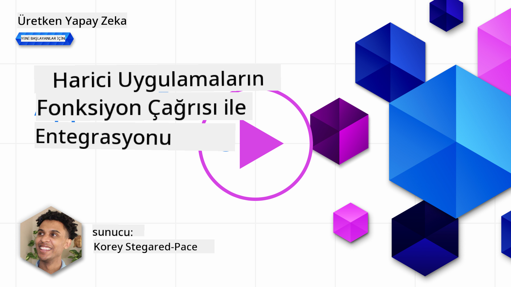
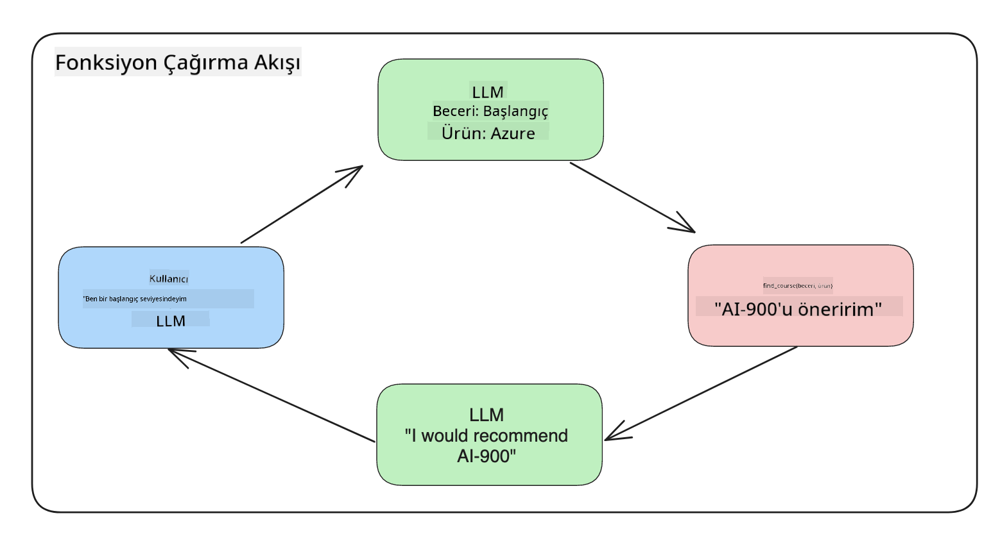
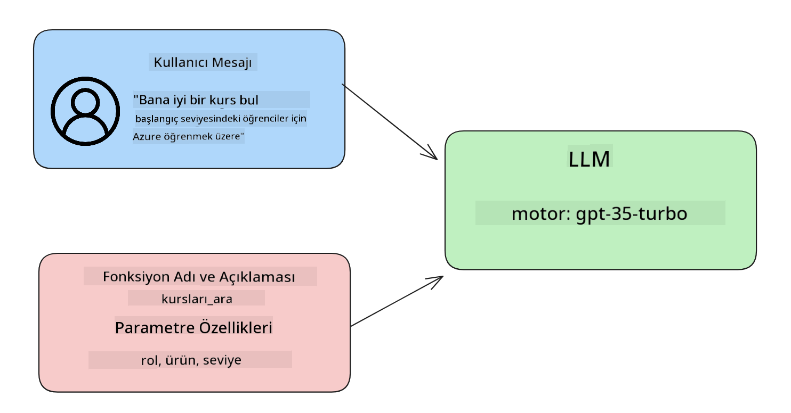

<!--
CO_OP_TRANSLATOR_METADATA:
{
  "original_hash": "77a48a201447be19aa7560706d6f93a0",
  "translation_date": "2025-07-09T14:33:02+00:00",
  "source_file": "11-integrating-with-function-calling/README.md",
  "language_code": "tr"
}
-->
# Fonksiyon çağrısı ile entegrasyon

[](https://aka.ms/gen-ai-lesson11-gh?WT.mc_id=academic-105485-koreyst)

Önceki derslerde oldukça fazla şey öğrendiniz. Ancak, daha da geliştirebiliriz. Ele alabileceğimiz bazı konular, yanıt formatını daha tutarlı hale getirerek yanıtla çalışmayı kolaylaştırmak ve uygulamamızı daha da zenginleştirmek için diğer kaynaklardan veri eklemek olabilir.

Yukarıda bahsedilen sorunlar, bu bölümün çözmeyi hedeflediği konulardır.

## Giriş

Bu ders şunları kapsayacak:

- Fonksiyon çağrısının ne olduğunu ve kullanım alanlarını açıklamak.
- Azure OpenAI kullanarak fonksiyon çağrısı oluşturmak.
- Fonksiyon çağrısını bir uygulamaya nasıl entegre edeceğimizi göstermek.

## Öğrenme Hedefleri

Bu dersin sonunda şunları yapabileceksiniz:

- Fonksiyon çağrısı kullanmanın amacını açıklamak.
- Azure OpenAI Servisi ile Fonksiyon Çağrısı kurmak.
- Uygulamanızın kullanım senaryosu için etkili fonksiyon çağrıları tasarlamak.

## Senaryo: Chatbot’umuzu fonksiyonlarla geliştirmek

Bu ders için, eğitim girişimimizde kullanıcıların teknik kursları bulmak için bir chatbot kullanmasını sağlayan bir özellik geliştirmek istiyoruz. Kullanıcının beceri seviyesi, mevcut rolü ve ilgi duyduğu teknolojiye uygun kurslar önereceğiz.

Bu senaryoyu tamamlamak için şu kombinasyonu kullanacağız:

- Kullanıcı için sohbet deneyimi oluşturmak üzere `Azure OpenAI`.
- Kullanıcının isteğine göre kurs bulmaya yardımcı olmak için `Microsoft Learn Catalog API`.
- Kullanıcının sorgusunu alıp API isteği yapmak için bir fonksiyona göndermek üzere `Function Calling`.

Başlamak için, öncelikle neden fonksiyon çağrısı kullanmak istediğimize bakalım:

## Neden Fonksiyon Çağrısı

Fonksiyon çağrısından önce, LLM’den gelen yanıtlar yapılandırılmamış ve tutarsızdı. Geliştiriciler, yanıtın her varyasyonunu işleyebilmek için karmaşık doğrulama kodları yazmak zorundaydı. Kullanıcılar “Stockholm’de şu anki hava durumu nedir?” gibi sorulara yanıt alamıyordu. Çünkü modeller, verilerin eğitildiği zamana kadar olan bilgilerle sınırlıydı.

Fonksiyon Çağrısı, Azure OpenAI Servisi’nin aşağıdaki sınırlamaları aşmak için sunduğu bir özelliktir:

- **Tutarlı yanıt formatı**. Yanıt formatını daha iyi kontrol edebilirsek, yanıtı diğer sistemlere entegre etmek daha kolay olur.
- **Harici veri**. Bir uygulamanın diğer kaynaklarından gelen verileri sohbet bağlamında kullanabilme yeteneği.

## Sorunu bir senaryo ile açıklamak

> Aşağıdaki senaryoyu çalıştırmak isterseniz, [ekli not defterini](../../../11-integrating-with-function-calling/python/aoai-assignment.ipynb) kullanmanızı öneririz. Ayrıca, fonksiyonların sorunu nasıl çözebileceğini göstermek için sadece okuyabilirsiniz.

Yanıt formatı sorununu gösteren örneğe bakalım:

Öğrencilere uygun kurs önerebilmek için bir öğrenci veri tabanı oluşturmak istediğimizi varsayalım. Aşağıda, içerdiği veriler açısından çok benzer iki öğrenci açıklaması var.

1. Azure OpenAI kaynağımıza bağlantı oluşturun:

   ```python
   import os
   import json
   from openai import AzureOpenAI
   from dotenv import load_dotenv
   load_dotenv()

   client = AzureOpenAI(
   api_key=os.environ['AZURE_OPENAI_API_KEY'],  # this is also the default, it can be omitted
   api_version = "2023-07-01-preview"
   )

   deployment=os.environ['AZURE_OPENAI_DEPLOYMENT']
   ```

   Aşağıda, `api_type`, `api_base`, `api_version` ve `api_key` ayarlarını yaptığımız Azure OpenAI bağlantısını yapılandırmak için Python kodu var.

1. `student_1_description` ve `student_2_description` değişkenleri ile iki öğrenci açıklaması oluşturuyoruz.

   ```python
   student_1_description="Emily Johnson is a sophomore majoring in computer science at Duke University. She has a 3.7 GPA. Emily is an active member of the university's Chess Club and Debate Team. She hopes to pursue a career in software engineering after graduating."

   student_2_description = "Michael Lee is a sophomore majoring in computer science at Stanford University. He has a 3.8 GPA. Michael is known for his programming skills and is an active member of the university's Robotics Club. He hopes to pursue a career in artificial intelligence after finishing his studies."
   ```

   Yukarıdaki öğrenci açıklamalarını, verileri ayrıştırması için bir LLM’ye göndermek istiyoruz. Bu veriler daha sonra uygulamamızda kullanılabilir, bir API’ye gönderilebilir veya bir veritabanında saklanabilir.

1. LLM’ye hangi bilgileri istediğimizi belirten iki aynı istem (prompt) oluşturalım:

   ```python
   prompt1 = f'''
   Please extract the following information from the given text and return it as a JSON object:

   name
   major
   school
   grades
   club

   This is the body of text to extract the information from:
   {student_1_description}
   '''

   prompt2 = f'''
   Please extract the following information from the given text and return it as a JSON object:

   name
   major
   school
   grades
   club

   This is the body of text to extract the information from:
   {student_2_description}
   '''
   ```

   Yukarıdaki istemler, LLM’ye bilgileri çıkarmasını ve yanıtı JSON formatında döndürmesini söylüyor.

1. İstemleri ve Azure OpenAI bağlantısını ayarladıktan sonra, `openai.ChatCompletion` kullanarak istemleri LLM’ye göndereceğiz. İstemi `messages` değişkenine kaydediyoruz ve rolü `user` olarak atıyoruz. Bu, bir kullanıcının chatbot’a mesaj yazmasını taklit etmek için.

   ```python
   # response from prompt one
   openai_response1 = client.chat.completions.create(
   model=deployment,
   messages = [{'role': 'user', 'content': prompt1}]
   )
   openai_response1.choices[0].message.content

   # response from prompt two
   openai_response2 = client.chat.completions.create(
   model=deployment,
   messages = [{'role': 'user', 'content': prompt2}]
   )
   openai_response2.choices[0].message.content
   ```

Şimdi her iki isteği de LLM’ye gönderebilir ve aldığımız yanıtı şu şekilde inceleyebiliriz: `openai_response1['choices'][0]['message']['content']`.

1. Son olarak, yanıtı JSON formatına dönüştürmek için `json.loads` çağrısı yapabiliriz:

   ```python
   # Loading the response as a JSON object
   json_response1 = json.loads(openai_response1.choices[0].message.content)
   json_response1
   ```

   Yanıt 1:

   ```json
   {
     "name": "Emily Johnson",
     "major": "computer science",
     "school": "Duke University",
     "grades": "3.7",
     "club": "Chess Club"
   }
   ```

   Yanıt 2:

   ```json
   {
     "name": "Michael Lee",
     "major": "computer science",
     "school": "Stanford University",
     "grades": "3.8 GPA",
     "club": "Robotics Club"
   }
   ```

   İstemler aynı ve açıklamalar benzer olmasına rağmen, `Grades` özelliğinin değerlerinin farklı formatlarda olduğunu görüyoruz; örneğin bazen `3.7`, bazen `3.7 GPA` gibi.

   Bu sonuç, LLM’nin yazılı istem biçimindeki yapılandırılmamış veriyi alıp yine yapılandırılmamış veri döndürmesinden kaynaklanıyor. Veriyi saklarken veya kullanırken ne bekleyeceğimizi bilmek için yapılandırılmış bir formata ihtiyacımız var.

Peki biçimlendirme sorununu nasıl çözeriz? Fonksiyon çağrısı kullanarak, yapılandırılmış veri aldığımızdan emin olabiliriz. Fonksiyon çağrısı kullanıldığında, LLM aslında herhangi bir fonksiyonu çağırmaz veya çalıştırmaz. Bunun yerine, LLM’nin yanıtları için takip edeceği bir yapı oluştururuz. Bu yapılandırılmış yanıtları, uygulamalarımızda hangi fonksiyonun çalıştırılacağını bilmek için kullanırız.



Fonksiyondan dönen veriyi alıp tekrar LLM’ye gönderebiliriz. LLM, kullanıcının sorgusuna doğal dil ile yanıt verir.

## Fonksiyon çağrısı kullanım alanları

Fonksiyon çağrıları, uygulamanızı geliştirebilecek birçok farklı kullanım alanına sahiptir, örneğin:

- **Harici Araçları Çağırmak**. Chatbotlar, kullanıcılardan gelen sorulara yanıt vermede iyidir. Fonksiyon çağrısı kullanarak, chatbotlar kullanıcı mesajlarını belirli görevleri tamamlamak için kullanabilir. Örneğin, bir öğrenci chatbot’a “Eğitmenime bu konuda daha fazla yardıma ihtiyacım olduğunu söyleyen bir e-posta gönder” diyebilir. Bu, `send_email(to: string, body: string)` fonksiyonunu çağırabilir.

- **API veya Veritabanı Sorguları Oluşturmak**. Kullanıcılar, doğal dil kullanarak bilgi bulabilir ve bu sorgu biçimlendirilmiş bir sorguya veya API isteğine dönüştürülebilir. Örneğin, bir öğretmen “Son ödevi tamamlayan öğrenciler kimler?” diye sorabilir ve bu, `get_completed(student_name: string, assignment: int, current_status: string)` adlı fonksiyonu çağırabilir.

- **Yapılandırılmış Veri Oluşturmak**. Kullanıcılar bir metin bloğu veya CSV alıp LLM’yi kullanarak önemli bilgileri çıkarabilir. Örneğin, bir öğrenci barış anlaşmaları hakkında bir Wikipedia makalesini AI flashcard’ları oluşturmak için dönüştürebilir. Bu, `get_important_facts(agreement_name: string, date_signed: string, parties_involved: list)` adlı fonksiyonla yapılabilir.

## İlk Fonksiyon Çağrınızı Oluşturmak

Fonksiyon çağrısı oluşturma süreci 3 ana adımdan oluşur:

1. Fonksiyonlarınızın listesi ve bir kullanıcı mesajı ile Chat Completions API’yi **çağırmak**.
2. Modelin yanıtını **okuyup** bir işlem yapmak, yani bir fonksiyon veya API çağrısı çalıştırmak.
3. Fonksiyonunuzdan gelen yanıtla Chat Completions API’ye tekrar **çağrı yapmak** ve bu bilgiyi kullanıcıya yanıt oluşturmak için kullanmak.



### Adım 1 - mesajları oluşturmak

İlk adım bir kullanıcı mesajı oluşturmaktır. Bu, bir metin girişinden dinamik olarak alınabilir veya burada bir değer atayabilirsiniz. Chat Completions API ile ilk kez çalışıyorsanız, mesajın `role` ve `content` değerlerini tanımlamanız gerekir.

`role` ya `system` (kuralları oluşturur), `assistant` (model) ya da `user` (son kullanıcı) olabilir. Fonksiyon çağrısı için bunu `user` olarak atayacağız ve örnek bir soru vereceğiz.

```python
messages= [ {"role": "user", "content": "Find me a good course for a beginner student to learn Azure."} ]
```

Farklı roller atayarak, LLM’ye sistemin mi yoksa kullanıcının mı konuştuğu net bir şekilde belirtilir; bu da LLM’nin üzerine inşa edebileceği bir konuşma geçmişi oluşturmasına yardımcı olur.

### Adım 2 - fonksiyonları oluşturmak

Sonra, bir fonksiyon ve parametrelerini tanımlayacağız. Burada sadece `search_courses` adlı bir fonksiyon kullanacağız ama birden fazla fonksiyon oluşturabilirsiniz.

> **Önemli** : Fonksiyonlar, LLM’ye gönderilen sistem mesajına dahil edilir ve kullanılabilir token miktarınıza dahildir.

Aşağıda, fonksiyonları bir dizi öğe olarak oluşturuyoruz. Her öğe bir fonksiyon olup `name`, `description` ve `parameters` özelliklerine sahiptir:

```python
functions = [
   {
      "name":"search_courses",
      "description":"Retrieves courses from the search index based on the parameters provided",
      "parameters":{
         "type":"object",
         "properties":{
            "role":{
               "type":"string",
               "description":"The role of the learner (i.e. developer, data scientist, student, etc.)"
            },
            "product":{
               "type":"string",
               "description":"The product that the lesson is covering (i.e. Azure, Power BI, etc.)"
            },
            "level":{
               "type":"string",
               "description":"The level of experience the learner has prior to taking the course (i.e. beginner, intermediate, advanced)"
            }
         },
         "required":[
            "role"
         ]
      }
   }
]
```

Her fonksiyon örneğini daha detaylı açıklayalım:

- `name` - Çağrılmasını istediğimiz fonksiyonun adı.
- `description` - Fonksiyonun nasıl çalıştığını açıklayan metin. Burada açık ve net olmak önemlidir.
- `parameters` - Modelin yanıtında üretmesini istediğiniz değerler ve format listesi. Parametreler dizisi, aşağıdaki özelliklere sahip öğelerden oluşur:
  1. `type` - Özelliklerin veri tipi.
  1. `properties` - Modelin yanıtında kullanacağı belirli değerlerin listesi.
      1. `name` - Modelin biçimlendirilmiş yanıtında kullanacağı özellik adı, örneğin `product`.
      1. `type` - Bu özelliğin veri tipi, örneğin `string`.
      1. `description` - Özelliğin açıklaması.

Ayrıca isteğe bağlı `required` özelliği vardır - fonksiyon çağrısının tamamlanması için gerekli özellikler.

### Adım 3 - Fonksiyon çağrısını yapmak

Bir fonksiyon tanımladıktan sonra, bunu Chat Completion API çağrısına dahil etmemiz gerekir. Bunu, isteğe `functions` ekleyerek yaparız. Bu durumda `functions=functions`.

Ayrıca `function_call` parametresini `auto` olarak ayarlama seçeneği vardır. Bu, fonksiyon çağrısının kullanıcı mesajına göre LLM tarafından otomatik seçilmesini sağlar, bizim atamamıza gerek kalmaz.

Aşağıda, `ChatCompletion.create` çağrısını gösteren kod var; burada `functions=functions` ve `function_call="auto"` olarak ayarlandığını ve böylece LLM’ye fonksiyonları ne zaman çağıracağına karar verme seçeneği verdiğimizi görebilirsiniz:

```python
response = client.chat.completions.create(model=deployment,
                                        messages=messages,
                                        functions=functions,
                                        function_call="auto")

print(response.choices[0].message)
```

Gelen yanıt şimdi şöyle görünüyor:

```json
{
  "role": "assistant",
  "function_call": {
    "name": "search_courses",
    "arguments": "{\n  \"role\": \"student\",\n  \"product\": \"Azure\",\n  \"level\": \"beginner\"\n}"
  }
}
```

Burada, `search_courses` fonksiyonunun çağrıldığını ve JSON yanıtındaki `arguments` özelliğinde hangi argümanlarla çağrıldığını görebiliyoruz.

LLM, fonksiyonun argümanlarına uyan veriyi, sohbet tamamlama çağrısındaki `messages` parametresine verilen değerden çıkarmayı başardı. Aşağıda `messages` değerinin hatırlatması var:

```python
messages= [ {"role": "user", "content": "Find me a good course for a beginner student to learn Azure."} ]
```

Gördüğünüz gibi, `student`, `Azure` ve `beginner` `messages`’tan çıkarılmış ve fonksiyonun girdisi olarak atanmış. Fonksiyonları bu şekilde kullanmak, bir istemden bilgi çıkarmak için harika bir yol olmasının yanı sıra LLM’ye yapı kazandırmak ve yeniden kullanılabilir işlevsellik sağlamak için de mükemmeldir.

Şimdi bunu uygulamamızda nasıl kullanacağımıza bakalım.

## Fonksiyon Çağrılarını Bir Uygulamaya Entegre Etmek

LLM’den gelen biçimlendirilmiş yanıtı test ettikten sonra, bunu bir uygulamaya entegre edebiliriz.

### Akışı yönetmek

Bunu uygulamamıza entegre etmek için şu adımları izleyelim:

1. Öncelikle, OpenAI servislerine çağrı yapalım ve yanıt mesajını `response_message` adlı bir değişkende saklayalım.

   ```python
   response_message = response.choices[0].message
   ```

1. Şimdi, Microsoft Learn API’yi çağırarak kurs listesini alacak fonksiyonu tanımlayacağız:

   ```python
   import requests

   def search_courses(role, product, level):
     url = "https://learn.microsoft.com/api/catalog/"
     params = {
        "role": role,
        "product": product,
        "level": level
     }
     response = requests.get(url, params=params)
     modules = response.json()["modules"]
     results = []
     for module in modules[:5]:
        title = module["title"]
        url = module["url"]
        results.append({"title": title, "url": url})
     return str(results)
   ```

   Burada, `functions` değişkeninde tanımlanan fonksiyon adlarıyla eşleşen gerçek bir Python fonksiyonu oluşturduğumuza dikkat edin. Ayrıca ihtiyacımız olan veriyi almak için gerçek dış API çağrıları yapıyoruz. Bu durumda, eğitim modüllerini aramak için Microsoft Learn API’ye gidiyoruz.

Tamam, `functions` değişkenini ve karşılık gelen Python fonksiyonunu oluşturduk, peki LLM’ye bu ikisini nasıl eşleştireceğimizi ve Python fonksiyonumuzun çağrılmasını nasıl sağlayacağız?

1. Python fonksiyonunu çağırmamız gerekip gerekmediğini görmek için, LLM yanıtına bakmamız ve `function_call` özelliğinin olup olmadığını kontrol etmemiz gerekir. İşte bunu nasıl yapabileceğiniz:

   ```python
   # Check if the model wants to call a function
   if response_message.function_call.name:
    print("Recommended Function call:")
    print(response_message.function_call.name)
    print()

    # Call the function.
    function_name = response_message.function_call.name

    available_functions = {
            "search_courses": search_courses,
    }
    function_to_call = available_functions[function_name]

    function_args = json.loads(response_message.function_call.arguments)
    function_response = function_to_call(**function_args)

    print("Output of function call:")
    print(function_response)
    print(type(function_response))


    # Add the assistant response and function response to the messages
    messages.append( # adding assistant response to messages
        {
            "role": response_message.role,
            "function_call": {
                "name": function_name,
                "arguments": response_message.function_call.arguments,
            },
            "content": None
        }
    )
    messages.append( # adding function response to messages
        {
            "role": "function",
            "name": function_name,
            "content":function_response,
        }
    )
   ```

   Bu üç satır, fonksiyon adını çıkarır, argümanları alır ve çağrıyı yapar:

   ```python
   function_to_call = available_functions[function_name]

   function_args = json.loads(response_message.function_call.arguments)
   function_response = function_to_call(**function_args)
   ```

   Aşağıda kodumuzun çalıştırılmasından çıkan çıktı var:

   **Çıktı**

   ```Recommended Function call:
   {
     "name": "search_courses",
     "arguments": "{\n  \"role\": \"student\",\n  \"product\": \"Azure\",\n  \"level\": \"beginner\"\n}"
   }

   Output of function call:
   [{'title': 'Describe concepts of cryptography', 'url': 'https://learn.microsoft.com/training/modules/describe-concepts-of-cryptography/?
   WT.mc_id=api_CatalogApi'}, {'title': 'Introduction to audio classification with TensorFlow', 'url': 'https://learn.microsoft.com/en-
   us/training/modules/intro-audio-classification-tensorflow/?WT.mc_id=api_CatalogApi'}, {'title': 'Design a Performant Data Model in Azure SQL
   Database with Azure Data Studio', 'url': 'https://learn.microsoft.com/training/modules/design-a-data-model-with-ads/?
   WT.mc_id=api_CatalogApi'}, {'title': 'Getting started with the Microsoft Cloud Adoption Framework for Azure', 'url':
   'https://learn.microsoft.com/training/modules/cloud-adoption-framework-getting-started/?WT.mc_id=api_CatalogApi'}, {'title': 'Set up the
   Rust development environment', 'url': 'https://learn.microsoft.com/training/modules/rust-set-up-environment/?WT.mc_id=api_CatalogApi'}]
   <class 'str'>
   ```

1. Şimdi, güncellenmiş mesajı `messages` LLM’ye göndererek API JSON formatlı yanıtı yerine doğal dil yanıtı alacağız.

   ```python
   print("Messages in next request:")
   print(messages)
   print()

   second_response = client.chat.completions.create(
      messages=messages,
      model=deployment,
      function_call="auto",
      functions=functions,
      temperature=0
         )  # get a new response from GPT where it can see the function response


   print(second_response.choices[0].message)
   ```

   **Çıktı**

   ```python
   {
     "role": "assistant",
     "content": "I found some good courses for beginner students to learn Azure:\n\n1. [Describe concepts of cryptography] (https://learn.microsoft.com/training/modules/describe-concepts-of-cryptography/?WT.mc_id=api_CatalogApi)\n2. [Introduction to audio classification with TensorFlow](https://learn.microsoft.com/training/modules/intro-audio-classification-tensorflow/?WT.mc_id=api_CatalogApi)\n3. [Design a Performant Data Model in Azure SQL Database with Azure Data Studio](https://learn.microsoft.com/training/modules/design-a-data-model-with-ads/?WT.mc_id=api_CatalogApi)\n4. [Getting started with the Microsoft Cloud Adoption Framework for Azure](https://learn.microsoft.com/training/modules/cloud-adoption-framework-getting-started/?WT.mc_id=api_CatalogApi)\n5. [Set up the Rust development environment](https://learn.microsoft.com/training/modules/rust-set-up-environment/?WT.mc_id=api_CatalogApi)\n\nYou can click on the links to access the courses."
   }

   ```

## Ödev

Azure OpenAI Fonksiyon Çağrısı öğreniminize devam etmek için şunları yapabilirsiniz:

- Öğrencilerin daha fazla kurs bulmasına yardımcı olabilecek fonksiyon parametrelerini artırmak.
- Öğrencinin ana dili gibi daha fazla bilgi alan başka bir fonksiyon çağrısı oluşturmak.
- Fonksiyon çağrısı ve/veya API çağrısı uygun kurs döndürmediğinde hata yönetimi oluşturmak.
## Harika İş! Yolculuğa Devam Et

Bu dersi tamamladıktan sonra, Generative AI bilginizi geliştirmeye devam etmek için [Generative AI Öğrenme koleksiyonumuza](https://aka.ms/genai-collection?WT.mc_id=academic-105485-koreyst) göz atın!

Bir sonraki ders olan Ders 12'ye geçin; burada [AI uygulamaları için UX tasarımını](../12-designing-ux-for-ai-applications/README.md?WT.mc_id=academic-105485-koreyst) inceleyeceğiz!

**Feragatname**:  
Bu belge, AI çeviri servisi [Co-op Translator](https://github.com/Azure/co-op-translator) kullanılarak çevrilmiştir. Doğruluk için çaba göstersek de, otomatik çevirilerin hatalar veya yanlışlıklar içerebileceğini lütfen unutmayınız. Orijinal belge, kendi dilinde yetkili kaynak olarak kabul edilmelidir. Kritik bilgiler için profesyonel insan çevirisi önerilir. Bu çevirinin kullanımı sonucu oluşabilecek yanlış anlamalar veya yorum hatalarından sorumlu değiliz.