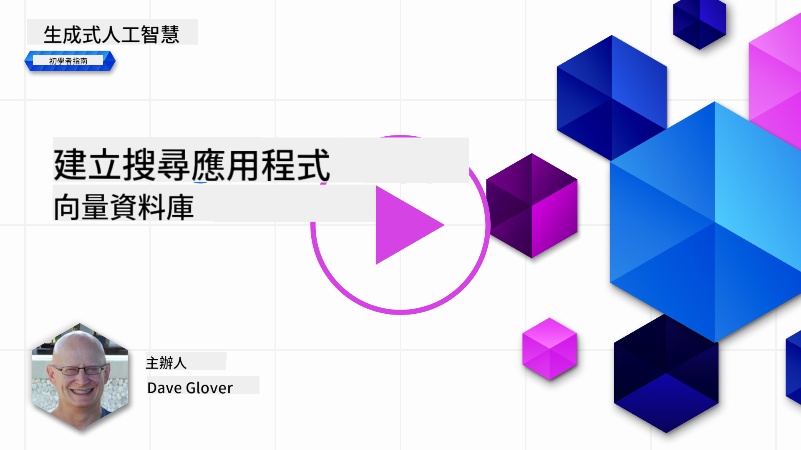
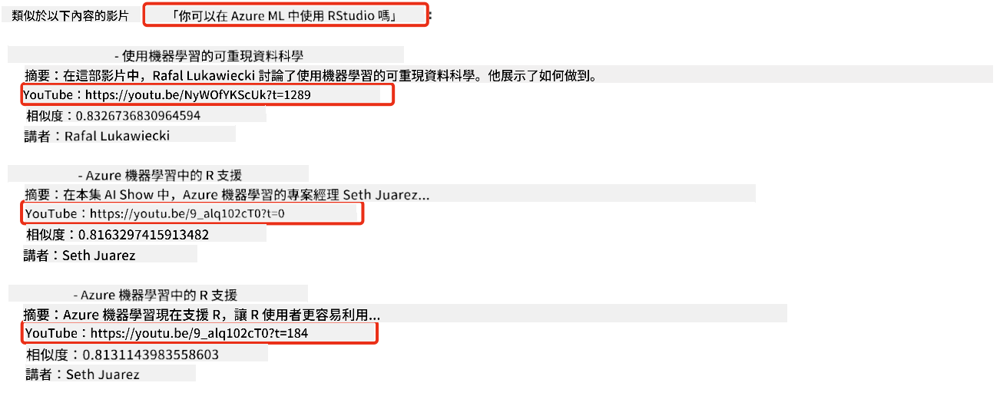
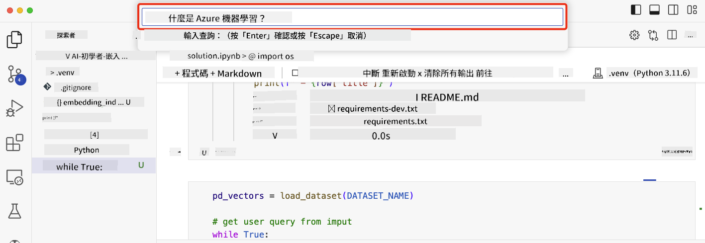

<!--
CO_OP_TRANSLATOR_METADATA:
{
  "original_hash": "d46aad0917a1a342d613e2c13d457da5",
  "translation_date": "2025-07-09T12:49:33+00:00",
  "source_file": "08-building-search-applications/README.md",
  "language_code": "tw"
}
-->
# 建立搜尋應用程式

[](https://aka.ms/gen-ai-lesson8-gh?WT.mc_id=academic-105485-koreyst)

> > _點擊上方圖片觀看本課程影片_

大型語言模型（LLM）不只是用於聊天機器人和文字生成，也能利用 Embeddings 建立搜尋應用程式。Embeddings 是資料的數值表示，也稱為向量，可用於資料的語意搜尋。

在本課程中，你將為我們的教育新創公司建立一個搜尋應用程式。我們的新創公司是一個非營利組織，提供發展中國家的學生免費教育。我們擁有大量的 YouTube 影片，供學生學習 AI。我們希望建立一個搜尋應用程式，讓學生能透過輸入問題來搜尋 YouTube 影片。

例如，學生可能會輸入「什麼是 Jupyter Notebooks？」或「什麼是 Azure ML」，搜尋應用程式會回傳與問題相關的 YouTube 影片清單，更棒的是，搜尋結果會直接連結到影片中回答該問題的時間點。

## 介紹

本課程將涵蓋：

- 語意搜尋與關鍵字搜尋的差異。
- 什麼是文字 Embeddings。
- 建立文字 Embeddings 索引。
- 搜尋文字 Embeddings 索引。

## 學習目標

完成本課程後，你將能夠：

- 分辨語意搜尋與關鍵字搜尋的不同。
- 解釋什麼是文字 Embeddings。
- 使用 Embeddings 建立搜尋資料的應用程式。

## 為什麼要建立搜尋應用程式？

建立搜尋應用程式能幫助你了解如何使用 Embeddings 來搜尋資料，也能學會如何打造一個讓學生快速找到資訊的搜尋工具。

本課程包含 Microsoft [AI Show](https://www.youtube.com/playlist?list=PLlrxD0HtieHi0mwteKBOfEeOYf0LJU4O1) YouTube 頻道的影片逐字稿 Embedding 索引。AI Show 是一個教你 AI 與機器學習的 YouTube 頻道。Embedding 索引包含截至 2023 年 10 月的所有影片逐字稿 Embeddings。你將使用這個索引來建立搜尋應用程式，搜尋結果會回傳影片中回答問題的時間點連結，讓學生能快速找到所需資訊。

以下是針對問題「can you use rstudio with azure ml?」的語意查詢範例。查看 YouTube 連結，你會發現網址包含時間戳記，直接帶你到影片中回答該問題的片段。



## 什麼是語意搜尋？

你可能會好奇，什麼是語意搜尋？語意搜尋是一種利用查詢中詞語的語意（意義）來回傳相關結果的搜尋技術。

舉例來說，假設你想買車，輸入「my dream car」進行搜尋，語意搜尋會理解你不是在「夢想」一輛車，而是在尋找理想的車款。語意搜尋能理解你的意圖，回傳相關結果。相對地，關鍵字搜尋會字面搜尋「夢想」和「車」，常常回傳不相關的結果。

## 什麼是文字 Embeddings？

[文字 Embeddings](https://en.wikipedia.org/wiki/Word_embedding?WT.mc_id=academic-105485-koreyst) 是一種用於[自然語言處理](https://en.wikipedia.org/wiki/Natural_language_processing?WT.mc_id=academic-105485-koreyst)的文字表示技術。文字 Embeddings 是文字的語意數值表示。Embeddings 用來將資料以機器容易理解的方式表示。有許多模型可用來建立文字 Embeddings，本課程將專注於使用 OpenAI Embedding 模型來產生 Embeddings。

舉例來說，假設以下文字來自 AI Show YouTube 頻道某集的逐字稿：

```text
Today we are going to learn about Azure Machine Learning.
```

我們會將文字傳給 OpenAI Embedding API，API 會回傳一組由 1536 個數字組成的向量。向量中的每個數字代表文字的不同面向。以下為向量的前 10 個數字，為簡潔起見。

```python
[-0.006655829958617687, 0.0026128944009542465, 0.008792596869170666, -0.02446001023054123, -0.008540431968867779, 0.022071078419685364, -0.010703742504119873, 0.003311325330287218, -0.011632772162556648, -0.02187200076878071, ...]
```

## Embedding 索引是如何建立的？

本課程的 Embedding 索引是透過一系列 Python 腳本建立。你可以在本課程的 `scripts` 資料夾中的 [README](./scripts/README.md?WT.mc_id=academic-105485-koreyst) 找到這些腳本和說明。你不需要執行這些腳本即可完成本課程，因為我們已提供 Embedding 索引。

這些腳本執行以下操作：

1. 下載 [AI Show](https://www.youtube.com/playlist?list=PLlrxD0HtieHi0mwteKBOfEeOYf0LJU4O1) 播放清單中每支 YouTube 影片的逐字稿。
2. 使用 [OpenAI Functions](https://learn.microsoft.com/azure/ai-services/openai/how-to/function-calling?WT.mc_id=academic-105485-koreyst) 嘗試從逐字稿的前三分鐘擷取講者名稱。每支影片的講者名稱會存入名為 `embedding_index_3m.json` 的 Embedding 索引中。
3. 將逐字稿切分成**三分鐘的文字段落**。每段會與下一段重疊約 20 個字，以確保 Embedding 不會被截斷，並提供更好的搜尋上下文。
4. 將每段文字傳給 OpenAI Chat API，將文字摘要成約 60 字，摘要也會存入 `embedding_index_3m.json`。
5. 最後，將段落文字傳給 OpenAI Embedding API，API 回傳一組 1536 維的向量，代表該段文字的語意。段落文字與向量會一起存入 `embedding_index_3m.json`。

### 向量資料庫

為簡化課程，Embedding 索引存成名為 `embedding_index_3m.json` 的 JSON 檔，並載入 Pandas DataFrame。但在實務中，Embedding 索引會存放在向量資料庫，例如 [Azure Cognitive Search](https://learn.microsoft.com/training/modules/improve-search-results-vector-search?WT.mc_id=academic-105485-koreyst)、[Redis](https://cookbook.openai.com/examples/vector_databases/redis/readme?WT.mc_id=academic-105485-koreyst)、[Pinecone](https://cookbook.openai.com/examples/vector_databases/pinecone/readme?WT.mc_id=academic-105485-koreyst)、[Weaviate](https://cookbook.openai.com/examples/vector_databases/weaviate/readme?WT.mc_id=academic-105485-koreyst) 等。

## 了解餘弦相似度

我們已了解文字 Embeddings，接下來要學習如何利用文字 Embeddings 來搜尋資料，特別是如何用餘弦相似度找到與查詢最相似的 Embeddings。

### 什麼是餘弦相似度？

餘弦相似度是衡量兩個向量相似度的指標，也稱為「最近鄰搜尋」。要進行餘弦相似度搜尋，首先需使用 OpenAI Embedding API 將查詢文字向量化，接著計算查詢向量與 Embedding 索引中每個向量的餘弦相似度。記得，Embedding 索引中每個向量代表一段 YouTube 逐字稿文字。最後，依餘弦相似度排序，數值最高的文字段落即與查詢最相似。

從數學角度看，餘弦相似度是多維空間中兩向量夾角的餘弦值。這個指標很有用，因為即使兩份文件在歐氏距離上相距較遠（可能因大小不同），它們的夾角仍可能較小，因而擁有較高的餘弦相似度。更多餘弦相似度的數學公式，請參考 [Cosine similarity](https://en.wikipedia.org/wiki/Cosine_similarity?WT.mc_id=academic-105485-koreyst)。

## 建立你的第一個搜尋應用程式

接下來，我們將學習如何使用 Embeddings 建立搜尋應用程式。該應用程式允許學生輸入問題搜尋影片，並回傳與問題相關的影片清單，還會提供影片中回答問題的時間點連結。

此解決方案已在 Windows 11、macOS 和 Ubuntu 22.04 上使用 Python 3.10 或更新版本測試。你可以從 [python.org](https://www.python.org/downloads/?WT.mc_id=academic-105485-koreyst) 下載 Python。

## 作業 - 建立搜尋應用程式，幫助學生

我們在課程開頭介紹了新創公司，現在是時候讓學生自己建立搜尋應用程式，作為評量的一部分。

在此作業中，你將建立用於搜尋應用程式的 Azure OpenAI 服務。你需要建立以下 Azure OpenAI 服務。完成作業需要 Azure 訂閱。

### 啟動 Azure Cloud Shell

1. 登入 [Azure 入口網站](https://portal.azure.com/?WT.mc_id=academic-105485-koreyst)。
2. 點選 Azure 入口網站右上角的 Cloud Shell 圖示。
3. 選擇環境類型為 **Bash**。

#### 建立資源群組

> 以下指令使用位於 East US 的資源群組名稱「semantic-video-search」。
> 你可以更改資源群組名稱，但更改資源位置時，
> 請參考[模型可用性表](https://aka.ms/oai/models?WT.mc_id=academic-105485-koreyst)。

```shell
az group create --name semantic-video-search --location eastus
```

#### 建立 Azure OpenAI 服務資源

在 Azure Cloud Shell 執行以下指令，建立 Azure OpenAI 服務資源。

```shell
az cognitiveservices account create --name semantic-video-openai --resource-group semantic-video-search \
    --location eastus --kind OpenAI --sku s0
```

#### 取得本應用程式使用的端點與金鑰

在 Azure Cloud Shell 執行以下指令，取得 Azure OpenAI 服務資源的端點與金鑰。

```shell
az cognitiveservices account show --name semantic-video-openai \
   --resource-group  semantic-video-search | jq -r .properties.endpoint
az cognitiveservices account keys list --name semantic-video-openai \
   --resource-group semantic-video-search | jq -r .key1
```

#### 部署 OpenAI Embedding 模型

在 Azure Cloud Shell 執行以下指令，部署 OpenAI Embedding 模型。

```shell
az cognitiveservices account deployment create \
    --name semantic-video-openai \
    --resource-group  semantic-video-search \
    --deployment-name text-embedding-ada-002 \
    --model-name text-embedding-ada-002 \
    --model-version "2"  \
    --model-format OpenAI \
    --sku-capacity 100 --sku-name "Standard"
```

## 解決方案

打開 GitHub Codespaces 中的 [解決方案筆記本](../../../08-building-search-applications/python/aoai-solution.ipynb)，並依照 Jupyter Notebook 中的指示操作。

執行筆記本時，系統會提示你輸入查詢，輸入框如下圖所示：



## 做得好！繼續學習

完成本課程後，歡迎參考我們的[生成式 AI 學習系列](https://aka.ms/genai-collection?WT.mc_id=academic-105485-koreyst)，持續提升你的生成式 AI 知識！

接著前往第 9 課，我們將探討如何[建立影像生成應用程式](../09-building-image-applications/README.md?WT.mc_id=academic-105485-koreyst)！

**免責聲明**：  
本文件係使用 AI 翻譯服務 [Co-op Translator](https://github.com/Azure/co-op-translator) 進行翻譯。雖然我們力求準確，但請注意自動翻譯可能包含錯誤或不準確之處。原始文件的母語版本應視為權威來源。對於重要資訊，建議採用專業人工翻譯。我們不對因使用本翻譯而產生的任何誤解或誤釋負責。