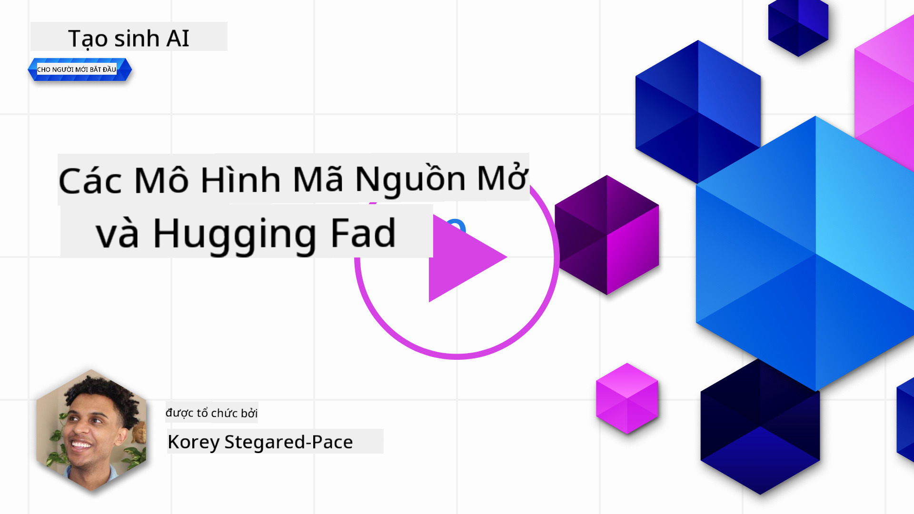
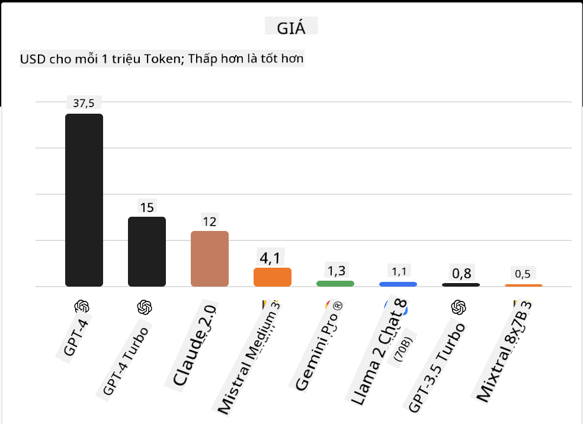
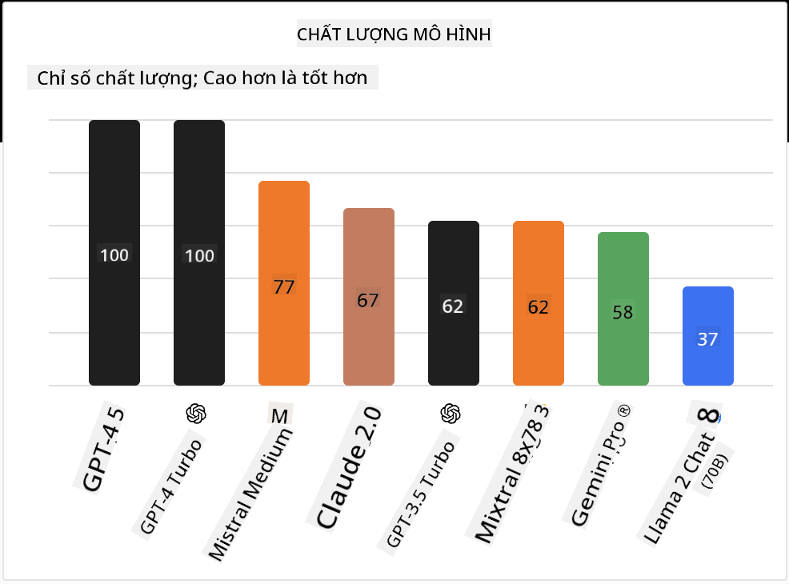

<!--
CO_OP_TRANSLATOR_METADATA:
{
  "original_hash": "0bba96e53ab841d99db731892a51fab8",
  "translation_date": "2025-07-09T17:12:24+00:00",
  "source_file": "16-open-source-models/README.md",
  "language_code": "vi"
}
-->

## Giới thiệu

Thế giới của các LLM mã nguồn mở rất thú vị và không ngừng phát triển. Bài học này nhằm cung cấp cái nhìn sâu sắc về các mô hình mã nguồn mở. Nếu bạn đang tìm hiểu về cách các mô hình độc quyền so sánh với các mô hình mã nguồn mở, hãy xem bài học ["Khám phá và So sánh Các LLM khác nhau"](../02-exploring-and-comparing-different-llms/README.md?WT.mc_id=academic-105485-koreyst). Bài học này cũng sẽ đề cập đến chủ đề tinh chỉnh mô hình, nhưng giải thích chi tiết hơn có thể tìm thấy trong bài học ["Tinh chỉnh LLM"](../18-fine-tuning/README.md?WT.mc_id=academic-105485-koreyst).

## Mục tiêu học tập

- Hiểu về các mô hình mã nguồn mở
- Nắm được lợi ích khi làm việc với các mô hình mã nguồn mở
- Khám phá các mô hình mở có sẵn trên Hugging Face và Azure AI Studio

## Mô hình mã nguồn mở là gì?

Phần mềm mã nguồn mở đã đóng vai trò quan trọng trong sự phát triển công nghệ ở nhiều lĩnh vực khác nhau. Tổ chức Open Source Initiative (OSI) đã định nghĩa [10 tiêu chí cho phần mềm](https://web.archive.org/web/20241126001143/https://opensource.org/osd?WT.mc_id=academic-105485-koreyst) để được phân loại là mã nguồn mở. Mã nguồn phải được chia sẻ công khai dưới một giấy phép được OSI phê duyệt.

Mặc dù việc phát triển LLM có những yếu tố tương tự như phát triển phần mềm, nhưng quy trình không hoàn toàn giống nhau. Điều này đã tạo ra nhiều tranh luận trong cộng đồng về định nghĩa mã nguồn mở trong bối cảnh LLM. Để một mô hình phù hợp với định nghĩa truyền thống về mã nguồn mở, các thông tin sau nên được công khai:

- Bộ dữ liệu được sử dụng để huấn luyện mô hình.
- Trọng số mô hình đầy đủ như một phần của quá trình huấn luyện.
- Mã đánh giá.
- Mã tinh chỉnh.
- Trọng số mô hình đầy đủ và các chỉ số huấn luyện.

Hiện tại chỉ có một vài mô hình đáp ứng được tiêu chí này. Mô hình [OLMo do Viện Allen về Trí tuệ Nhân tạo (AllenAI) tạo ra](https://huggingface.co/allenai/OLMo-7B?WT.mc_id=academic-105485-koreyst) là một trong số đó.

Trong bài học này, chúng ta sẽ gọi các mô hình là "mô hình mở" vì có thể chúng chưa hoàn toàn đáp ứng các tiêu chí trên tại thời điểm viết.

## Lợi ích của các mô hình mở

**Dễ tùy chỉnh** - Vì các mô hình mở được phát hành kèm theo thông tin huấn luyện chi tiết, các nhà nghiên cứu và phát triển có thể chỉnh sửa bên trong mô hình. Điều này cho phép tạo ra các mô hình chuyên biệt cao, được tinh chỉnh cho một nhiệm vụ hoặc lĩnh vực nghiên cứu cụ thể. Ví dụ như tạo mã lập trình, các phép toán toán học và sinh học.

**Chi phí** - Chi phí trên mỗi token khi sử dụng và triển khai các mô hình này thấp hơn so với các mô hình độc quyền. Khi xây dựng các ứng dụng Generative AI, bạn nên cân nhắc hiệu suất so với giá thành khi làm việc với các mô hình này cho trường hợp sử dụng của mình.

  
Nguồn: Artificial Analysis

**Linh hoạt** - Làm việc với các mô hình mở giúp bạn linh hoạt trong việc sử dụng các mô hình khác nhau hoặc kết hợp chúng. Ví dụ như [HuggingChat Assistants](https://huggingface.co/chat?WT.mc_id=academic-105485-koreyst) cho phép người dùng chọn mô hình sử dụng trực tiếp trên giao diện:

## Khám phá các mô hình mở khác nhau

### Llama 2

[LLama2](https://huggingface.co/meta-llama?WT.mc_id=academic-105485-koreyst), do Meta phát triển, là một mô hình mở được tối ưu cho các ứng dụng trò chuyện. Điều này nhờ phương pháp tinh chỉnh, bao gồm lượng lớn hội thoại và phản hồi từ con người. Với phương pháp này, mô hình tạo ra kết quả phù hợp hơn với kỳ vọng của con người, mang lại trải nghiệm người dùng tốt hơn.

Một số phiên bản tinh chỉnh của Llama bao gồm [Japanese Llama](https://huggingface.co/elyza/ELYZA-japanese-Llama-2-7b?WT.mc_id=academic-105485-koreyst), chuyên về tiếng Nhật và [Llama Pro](https://huggingface.co/TencentARC/LLaMA-Pro-8B?WT.mc_id=academic-105485-koreyst), phiên bản nâng cao của mô hình gốc.

### Mistral

[Mistral](https://huggingface.co/mistralai?WT.mc_id=academic-105485-koreyst) là một mô hình mở tập trung mạnh vào hiệu suất cao và hiệu quả. Nó sử dụng phương pháp Mixture-of-Experts, kết hợp một nhóm các mô hình chuyên gia thành một hệ thống, trong đó tùy theo đầu vào, các mô hình cụ thể sẽ được chọn để sử dụng. Điều này giúp tính toán hiệu quả hơn vì các mô hình chỉ xử lý những đầu vào mà chúng chuyên môn.

Một số phiên bản tinh chỉnh của Mistral bao gồm [BioMistral](https://huggingface.co/BioMistral/BioMistral-7B?text=Mon+nom+est+Thomas+et+mon+principal?WT.mc_id=academic-105485-koreyst), tập trung vào lĩnh vực y tế và [OpenMath Mistral](https://huggingface.co/nvidia/OpenMath-Mistral-7B-v0.1-hf?WT.mc_id=academic-105485-koreyst), chuyên thực hiện các phép toán học.

### Falcon

[Falcon](https://huggingface.co/tiiuae?WT.mc_id=academic-105485-koreyst) là một LLM được tạo ra bởi Viện Đổi mới Công nghệ (**TII**). Falcon-40B được huấn luyện trên 40 tỷ tham số và đã chứng minh hiệu suất vượt trội hơn GPT-3 với chi phí tính toán thấp hơn. Điều này nhờ thuật toán FlashAttention và multiquery attention giúp giảm yêu cầu bộ nhớ khi suy luận. Với thời gian suy luận được rút ngắn, Falcon-40B phù hợp cho các ứng dụng trò chuyện.

Một số phiên bản tinh chỉnh của Falcon là [OpenAssistant](https://huggingface.co/OpenAssistant/falcon-40b-sft-top1-560?WT.mc_id=academic-105485-koreyst), trợ lý được xây dựng trên các mô hình mở và [GPT4ALL](https://huggingface.co/nomic-ai/gpt4all-falcon?WT.mc_id=academic-105485-koreyst), mang lại hiệu suất cao hơn mô hình gốc.

## Cách chọn lựa

Không có câu trả lời duy nhất cho việc chọn mô hình mở. Một điểm khởi đầu tốt là sử dụng tính năng lọc theo nhiệm vụ của Azure AI Studio. Điều này giúp bạn hiểu các loại nhiệm vụ mà mô hình đã được huấn luyện. Hugging Face cũng duy trì một bảng xếp hạng LLM, hiển thị các mô hình có hiệu suất tốt nhất dựa trên các chỉ số nhất định.

Khi muốn so sánh các LLM theo các loại khác nhau, [Artificial Analysis](https://artificialanalysis.ai/?WT.mc_id=academic-105485-koreyst) là một nguồn tài nguyên tuyệt vời khác:

  
Nguồn: Artificial Analysis

Nếu làm việc trên một trường hợp sử dụng cụ thể, tìm kiếm các phiên bản tinh chỉnh tập trung vào cùng lĩnh vực có thể rất hiệu quả. Thử nghiệm với nhiều mô hình mở để xem chúng hoạt động như thế nào theo kỳ vọng của bạn và người dùng cũng là một cách làm tốt.

## Bước tiếp theo

Điều tuyệt vời nhất về các mô hình mở là bạn có thể bắt đầu làm việc với chúng khá nhanh chóng. Hãy xem [Azure AI Studio Model Catalog](https://ai.azure.com?WT.mc_id=academic-105485-koreyst), nơi có bộ sưu tập Hugging Face đặc biệt với các mô hình mà chúng ta đã thảo luận ở đây.

## Học tập không dừng lại ở đây, tiếp tục hành trình

Sau khi hoàn thành bài học này, hãy khám phá bộ sưu tập [Generative AI Learning](https://aka.ms/genai-collection?WT.mc_id=academic-105485-koreyst) để tiếp tục nâng cao kiến thức về Generative AI của bạn!

**Tuyên bố từ chối trách nhiệm**:  
Tài liệu này đã được dịch bằng dịch vụ dịch thuật AI [Co-op Translator](https://github.com/Azure/co-op-translator). Mặc dù chúng tôi cố gắng đảm bảo độ chính xác, xin lưu ý rằng các bản dịch tự động có thể chứa lỗi hoặc không chính xác. Tài liệu gốc bằng ngôn ngữ gốc của nó nên được coi là nguồn chính xác và đáng tin cậy. Đối với các thông tin quan trọng, nên sử dụng dịch vụ dịch thuật chuyên nghiệp do con người thực hiện. Chúng tôi không chịu trách nhiệm về bất kỳ sự hiểu lầm hoặc giải thích sai nào phát sinh từ việc sử dụng bản dịch này.